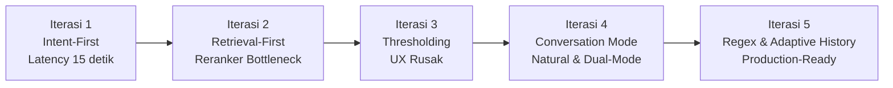
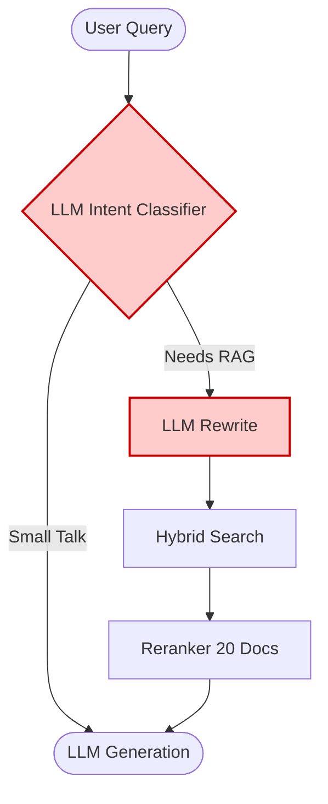
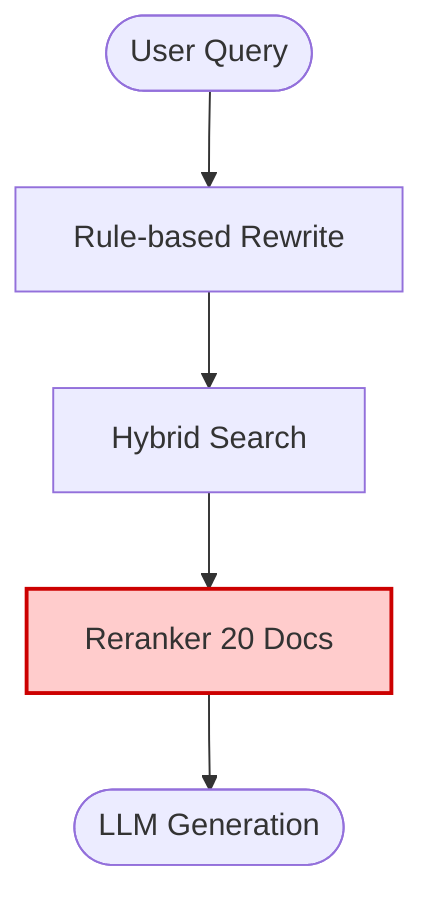
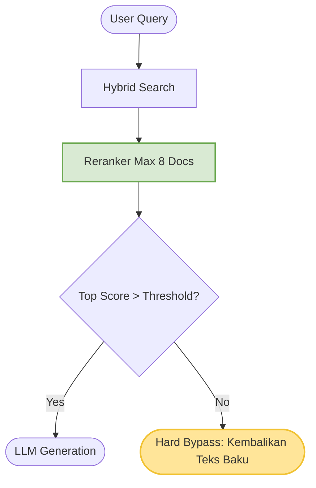
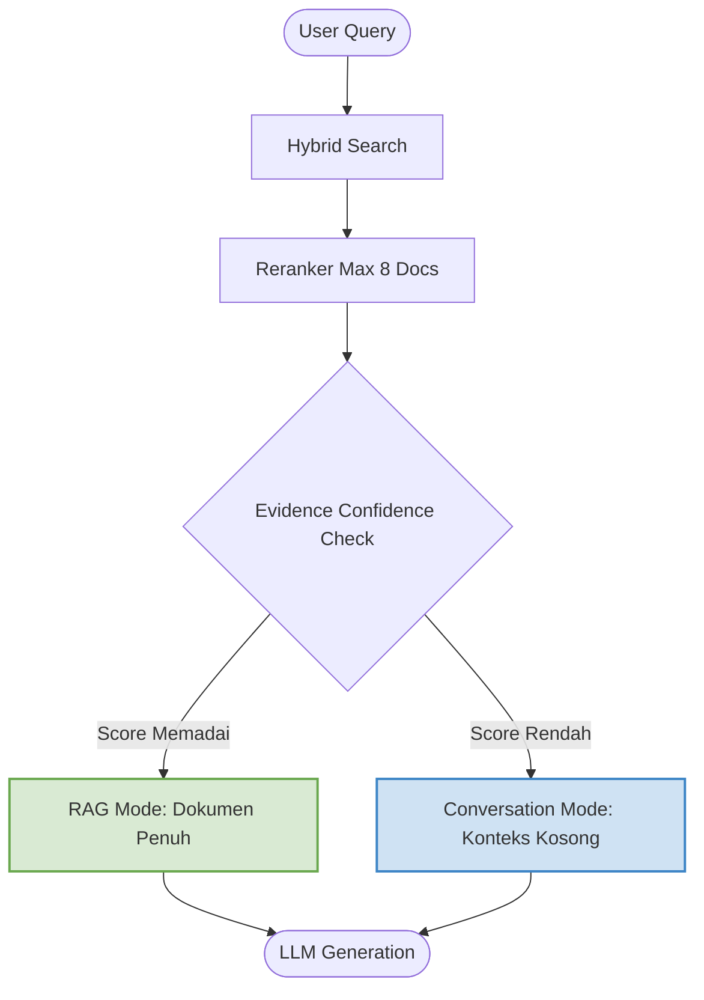
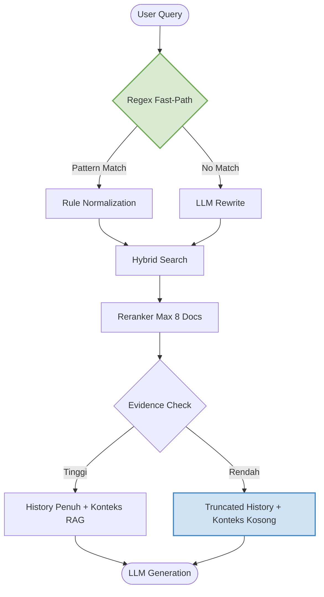

# Laporan Evolusi Arsitektur RAG: Pergeseran Paradigma dari "LLM-Centric" ke "Evidence-Driven"

*Catatan: Dokumen ini disusun selayaknya buku harian rekayasa (engineering diary/postmortem). Dokumen ini tidak sekadar mencatat apa yang berubah, tetapi merekam perdebatan, kegagalan hipotesis, proses debugging, hingga penemuan insight yang mendasari desain akhir Chatbot Panduan Akademik. Seluruh data log adalah data rill dari eksperimen.*

## Benang Merah Penelitian (The Plot Twist)
Pada awal penelitian, hampir seluruh keputusan sistem (*intent detection, query rewriting,* hingga *routing*) diserahkan kepada LLM dengan asumsi bahwa model bahasa merupakan komponen paling cerdas. Namun, melalui serangkaian eksperimen dan analisis log performa, kami justru menemukan fakta sebaliknya: **keputusan-keputusan krusial tersebut jauh lebih cepat, konsisten, dan akurat bila ditentukan oleh bukti matematis dari proses retrieval serta aturan deterministik (regex) yang presisi.** 

Perjalanan ini secara bertahap menggeser peran LLM dari "pengambil keputusan utama" menjadi murni sebagai "generator jawaban", sementara keputusan arsitektural dipindahkan ke mekanisme yang lebih dapat dijelaskan, diukur, dan diprediksi.

---

## Ringkasan Perjalanan (Timeline Evolusi)



---

## 1. Fase Intent-First: Terlalu Mengandalkan LLM (Iterasi 1)

### Hipotesis Awal & Perdebatan
Pada titik awal, kami berhadapan dengan sebuah ketakutan umum dalam sistem RAG: 
> *"Retrieval itu mahal. Embedding memakan waktu. Reranking sangat berat untuk komputasi lokal. Oleh karena itu, jangan sampai sistem memanggil fase Retrieval jika kuerinya sekadar sapaan ringan."*

Berdasarkan hipotesis tersebut, kami merancang *Intent Classifier* menggunakan LLM di garis terdepan. Biarkan LLM menyeleksi mana kueri akademis dan mana yang *small talk*.

### Eksperimen & Alur Arsitektur


### Hasil Log (Steady-State)
Ternyata setelah melakukan *profiling*, metrik waktu berteriak mengungkapkan fakta sebaliknya:
| Komponen / Fase | Waktu Eksekusi | Keterangan |
| :--- | :--- | :--- |
| **Intent Classifier (LLM)** | ~2.4 detik | Beban utama di awal |
| **Rewrite (LLM)** | ~2.1 detik | |
| **Hybrid Search (Supabase)** | ~1.2 detik | **Ternyata sangat murah!** |
| **Reranker (Cross-Encoder)** | ~4.0 detik | Menilai 20 dokumen utuh di CPU lokal |

### Insight
Asumsi awal kami runtuh. Kami takut pada latensi *Retrieval* (1.2s), tetapi justru menciptakan monster latensi baru berupa dua lapis LLM di depan (2.4s + 2.1s = 4.5 detik waktu terbuang). Pertanyaan mulai bermunculan:
> *"Kenapa kueri sapaan tetap masuk ke Retrieval? Pasti ada salah klasifikasi."*
> *"Kalau LLM di depan seburuk ini, bukankah lebih murah jika semua kueri langsung dilempar ke mesin pencari?"*

Dari titik ini kami mulai meragukan asumsi "LLM is all you need".

### Keputusan Berikutnya
Singkirkan *Intent Classifier*. Biarkan semua kueri (baik sapaan maupun pertanyaan berat) langsung menabrak mesin pencari secara buta (Retrieval-First). Kami akan menanggung risikonya dan melihat seberapa parah sistem ini tersedak.

---

## 2. Fase Retrieval-First: Penemuan Tak Terduga (Iterasi 2)

### Hipotesis Awal
Kami mengeksekusi penghapusan klasifikasi. Asumsinya, *Hybrid Search* Supabase cukup kuat, namun kami bersiap untuk komputasi brutal jika kueri "Halo" dipaksakan masuk ke jalur dokumen berat.

### Eksperimen & Alur Arsitektur


### Hasil Log
*   **Intent Classifier:** 0.0s (Beban hilang total)
*   **Hybrid Search:** ~1.5s (Sangat stabil)
*   **Reranker (Cross-Encoder):** ~4.0s (Mengevaluasi 20 dokumen utuh)

### Insight: *Unexpected Discovery*
*Hybrid Search* terbukti sangat responsif. Namun, kini *Cross-Encoder* menjadi *bottleneck*. CPU lokal harus menilai 20 dokumen secara berurutan. Di sinilah kami menemukan sesuatu yang menakjubkan dari log kami:
Ketika pengguna mengetik `"Halo"` atau `"Masak rendang"`, hampir seluruh skor dari *Cross-Encoder* anjlok ke angka negatif ekstrem (-6.0, -8.0). Sedangkan pertanyaan akademis wajar selalu menorehkan angka positif (>0.5).

Awalnya *Cross-Encoder* hanya kami gunakan semata-mata untuk mengurutkan dokumen. Namun ketika kami mulai mengamati distribusi skor pada berbagai jenis pertanyaan, muncul pola yang tidak pernah kami rencanakan sebelumnya. 
**Cross-Encoder secara alami bertindak sebagai pendeteksi niat (Intent Detector)!** Ia tidak lagi sekadar *reranker*, melainkan indikator valid mengenai keberadaan bukti (*evidence*) dalam basis pengetahuan.

### Keputusan Berikutnya
Membatasi dokumen yang diuji oleh *Cross-Encoder* maksimal 8 buah, dan menerapkan *Minimum Evidence Thresholding*. Jika skor teratas berada di zona merah, kita tolak langsung (*hard bypass*).

---

## 3. Fase Thresholding: Logika Bagus, UX Hancur (Iterasi 3)

### Hipotesis Awal
Jika *top_score* negatif, artinya pertanyaan pasti *small talk* atau di luar domain. Untuk apa memanggil LLM OpenAI dan membuang kuota? Langsung saja tolak dan hemat latensi semaksimal mungkin.

### Eksperimen & Alur Arsitektur


### Hasil Log
| Fase Retrieval | Waktu Eksekusi |
| :--- | :--- |
| **Reranker (8 Pairs)** | **0.68s** (Anjlok drastis dari 4.0s!) |
| **Total Retrieval Pipeline** | **~2.03s** |

### Insight
Dari sisi *engineering* (metrik), ini adalah kemenangan besar. Latensi anjlok menjadi 2 detik. Tapi dari sisi *User Experience (UX)*, ini adalah bencana.
Pengguna mengetik: `"Halo"`
Bot menjawab: `"Maaf, informasi akademik tidak ditemukan."`

UX rusak total. Pengalaman *chatbot* berubah kaku layaknya mesin ATM. Pelajaran mahal: **Latency ≠ UX**. Mematikan jalur LLM sepenuhnya (*hard bypass*) menghapus kemampuan bahasa alami (*natural language*) yang merupakan nyawa utama agen AI.

### Keputusan Berikutnya
Jangan mem-bypass LLM-nya, tetapi **bypass Konteks Dokumen-nya**. Kueri yang gagal *threshold* harus tetap diteruskan ke LLM, tetapi dibekali instruksi ketat agar tetap ramah tanpa berhalusinasi.

---

## 4. Fase Dual-Mode: RAG vs Conversation (Iterasi 4)

### Hipotesis Awal
Jika LLM dihadapkan pada konteks kosong, ia punya kecenderungan berhalusinasi (menjawab berdasarkan *pre-training knowledge*). Hal ini mematikan untuk *chatbot* resmi perguruan tinggi. Kami butuh "Pawang LLM".

### Eksperimen & Alur Arsitektur
Mengadopsi **Soft Bypass**. Jika skor di bawah batas, sistem berganti ke `Mode Conversation` dengan menginjeksi sebuah *Prompt Status* khusus:
> *Status: NO_RELEVANT_DOCUMENT*
> *Instruksi: Jika percakapan umum, jawab normal. Jika pertanyaan akademik, tolak dengan sopan.*



### Hasil Log (Uji Coba Ekstrem)
*   **Akademik ("cara menulis PI"):** RAG Mode aktif $\rightarrow$ **Waktu Generasi 4.38s**.
*   **Out-of-Domain ("cara masak soto banjar"):** Conversation Mode aktif $\rightarrow$ Ditolak sopan tanpa halusinasi dalam **1.18s**.

### Insight
Model AI tunduk sepenuhnya pada intervensi status mesin (*Retrieval Status*). Sistem ini berhasil menjadi **Dual-Mode** tanpa perlu *classifier* tambahan. Pemisahan *small talk* dan akademik kini dibentuk dari **kepastian matematis (evidence score)**, bukan lagi tebakan abu-abu.
Meski begitu, kami menangkap keanehan. Mengapa sapaan ringan masih butuh ribuan token input dan generasi lebih dari 1 detik?

### Keputusan Berikutnya
Saatnya masuk ke ranah mikro-optimisasi. Kami harus menginvestigasi log pemrosesan token dan men-debug proses *rewrite* yang tersisa.

---

## 5. Fase Pencerahan Deterministik: Regex & Adaptive History (Iterasi 5 - Final)

### Proses Debugging & Hipotesis Awal
Kami mendapati sesuatu yang aneh. 
Kueri: `"Apa itu KKP?"`
Waktu terbuang di fase Rewrite: **2.31 detik**! 
> *"Lho kok LLM Rewrite dipanggil lagi? Padahal kuerinya sangat jelas."*

Kami mulai menelusuri log. Setelah beberapa kali profiling, ternyata penyebabnya bukan lambatnya LLM maupun *Retriever*, melainkan implementasi sederhana pada fungsi `needs_rewrite()`.
Implementasi lama hanya memeriksa apakah kueri mengandung sembarang *substring* (misalnya `"itu"` atau `"tadi"`). Akibatnya, pada kalimat `"Apa itu KKP?"`, kata `"itu"` secara keliru dianggap sebagai referensi obrolan masa lalu, memicu pemanggilan LLM. Padahal kata "itu" merupakan bagian alami dari kalimat definisi.

Lalu di sisi lain, kami melihat log memori percakapan:
> *"Kenapa kita mengirim 500+ token riwayat percakapan ke LLM kalau pengguna cuma bilang 'oke terima kasih'?"*
Pemikiran awal bahwa *"semakin banyak memori semakin pintar"* terbukti membengkakkan beban tanpa makna.

### Eksperimen & Alur Arsitektur
1.  **Regex Boundary:** Mengganti *substring match* naif dengan batas kata Regex (`\b`). Mengonversi mutlak frasa `"apa itu [X]"` menjadi `"Apa yang dimaksud dengan [X]"` langsung via kode Python (*zero LLM latency*).
2.  **Adaptive History:** Jika *Conversation Mode* aktif, riwayat percakapan dipotong sadis menjadi hanya 1 putaran.



### Hasil Log (Pembuktian Akhir)
Kueri: *"oke terimakasih"*

```text
========== PROMPT PROFILE ==========
History           : 553 tokens ➔ 49 tokens (Terpangkas tajam!)
Total Input       : 318 tokens
Generation time   : 1.01s
Total process time: 5.26s
```

### Insight
Konflik dan perdebatan panjang kami berbuah manis. Konteks bukanlah tentang memberikan memori sebanyak mungkin, melainkan menjaga relevansi seketat mungkin. Di sisi pra-pemrosesan, logika *Regex* membuktikan bahwa pendekatan aturan deterministik jauh lebih efisien, instan, dan presisi ketimbang melempar segala urusan linguistik kepada keajaiban model LLM.

---

## 6. Kesimpulan Penelitian (Dampak pada Bab 4 Skripsi)

Evolusi arsitektur ini menunjukkan bahwa **kemampuan LLM sebaiknya digunakan hanya pada tahap yang benar-benar membutuhkan penalaran bahasa alami (Natural Language Generation).** 

Keputusan-keputusan arsitektural yang kritis—seperti klasifikasi *intent*, normalisasi kueri, pembatasan ruang lingkup, dan pemilihan ukuran konteks—jauh lebih tepat jika diselesaikan secara deterministik melalui *evidence retrieval* (skor Cross-Encoder) serta aturan *Regex* yang absolut sebelum mencapai gerbang LLM.

Pendekatan **Retrieval Confidence-Aware Generation** ini tidak hanya memangkas latensi pada *steady-state* lebih dari **50%** (dari ~15 detik menjadi ~5-7 detik), tetapi yang terpenting: ia secara fundamental meningkatkan keterjelasan (*explainability*), konsistensi, dan prediktabilitas dari perilaku sistem secara utuh.
