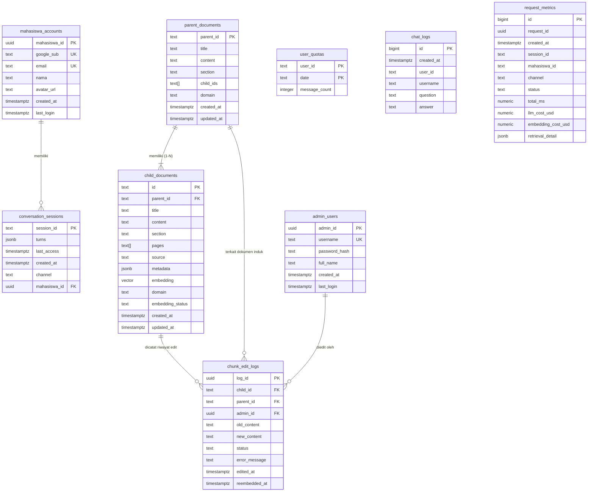

# Dokumentasi Arsitektur & Skema Database Supabase

> **Status Database:** Live & Terverifikasi  
> **Metode Akses:** Kredensial dari `backend/config/settings.py` (`supabase_url`, `supabase_service_key`)  
> **Terakhir Diperiksa:** September 2026  
> **Engine:** PostgreSQL 15+ (Supabase Managed) dengan Extensions `pgvector` & `pg_trgm`

Dokumen ini mendokumentasikan seluruh arsitektur database secara komprehensif, mencakup **9 tabel utama**, **18 database views analitik**, dan **7 stored procedures (RPC)** yang aktif di database Supabase setelah berbagai tahapan pembaruan via Supabase Terminal maupun skrip migrasi.

---

## Daftar Isi

1. [Arsitektur & Extensions](#1-arsitektur--extensions)
2. [Entity-Relationship Diagram (ERD)](#2-entity-relationship-diagram-erd)
3. [Detail & Kamus Data Tabel Utama (9 Tabel)](#3-detail--kamus-data-tabel-utama-9-tabel)
   - [3.1. parent_documents](#31-parent_documents)
   - [3.2. child_documents](#32-child_documents)
   - [3.3. conversation_sessions](#33-conversation_sessions)
   - [3.4. user_quotas](#34-user_quotas)
   - [3.5. chat_logs](#35-chat_logs)
   - [3.6. request_metrics](#36-request_metrics)
   - [3.7. mahasiswa_accounts](#37-mahasiswa_accounts)
   - [3.8. admin_users](#38-admin_users)
   - [3.9. chunk_edit_logs](#39-chunk_edit_logs)
4. [Daftar Views Observability & Monitoring (18 Views)](#4-daftar-views-observability--monitoring-18-views)
5. [Stored Procedures / Remote Procedure Calls (RPC)](#5-stored-procedures--remote-procedure-calls-rpc)
7. [Catatan Penting & Sinkronisasi Kode](#7-catatan-penting--sinkronisasi-kode)

---

## 1. Arsitektur & Extensions

Database menggunakan PostgreSQL yang di-host di Supabase Cloud dengan ekstensi utama:
- **`vector` (pgvector):** Mendukung penyimpanan vektor embedding berdimensi 2000 (`VECTOR(2000)`) untuk similarity search (Cosine Distance `<=>`).
  > *Catatan dimensi:* Embedding OpenAI `text-embedding-3-large` (3072 dimensi) disesuaikan/dikurangi menjadi 2000 dimensi untuk kompatibilitas indeks IVFFlat di Supabase.
- **`pg_trgm` (trigram):** Mendukung pencarian teks fuzzy dan fungsi pencarian teks cepat.

Akses dari backend Python dilakukan via dua mode:
1. **REST API / PostgREST (`supabase-py`):** Operasi CRUD, pemanggilan RPC, dan autentikasi Service Role.
2. **PostgreSQL Connection String (Direct):** Opsi koneksi SQL langsung untuk eksekusi DDL / migrasi.

---

## 2. Entity-Relationship Diagram (ERD)



---

## 3. Detail & Kamus Data Tabel Utama (9 Tabel)

### 3.1. `parent_documents`
*Tabel penyimpan dokumen induk (Parent Chunk) dalam arsitektur Parent-Child Retrieval.*  
- **Live Row Count:** 175 baris  
- **Primary Key:** `parent_id`

| Nama Kolom | Tipe Data | Nullable | Keterangan |
| :--- | :--- | :---: | :--- |
| `parent_id` | `text` | NOT NULL | Identifier unik dokumen induk (e.g., `parent_bab1_01`) **[PK]** |
| `title` | `text` | NOT NULL | Judul dokumen atau bab panduan |
| `content` | `text` | NOT NULL | Teks lengkap dokumen induk yang dikirim ke LLM saat context assembly |
| `section` | `text` | NOT NULL | Bagian/bab (misal: "BAB I", "BAB II", "SISTEMATIKA") |
| `child_ids` | `text[]` | NOT NULL | Array berisi daftar ID child chunks yang diturunkan dari parent ini |
| `domain` | `text` | NOT NULL | Domain dokumen panduan (`KKP`, `PI`, `SKRIPSI`, atau `NON_SKRIPSI`) |
| `created_at` | `timestamptz` | NULL | Waktu pembuatan dokumen di database |
| `updated_at` | `timestamptz` | NOT NULL | Waktu terakhir dokumen diperbarui |

---

### 3.2. `child_documents`
*Tabel penyimpan potongan teks kecil (Child Chunk) beserta vektor embedding untuk similarity search.*  
- **Live Row Count:** 373 baris  
- **Primary Key:** `id`  
- **Foreign Key:** `parent_id` &rarr; `parent_documents(parent_id)`

| Nama Kolom | Tipe Data | Nullable | Keterangan |
| :--- | :--- | :---: | :--- |
| `id` | `text` | NOT NULL | Identifier unik child chunk (e.g., `chunk_001`) **[PK]** |
| `parent_id` | `text` | NOT NULL | Referensi ke parent document **[FK]** |
| `title` | `text` | NOT NULL | Judul chunk dokumen |
| `content` | `text` | NOT NULL | Teks chunk untuk pencarian teks & embedding |
| `section` | `text` | NOT NULL | Bagian/bab chunk dokumen |
| `pages` | `text[]` | NOT NULL | Array nomor halaman asal (misal: `['1', '2']`) |
| `source` | `text` | NOT NULL | Nama file PDF sumber dokumen |
| `metadata` | `jsonb` | NOT NULL | Metadata tambahan terstruktur (digunakan SelfQueryRetriever) |
| `embedding` | `vector(2000)`| NULL | Representasi vektor dimensi 2000 untuk cosine similarity search |
| `domain` | `text` | NOT NULL | Domain dokumen (`KKP`, `PI`, `SKRIPSI`, atau `NON_SKRIPSI`) |
| `embedding_status` | `text` | NOT NULL | Status sinkronisasi embedding (`synced`, `pending`, `failed`) |
| `created_at` | `timestamptz` | NULL | Waktu pembuatan chunk |
| `updated_at` | `timestamptz` | NOT NULL | Waktu terakhir chunk diperbarui |

**Indeks yang Terpasang:**
- `idx_child_embedding`: Index IVFFlat `(embedding vector_cosine_ops) WITH (lists = 10)`
- `idx_child_content_fts`: Index GIN `(to_tsvector('indonesian', content))` untuk Indonesian Full-Text Search
- `idx_child_metadata`: Index GIN `(metadata)` untuk pencarian JSONB terstruktur
- `idx_child_parent_id`: Index B-Tree `(parent_id)` untuk parent lookup cepat
- `idx_child_section`: Index B-Tree `(section)`
- `idx_child_documents_domain`: Index B-Tree `(domain)` untuk domain filtering

---

### 3.3. `conversation_sessions`
*Tabel manajemen memori percakapan (stateful sessions) lintas channel (Web & Telegram).*  
- **Live Row Count:** 4 baris  
- **Primary Key:** `session_id`  
- **Foreign Key:** `mahasiswa_id` &rarr; `mahasiswa_accounts(mahasiswa_id)`

| Nama Kolom | Tipe Data | Nullable | Keterangan |
| :--- | :--- | :---: | :--- |
| `session_id` | `text` | NOT NULL | Identifier unik session percakapan **[PK]** |
| `turns` | `jsonb` | NOT NULL | Serialisasi array percakapan user & bot `[{role, content}, ...]` |
| `channel` | `text` | NOT NULL | Asal kanal komunikasi (`website` atau `telegram`) |
| `mahasiswa_id` | `uuid` | NULL | Relasi ke akun mahasiswa jika user terautentikasi di web **[FK]** |
| `created_at` | `timestamptz` | NOT NULL | Waktu awal sesi dibuat |
| `last_access` | `timestamptz` | NOT NULL | Timestamp akses terakhir (digunakan TTL cleanup) |

**Indeks yang Terpasang:**
- `idx_sessions_last_access`: Index B-Tree pada `last_access` untuk efisiensi pembersihan idle session
- `idx_sessions_created_at`: Index B-Tree pada `created_at`
- `idx_sessions_mahasiswa_id`: Index B-Tree pada `mahasiswa_id`

---

### 3.4. `user_quotas`
*Tabel pelacakan batas penggunaan harian (daily rate limiting) berbasis zona waktu WITA (Asia/Makassar).*  
- **Live Row Count:** 17 baris  
- **Primary Key Komposit:** `(user_id, date)`

| Nama Kolom | Tipe Data | Nullable | Keterangan |
| :--- | :--- | :---: | :--- |
| `user_id` | `text` | NOT NULL | Identifier pengguna (Telegram Chat ID atau Mahasiswa UUID) **[PK 1]** |
| `date` | `text` | NOT NULL | Format tanggal string `YYYY-MM-DD` (WITA) **[PK 2]** |
| `message_count` | `integer` | NULL | Jumlah pesan yang telah dikirim pada tanggal tersebut (default: 0) |

---

### 3.5. `chat_logs`
*Tabel log audit riwayat tanya jawab pengguna.*  
- **Live Row Count:** 86 baris  
- **Primary Key:** `id` (Auto-increment `bigint`)

| Nama Kolom | Tipe Data | Nullable | Keterangan |
| :--- | :--- | :---: | :--- |
| `id` | `bigint` | NOT NULL | ID unik auto-increment log **[PK]** |
| `user_id` | `text` | NOT NULL | ID pengguna yang mengajukan pertanyaan |
| `username` | `text` | NULL | Username atau nama pengguna jika tersedia |
| `question` | `text` | NOT NULL | Pertanyaan mentah yang diajukan pengguna |
| `answer` | `text` | NULL | Jawaban akhir yang dihasilkan oleh asisten |
| `created_at` | `timestamptz` | NULL | Waktu interaksi dicatat (default: `NOW()`) |

---

### 3.6. `request_metrics`
*Tabel observabilitas dan distributed tracing untuk setiap request chat (evaluasi latensi, token, biaya, & kualitas retrieval).*  
- **Live Row Count:** 28 baris  
- **Primary Key:** `id` (`bigint`)

| Nama Kolom | Tipe Data | Nullable | Keterangan |
| :--- | :--- | :---: | :--- |
| `id` | `bigint` | NOT NULL | Primary key auto-increment **[PK]** |
| `request_id` | `uuid` | NOT NULL | Trace ID unik per request |
| `created_at` | `timestamptz` | NOT NULL | Waktu request diproses |
| `session_id` | `text` | NULL | ID sesi percakapan terkait |
| `mahasiswa_id` | `text` | NULL | ID mahasiswa jika login |
| `channel` | `text` | NOT NULL | Kanal request (`website`, `telegram`) |
| `status` | `text` | NOT NULL | Status eksekusi (`success`, `error`, `quota_rejected`, dll.) |
| `error_type` | `text` | NULL | Nama exception / tipe kesalahan jika gagal |
| `error_source` | `text` | NULL | Komponen sumber error (`retrieval`, `llm`, `database`, dll.) |
| `http_status` | `integer` | NULL | HTTP status code yang dikembalikan ke client |
| `stage_validation_ms` | `numeric` | NULL | Durasi tahap validasi request |
| `stage_session_load_ms` | `numeric` | NULL | Durasi pengambilan session dari cache/DB |
| `stage_reformulation_ms`| `numeric` | NULL | Durasi penulisan ulang pertanyaan (query rewriting) |
| `stage_self_query_ms` | `double precision`| NULL | Durasi ekstraksi metadata / self-query parsing |
| `stage_embedding_ms` | `numeric` | NULL | Durasi pembentukan vector query ke OpenAI |
| `stage_retrieval_ms` | `numeric` | NULL | Durasi eksekusi pencarian di Supabase |
| `stage_reranking_ms` | `numeric` | NULL | Durasi reranking dengan Cross-Encoder |
| `stage_parent_assembly_ms`| `numeric`| NULL | Durasi penyusunan parent context dokumen |
| `stage_generation_ms` | `numeric` | NULL | Durasi inferensi LLM menghasilkan jawaban |
| `stage_db_save_ms` | `numeric` | NULL | Durasi penyimpanan session & log ke database |
| `total_ms` | `numeric` | NULL | Total latensi request end-to-end |
| `num_docs_retrieved` | `integer` | NULL | Jumlah child chunk yang ditemukan tahap retrieval |
| `num_docs_after_rerank`| `integer` | NULL | Jumlah chunk yang lolos skor reranker |
| `top_cross_encoder_score`| `numeric` | NULL | Nilai relevansi tertinggi dari Cross-Encoder |
| `avg_cross_encoder_score`| `numeric` | NULL | Nilai relevansi rata-rata dokumen hasil rerank |
| `domain_detected` | `text` | NULL | Domain dokumen yang dideteksi (`PI`, `KKP`, `SKRIPSI`, `NON_SKRIPSI`, `UNKNOWN`) |
| `is_no_relevant_doc` | `boolean` | NOT NULL | Flag jika tidak ada dokumen yang memenuhi ambang batas |
| `retrieved_parent_ids`| `text[]` | NULL | Array ID parent documents yang digunakan sebagai konteks |
| `rewrite_method` | `text` | NULL | Metode rewriting yang digunakan |
| `input_tokens` | `integer` | NULL | Jumlah token input LLM |
| `output_tokens` | `integer` | NULL | Jumlah token output LLM |
| `embedding_tokens` | `integer` | NULL | Jumlah token input embedding OpenAI |
| `llm_cost_usd` | `numeric` | NULL | Estimasi biaya LLM dalam USD |
| `embedding_cost_usd` | `numeric` | NULL | Estimasi biaya embedding dalam USD |
| `openai_retry_count` | `integer` | NOT NULL | Frekuensi retry API OpenAI saat terjadi rate limit/timeout |
| `question` | `text` | NULL | Pertanyaan user yang diproses |
| `username` | `text` | NULL | Nama user jika tersedia |
| `retrieval_detail` | `jsonb` | NULL | Metadata detail retrieval untuk debugging |
| `cache_hit` | `boolean` | NULL | `true` jika retrieval diambil dari cache TTL, `false` jika cold run |

---

### 3.7. `mahasiswa_accounts`
*Tabel profil akun mahasiswa yang terdaftar melalui Google OAuth pada frontend Web.*  
- **Live Row Count:** 2 baris  
- **Primary Key:** `mahasiswa_id` (`uuid`)

| Nama Kolom | Tipe Data | Nullable | Keterangan |
| :--- | :--- | :---: | :--- |
| `mahasiswa_id` | `uuid` | NOT NULL | Identifier unik akun mahasiswa **[PK]** |
| `google_sub` | `text` | NOT NULL | Subject ID unik dari Google OAuth (Unique identifier) |
| `email` | `text` | NOT NULL | Alamat email institusi / Google mahasiswa |
| `nama` | `text` | NULL | Nama lengkap mahasiswa |
| `avatar_url` | `text` | NULL | URL foto profil dari Google |
| `created_at` | `timestamptz` | NULL | Waktu pendaftaran pertama akun |
| `last_login` | `timestamptz` | NULL | Timestamp login terakhir |

---

### 3.8. `admin_users`
*Tabel kredensial administrator untuk akses Dashboard Admin.*  
- **Live Row Count:** 1 baris  
- **Primary Key:** `admin_id` (`uuid`)

| Nama Kolom | Tipe Data | Nullable | Keterangan |
| :--- | :--- | :---: | :--- |
| `admin_id` | `uuid` | NOT NULL | Identifier unik akun administrator **[PK]** |
| `username` | `text` | NOT NULL | Username login admin (Unique) |
| `password_hash` | `text` | NOT NULL | Hash kata sandi terenkripsi (Bcrypt) |
| `full_name` | `text` | NULL | Nama lengkap administrator |
| `created_at` | `timestamptz` | NULL | Waktu akun admin dibuat |
| `last_login` | `timestamptz` | NULL | Timestamp login terakhir admin |

---

### 3.9. `chunk_edit_logs`
*Tabel audit trail dan antrian re-embedding saat admin mengedit konten chunk dokumen pada dashboard.*  
- **Live Row Count:** 2 baris  
- **Primary Key:** `log_id` (`uuid`)  
- **Foreign Keys:**
  - `child_id` &rarr; `child_documents(id)`
  - `parent_id` &rarr; `parent_documents(parent_id)`
  - `admin_id` &rarr; `admin_users(admin_id)`

| Nama Kolom | Tipe Data | Nullable | Keterangan |
| :--- | :--- | :---: | :--- |
| `log_id` | `uuid` | NOT NULL | Identifier unik log edit **[PK]** |
| `child_id` | `text` | NOT NULL | ID child chunk yang diedit **[FK]** |
| `parent_id` | `text` | NOT NULL | ID parent document terkait **[FK]** |
| `admin_id` | `uuid` | NULL | ID admin yang melakukan pengeditan **[FK]** |
| `old_content` | `text` | NULL | Konten chunk sebelum diedit |
| `new_content` | `text` | NULL | Konten chunk setelah diedit |
| `status` | `text` | NOT NULL | Status proses re-embedding (`pending`, `success`, `failed`) |
| `error_message` | `text` | NULL | Pesan error jika proses kalkulasi embedding gagal |
| `edited_at` | `timestamptz` | NULL | Waktu chunk diedit oleh admin |
| `reembedded_at`| `timestamptz` | NULL | Waktu kalkulasi vektor embedding baru selesai |

---

## 4. Daftar Views Observability & Monitoring (18 Views)

Database menyediakan 18 View SQL yang secara otomatis mengagregasi data dari tabel `request_metrics`, `conversation_sessions`, dan `chunk_edit_logs`:

| Nama View | Tujuan & Agregasi Data | Kolom Utama |
| :--- | :--- | :--- |
| `v_latency_stats_hourly` | Statistik latensi per jam (P50, P95, P99, Avg) per channel | `bucket`, `channel`, `total_requests`, `p50_ms`, `p95_ms`, `p99_ms`, `avg_ms` |
| `v_stage_breakdown_daily`| Rata-rata durasi milidetik untuk setiap tahap pipeline RAG harian | `day`, `avg_validation_ms`, `avg_session_load_ms`, `avg_reformulation_ms`, `avg_embedding_ms`, `avg_retrieval_ms`, `avg_reranking_ms`, `avg_parent_assembly_ms`, `avg_generation_ms`, `avg_db_save_ms` |
| `v_cost_daily` | Total biaya API OpenAI (LLM + Embedding) harian dan penggunaan token | `day`, `total_llm_cost_usd`, `total_embedding_cost_usd`, `total_cost_usd`, `total_requests`, `cost_per_request_usd`, `total_input_tokens`, `total_output_tokens` |
| `v_cost_per_user` | Total biaya konsumsi token per mahasiswa | `mahasiswa_id`, `total_cost_usd`, `total_requests` |
| `v_cost_per_session` | Total biaya per session percakapan | `session_id`, `total_cost_usd`, `total_requests` |
| `v_retrieval_quality_daily`| Metrik kualitas dokumen hasil pencarian (skor rerank, zero-doc rate) | `day`, `total_queries`, `no_relevant_doc_count`, `no_relevant_doc_pct`, `avg_docs_after_rerank`, `avg_top_score`, `avg_score_all_docs` |
| `v_top_retrieved_documents`| Peringkat dokumen induk yang paling sering dijadikan referensi | `parent_id`, `times_retrieved` |
| `v_domain_stats_daily` | Frekuensi query dan tingkat kegagalan per domain (`KKP` vs `PI`) | `day`, `domain`, `total_queries`, `failed_retrieval_count`, `failed_retrieval_pct` |
| `v_error_stats_daily` | Ringkasan harian tingkat kegagalan request dan penolakan kuota | `day`, `total_requests`, `error_count`, `quota_rejected_count`, `error_rate_pct`, `quota_rejection_rate_pct` |
| `v_error_breakdown_daily`| Klasifikasi jumlah error berdasarkan sumber modul (`error_source`) | `day`, `error_source`, `error_count` |
| `v_openai_retry_stats_daily`| Tingkat retry ke OpenAI API harian akibat rate-limit | `day`, `avg_retry_per_request`, `pct_requests_with_retry` |
| `v_active_users_daily` | Jumlah pengguna aktif harian (DAU) per channel | `day`, `channel`, `active_users` |
| `v_active_users_monthly`| Jumlah pengguna aktif bulanan (MAU) per channel | `month`, `channel`, `active_users` |
| `v_avg_turns_per_session_daily`| Rata-rata putaran chat per sesi percakapan harian | `day`, `avg_turns_per_session` |
| `v_followup_rate_daily` | Rasio pertanyaan lanjutan dalam percakapan yang sama | `day`, `followup_count`, `total_requests`, `followup_rate_pct` |
| `v_new_vs_returning_daily`| Perbandingan volume request dari sesi baru vs sesi lama | `day`, `requests_from_new_sessions`, `requests_from_returning_sessions` |
| `v_session_first_seen` | Waktu pertama kali suatu session ID dibuat | `session_id`, `first_seen` |
| `v_admin_activity_daily`| Rekapitulasi aktivitas admin dalam mengedit chunk dokumen | `day`, `admin_username`, `total_edits`, `successful_reembeds`, `failed_reembeds`, `in_progress` |

---

## 5. Stored Procedures / Remote Procedure Calls (RPC)

Database memiliki fungsi-fungsi PL/pgSQL khusus untuk operasi performa tinggi:

### 5.1. `hybrid_search(...)`
- **Tujuan:** Menjalankan pencarian gabungan antara Dense Vector Search (Cosine) dan Sparse Full-Text Search (BM25/tsvector) menggunakan algoritma **Reciprocal Rank Fusion (RRF)**.
- **Parameter:**
  - `query_text` (`text`): Teks kueri pencarian.
  - `query_embedding` (`vector`): Vektor embedding query (dimensi 2000).
  - `match_count` (`int`, default: 10): Jumlah dokumen maksimal yang dikembalikan.
  - `fts_weight` (`float`, default: 0.4): Bobot pencarian teks.
  - `vector_weight` (`float`, default: 0.6): Bobot pencarian vektor.
  - `rrf_k` (`int`, default: 60): Parameter smoothing RRF.
  - `filter_section` (`text`, default: NULL): Filter bab/section opsional.
  - `filter_source` (`text`, default: NULL): Filter nama file sumber opsional.
- **Return:** `TABLE (...)` berisi chunk dokumen dengan nilai `rrf_score`.

### 5.2. `match_child_documents(...)`
- **Tujuan:** Pencarian berbasis vector similarity murni (Cosine Distance) sebagai fallback jika Full-Text Search tidak menghasilkan kecocokan.
- **Parameter:**
  - `query_embedding` (`vector`): Vektor kueri.
  - `match_count` (`int`, default: 10): Maksimum hasil.
  - `match_threshold` (`float`, default: 0.3): Ambang batas kesamaan minimum (`1 - cosine_distance`).
  - `filter_section` (`text`, default: NULL): Filter section opsional.
  - `filter_source` (`text`, default: NULL): Filter file dokumen opsional.

### 5.3. `match_documents(...)`
- **Tujuan:** Fungsi legacy dense vector search yang kompatibel dengan format LangChain `SupabaseVectorStore`.
- **Parameter:** `query_embedding` (`vector`), `match_count` (`int`, default: 10).

### 5.4. `increment_quota_if_under_limit(...)`
- **Tujuan:** Menambah kuota pesan user secara atomik dan thread-safe. Menghindari race condition ketika ada banyak request bersamaan.
- **Parameter:**
  - `p_user_id` (`text`): ID user.
  - `p_date` (`text`): Tanggal format `YYYY-MM-DD`.
  - `p_daily_limit` (`int`): Batas kuota harian (e.g., 100).
- **Return:** `TABLE (allowed boolean, current_count integer)`.
- **Mekanisme:** Menjalankan atomic `INSERT INTO user_quotas ... ON CONFLICT DO UPDATE ... WHERE message_count < p_daily_limit`.

### 5.5. `cleanup_idle_sessions(...)`
- **Tujuan:** Menghapus sesi percakapan lama dari `conversation_sessions` yang waktu `last_access`-nya melebihi batas TTL.
- **Parameter:** `p_ttl_seconds` (`integer`, default: 3600 detik).
- **Return:** `integer` (jumlah baris sesi yang terhapus).
- *(Lihat Catatan Bagian 7 terkait rencana perbaikan return type fungsi ini)*.

### 5.6. `get_session_statistics()`
- **Tujuan:** Menghitung statistik sesi percakapan secara agregat untuk monitoring.
- **Return:** `TABLE (total_sessions, active_sessions_1h, active_sessions_24h, avg_turns_per_session, oldest_session, newest_session)`.

### 5.7. `search_fts_child_documents(...)`
- **Tujuan:** Pencarian Full-Text Search (BM25/tsvector) murni berbasis parser Bahasa Indonesia (`indonesian`) sebagai fallback saat OpenAI Embedding API offline atau mengalami timeout.
- **Parameter:**
  - `query_text` (`text`): Teks kueri pencarian (setelah query expansion).
  - `match_count` (`int`, default: 10): Jumlah child chunks maksimal.
  - `filter_section` (`text`, default: NULL): Filter section opsional.
  - `filter_source` (`text`, default: NULL): Filter file sumber opsional.
- **Return:** `TABLE (...)` berisi child chunk beserta nilai `fts_rank`.

---

## 7. Catatan Penting & Sinkronisasi Kode

1. **Status Sinkronisasi Skrip vs Live DB:**
   - Seluruh 9 tabel, 18 views, dan 7 fungsi RPC di database telah sepenuhnya teridentifikasi dan cocok dengan skema yang digunakan pada kode backend.
2. **Penyelarasan TODO pada `cleanup_idle_sessions`:**
   - RPC `cleanup_idle_sessions` saat ini mengembalikan `INTEGER`. Jika ingin mengaktifkan pembersihan cache in-memory `SessionCache.remove_idle(deleted_ids)` secara instan, fungsi ini dapat diperbarui dengan signature:
     ```sql
     CREATE OR REPLACE FUNCTION cleanup_idle_sessions(p_ttl_seconds INTEGER DEFAULT 3600)
     RETURNS TABLE (session_id TEXT)
     LANGUAGE plpgsql AS $$
     BEGIN
         RETURN QUERY
         DELETE FROM conversation_sessions
         WHERE last_access < NOW() - INTERVAL '1 second' * p_ttl_seconds
         RETURNING conversation_sessions.session_id::TEXT;
     END;
     $$;
     ```
3. **Row Level Security (RLS):**
   - Tabel `conversation_sessions`, `request_metrics`, dan tabel dokumen menggunakan kebijakan RLS yang mengizinkan akses penuh untuk `service_role`.
   - Karena backend mengakses Supabase menggunakan `supabase_service_key` (service role), semua operasi backend memiliki hak akses penuh tanpa terhambat kebijakan anonim.
