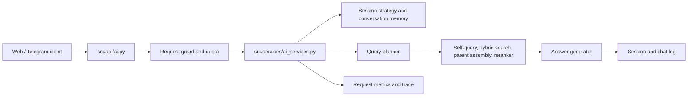

# Backend Architecture

## Runtime entry points

`main.py` starts the local server and offers maintenance commands. It creates
the FastAPI application from `application.py`. The application composes CORS,
rate limiting, security headers, request context, telemetry, and API routers.

## Chat request flow

`ai_services.py` is the orchestration boundary. It should coordinate the
stages above and not contain database or retrieval implementation details.

## Main modules

| Area | Responsibility |
| --- | --- |
| `src/api` | HTTP request validation and response contracts. |
| `src/services` | Application use cases, session strategy, quotas, and cache lifecycle. |
| `src/retrieval` | Query parsing, search, parent-child assembly, and reranking. |
| `src/generation` | Prompt construction, answer generation, memory, and summarization. |
| `src/monitoring` | Per-request metrics, persisted traces, cost, and telemetry. |
| `src/evaluation_agent` | Batch investigation of failed or abstained answers. |
| `src/auth`, `src/security` | Token verification, OAuth, browser origin, and input safety. |
| `src/admin` | Knowledge-base editing operations used by admin APIs. |

## Data boundaries

Supabase is the persistent source for chunks, sessions, logs, metrics, and
evaluation runs. In-process caches only improve latency. Cache cleanup must
never remove durable session data from Supabase.

The retrieval cache is revision-aware. When a knowledge-base revision changes,
old cache entries are not reused.
