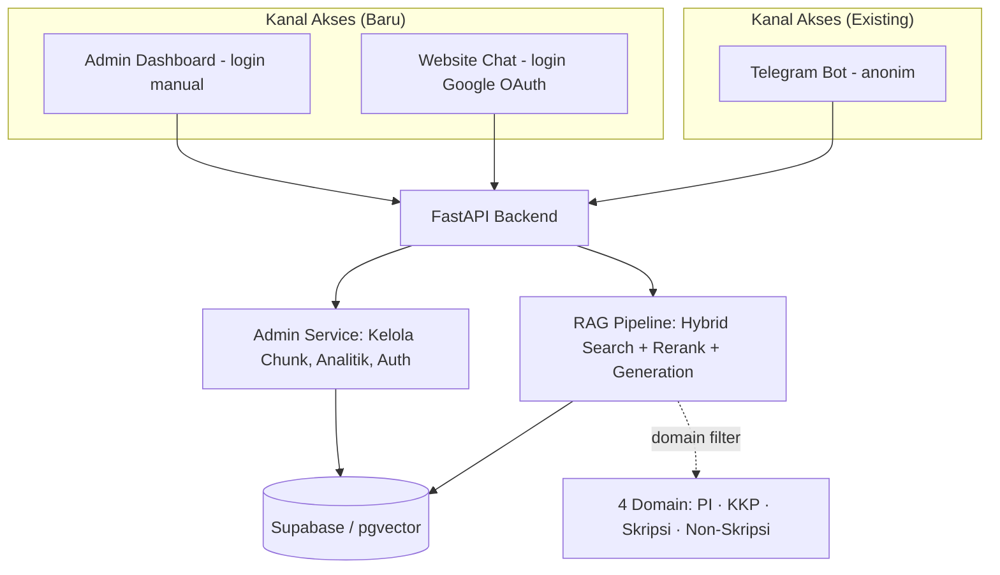
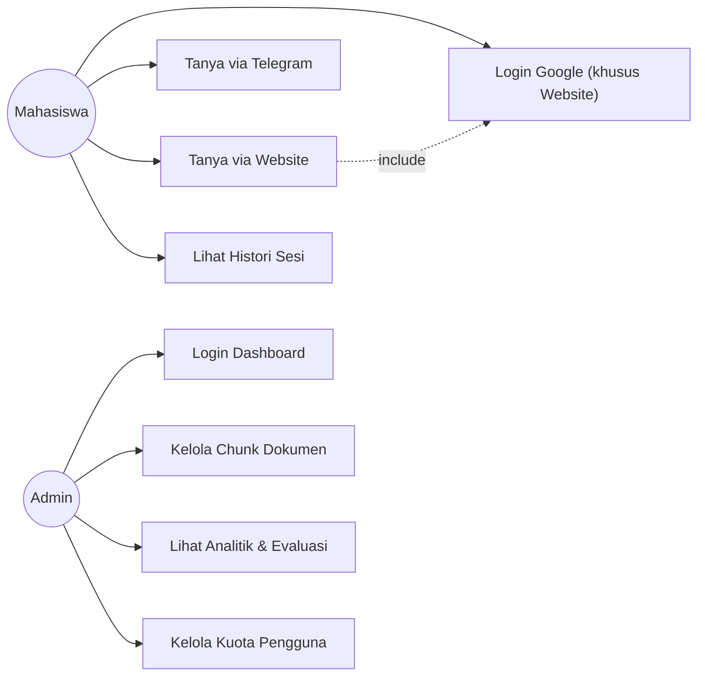

# SKPL — Spesifikasi Kebutuhan Perangkat Lunak
## Chatbot Asisten Virtual RAG Multi-Domain (PI / KKP / Skripsi / Non-Skripsi)
### STMIK Widya Cipta Dharma

| | |
|---|---|
| **Versi** | 1.1 — Draft Pengembangan Skripsi (revisi) |
| **Status** | Working Document |
| **Dasar** | Knowledge Base sistem eksisting (PI: *"Implementasi Chatbot Asisten Virtual Berbasis RAG untuk Membantu Mahasiswa dalam Mendapatkan Informasi Terkait PI/KKP di STMIK WCD"*) |
| **Tanggal disusun** | 29 Juli 2026 |

---

## 1. Pendahuluan

### 1.1 Latar Belakang & Tujuan Dokumen
Sistem PI sudah berjalan: chatbot RAG berbasis Telegram yang menjawab pertanyaan seputar pedoman **PI** dan **KKP** menggunakan hybrid search (BM25 + vector) di atas Supabase/pgvector. Dokumen ini mendefinisikan kebutuhan perangkat lunak untuk **mengembangkan sistem tersebut menjadi skripsi**, dengan tiga penambahan besar:

1. Perluasan cakupan pengetahuan dari 2 domain (PI, KKP) menjadi **4 domain** (+ Skripsi, + Non-Skripsi/jalur lulus non-skripsi).
2. Kanal akses baru: **Website** (login Google OAuth), melengkapi Telegram Bot yang sudah ada (tetap anonim).
3. Kanal pengelolaan baru: **Admin Dashboard**, untuk mengelola chunk dokumen sumber yang sudah ter-ingest dan memantau performa sistem — sesuatu yang saat ini masih manual lewat script CLI dan log konsol.

Dokumen ini menjadi acuan sebelum implementasi (ngoding) dimulai, dan menjadi dasar penulisan BAB Analisis Kebutuhan pada laporan skripsi.

### 1.2 Ruang Lingkup

| Aspek | Sistem PI (Eksisting) | Sistem Skripsi (Target) |
|---|---|---|
| Domain dokumen | PI, KKP (2 domain) | PI, KKP, Skripsi, Non-Skripsi (4 domain) |
| Antarmuka pengguna | Telegram Bot | Telegram Bot **+ Website** (Next.js) |
| Manajemen dokumen sumber | Manual via script (`loader.py`, `embedder.py`) dari terminal | Manual via script (dokumen baru) **+ Admin Dashboard** (edit, hapus, re-index chunk yang sudah ada) |
| Monitoring & analitik | Tidak ada (hanya log konsol `loguru`) | **Dashboard analitik** (jumlah user, jumlah pertanyaan, persentase domain, dan sebagainya) |
| Autentikasi | Tidak ada (publik + rate limit) | Telegram tetap tanpa login (anonim by `chat_id`); **Website wajib login Google OAuth** untuk mahasiswa; **login manual (username/password)** untuk admin |
| Metodologi pengembangan | — (dikerjakan sebagai satu kesatuan) | **Incremental Development** (bertahap per fitur, lihat Dok. 03) |

**Yang TIDAK berubah** (harus tetap dipertahankan): pipeline retrieval (hybrid search → rerank → parent-child expansion), guardrail anti-halusinasi, manajemen sesi & histori percakapan, deployment berbasis Docker.

### 1.3 Definisi, Akronim, dan Istilah

| Istilah | Penjelasan |
|---|---|
| RAG | Retrieval-Augmented Generation — LLM menjawab berdasarkan dokumen yang diambil, bukan hafalan model |
| PI | Penulisan Ilmiah — tugas akhir jalur mini-skripsi di STMIK WCD |
| KKP | Kuliah Kerja Praktik |
| Non-Skripsi | Jalur kelulusan alternatif tanpa menyusun skripsi (3 jalur: publikasi jurnal karya ilmiah Sinta, profesional (sudah bekerja di perusahaan resmi), wirausaha (memiliki usaha dalam bentuk produk/jasa — Startup, UD, CV, PT, dan sejenisnya)) |
| Domain (dalam konteks ini) | Kategori dokumen pedoman: PI / KKP / Skripsi / Non-Skripsi |
| Hybrid Search | Kombinasi pencarian keyword (BM25) dan pencarian vektor (embedding) |
| Parent/Child Chunk | Potongan kecil teks (child, untuk pencarian) yang tertaut ke teks konteks besar (parent, untuk dikirim ke LLM) |
| Reranking | Pengurutan ulang hasil pencarian dengan cross-encoder agar hasil paling relevan naik ke atas |
| OAuth | Protokol otorisasi standar — di sini dipakai agar mahasiswa login pakai akun Google tanpa sistem menyimpan password sendiri |
| SKPL | Spesifikasi Kebutuhan Perangkat Lunak (dokumen ini) |
| DPPL | Deskripsi Perancangan Perangkat Lunak (dokumen desain sistem) |
| Increment | Satu tahap pengembangan yang menghasilkan fitur utuh dan bisa didemokan |

### 1.4 Dokumen Acuan
- `AI_Knowledge_Base.md` — dokumentasi teknis sistem PI eksisting (sumber utama seluruh asumsi teknis di dokumen ini)
- Dokumen pedoman resmi kampus: Panduan PI, Panduan KKP, **Panduan Skripsi**, **Panduan Non-Skripsi** (dua terakhir perlu disiapkan sebagai sumber data ingestion)

---

## 2. Deskripsi Umum Sistem

### 2.1 Perspektif Produk

Sistem tetap satu backend FastAPI yang sama (reuse total investasi dari PI), tetapi diakses dari tiga kanal dengan skema identitas berbeda (Telegram anonim, Website login Google, Admin login manual) dan melayani empat domain pengetahuan.

### 2.2 Fungsi Utama Produk (Ringkasan)
- Menjawab pertanyaan mahasiswa terkait PI, KKP, Skripsi, dan Non-Skripsi secara akurat berbasis dokumen resmi kampus.
- Menyediakan histori percakapan per sesi, baik dari Telegram maupun Website.
- Memungkinkan admin mengelola chunk dokumen sumber tanpa harus menyentuh terminal/script.
- Memberi visibilitas ke admin tentang bagaimana chatbot digunakan dan seberapa baik kualitas jawabannya.

### 2.3 Karakteristik Pengguna (Aktor)

| Aktor | Deskripsi | Akses |
|---|---|---|
| **Mahasiswa** | Pengguna umum yang mencari informasi PI/KKP/Skripsi/Non-Skripsi | **Telegram Bot** — tanpa login, anonim by `chat_id`, dibatasi rate limit per sesi. **Website** — wajib login Google OAuth, dibatasi rate limit per akun |
| **Admin/Pengelola** | Pihak prodi yang mengelola konten & memantau sistem | Admin Dashboard — wajib login manual (username/password) |

### 2.4 Batasan Desain & Implementasi
- Backend tetap Python 3 / FastAPI / Langchain, database tetap Supabase (PostgreSQL + pgvector) — tidak migrasi stack, hanya diperluas.
- Biaya API OpenAI (embedding + generation) bertambah seiring volume dokumen (4 domain) dan kanal (3 kanal) — perlu diperhatikan saat estimasi `RATE_LIMIT_REQUESTS` dan ukuran korpus.
- Frontend (Website & Admin Dashboard): **Next.js**, terpisah dari backend FastAPI, berkomunikasi lewat REST API.
- Belum ada direktori `/tests` di sistem eksisting — pengembangan skripsi sebaiknya mulai memasukkan unit test dasar (lihat Dok. 03).
- Deployment untuk fase uji coba ke mahasiswa memakai platform **free-tier** (bukan Railway — biayanya sudah tidak lagi gratis di 2026) demi menekan biaya selama masa pengujian; detail platform ada di DPPL §9.
- Password admin **tetap disimpan dalam bentuk hash** (bukan plaintext); kemudahan reset saat lupa password difasilitasi lewat script CLI, bukan dengan menghilangkan hashing (lihat DPPL §5).

### 2.5 Asumsi & Ketergantungan
- Dokumen pedoman Skripsi dan Non-Skripsi tersedia dalam bentuk digital (PDF/Word) yang bisa diproses oleh pipeline ingestion yang sudah ada.
- Admin Dashboard awalnya cukup untuk **satu peran** (admin/pengelola prodi) — tidak ada multi-level role di versi awal, kecuali dibutuhkan kampus.
- Website mewajibkan login mahasiswa menggunakan **Google OAuth**, **tidak dibatasi domain email kampus** — siapa pun dengan akun Google dapat login.
- Telegram tetap tanpa login tambahan karena identitas Telegram (`chat_id`) sudah cukup untuk keperluan sesi & rate limiting saat ini.
- Dokumen baru (di luar Skripsi/Non-Skripsi awal) tetap ditambahkan lewat script CLI eksisting, bukan lewat Admin Dashboard — Dashboard hanya mengelola chunk yang sudah ter-ingest.

---

## 3. Kebutuhan Fungsional

### 3.1 Modul Inti RAG Multi-Domain

| ID | Kebutuhan |
|---|---|
| FR-CORE-01 | Sistem dapat menyimpan dan mengambil dokumen sumber untuk **4 domain**: PI, KKP, Skripsi, Non-Skripsi. |
| FR-CORE-02 | Sistem dapat memfilter hasil pencarian berdasarkan domain tertentu, baik secara eksplisit (mahasiswa menyebut "skripsi") maupun implisit (self-query). |
| FR-CORE-03 | Sistem dapat mendeteksi domain yang dimaksud secara otomatis ketika pertanyaan ambigu, dengan fallback yang jelas (mis. menanyakan klarifikasi domain ke pengguna). |
| FR-CORE-04 | Query expansion mengenali singkatan/istilah baru terkait Skripsi dan Non-Skripsi (perluasan dari `query_expansion.py` yang sudah ada untuk PI/KKP). |
| FR-CORE-05 | Sistem tetap menjaga guardrail anti-halusinasi: jawaban harus bersumber dari dokumen yang diambil, bukan pengetahuan umum LLM. |

### 3.2 Modul Website (Antarmuka Chat Publik)

| ID | Kebutuhan |
|---|---|
| FR-WEB-01 | Mahasiswa wajib login menggunakan akun Google (OAuth) sebelum dapat menggunakan fitur chat di Website. |
| FR-WEB-02 | Mahasiswa dapat mengirim pertanyaan dan menerima jawaban melalui antarmuka web, tanpa perlu Telegram. |
| FR-WEB-03 | Website menampilkan histori percakapan dalam sesi berjalan (persisten selama sesi aktif, mengikuti pola `conversation_sessions` yang ada, kini tertaut ke akun Google mahasiswa). |
| FR-WEB-04 | Website menampilkan indikator sumber jawaban (nama dokumen/bab) agar mahasiswa bisa menelusuri sumber aslinya. |
| FR-WEB-05 | Mahasiswa dapat memulai sesi baru (reset percakapan) kapan saja. |
| FR-WEB-06 | Website tunduk pada rate limit yang sama dengan Telegram, dihitung per akun mahasiswa (bukan per `session_id` anonim). |
| FR-WEB-07 | Tampilan responsif — dapat diakses dari desktop maupun mobile browser. |
| FR-WEB-08 | Website menampilkan sidebar navigasi berisi menu "Dokumen Panduan" (PI/KKP/Skripsi/Non-Skripsi) yang membuka dokumen asli secara statis — **tidak** memicu request ke endpoint chat/LLM, murni pengambilan file. |
| FR-WEB-09 | Mahasiswa dapat mengakses daftar riwayat obrolan terdahulu (terkelompok berdasarkan waktu) dan dapat menghapus percakapan dari sistem. |

### 3.3 Modul Admin Dashboard

| ID | Kebutuhan |
|---|---|
| FR-ADM-01 | Admin dapat login dengan kredensial (username/password) sebelum mengakses dashboard. |
| FR-ADM-02 | Admin dapat melihat daftar dokumen sumber yang sudah ter-ingest, dikelompokkan per domain. |
| FR-ADM-03 | Admin dapat menghapus atau memperbarui (re-index (chunk)) dokumen sumber yang sudah ada. |
| FR-ADM-04 | Admin dapat melihat status proses pembaruan (berhasil/gagal/sedang proses) untuk setiap chunk yang diubah. |
| FR-ADM-05 | Admin dapat melihat dashboard analitik: jumlah percakapan, pertanyaan terpopuler, distribusi pertanyaan per domain, dan skor evaluasi kualitas, dan sebagainya. |
| FR-ADM-06 | Admin dapat melihat/menyesuaikan konfigurasi kuota rate-limit per pengguna (memanfaatkan RPC kuota yang sudah ada). |

### 3.4 Use Case Diagram

### 3.5 Deskripsi Use Case Utama

**UC-00: Mahasiswa Login via Google (Website)**
- **Aktor**: Mahasiswa
- **Precondition**: Mahasiswa belum memiliki sesi aktif di Website
- **Alur Utama**: Mahasiswa klik "Login dengan Google" → redirect ke halaman consent Google → Google mengembalikan token identitas → backend memverifikasi token & membuat/memperbarui akun mahasiswa → sesi Website dibuat, tertaut ke akun
- **Postcondition**: Mahasiswa dapat mengakses fitur chat di Website

**UC-01: Mahasiswa Bertanya (via Website/Telegram)**
- **Aktor**: Mahasiswa
- **Precondition**: Sesi aktif (baru atau lanjutan); untuk Website, mahasiswa sudah login Google; untuk Telegram, tidak perlu login; belum melebihi rate limit
- **Alur Utama**: Mahasiswa mengetik pertanyaan → sistem klasifikasi intent → jika perlu retrieval, sistem deteksi domain → hybrid search + rerank → LLM susun jawaban dari konteks → jawaban ditampilkan beserta sumber
- **Postcondition**: Turn percakapan tersimpan di `conversation_sessions`

**UC-02: Admin Mengedit Chunk**
- **Aktor**: Admin
- **Precondition**: Admin sudah login
- **Alur Utama**: Admin pilih domain → admin pilih & edit chunk → proses embedding ulang → simpan ke database → status ditampilkan ke admin
- **Postcondition**: Chunk yang diedit langsung terpakai di pencarian berikutnya

**UC-03: Admin Meninjau Analitik**
- **Aktor**: Admin
- **Precondition**: Admin sudah login
- **Alur Utama**: Admin buka halaman analitik → sistem agregasi data dari database → tampilkan grafik/angka ringkas
- **Postcondition**: Admin mendapat informasi

---

## 4. Kebutuhan Non-Fungsional

| Kategori | Kebutuhan |
|---|---|
| **Performa** | Waktu respons chat (retrieval + generation) tetap dalam rentang wajar sesuai `REQUEST_TIMEOUT` eksisting (≤30 detik), meski korpus bertambah 2x domain. |
| **Keamanan** | Endpoint wajib terautentikasi sesuai kanalnya: admin (login manual + JWT/session), Website (token Google OAuth terverifikasi), Telegram (webhook secret, seperti sekarang). Password admin di-hash, bukan plaintext. |
| **Skalabilitas** | Skema database & pipeline retrieval harus tetap efisien saat volume dokumen bertambah ~2x (4 domain vs 2 domain). |
| **Usability** | Website dan Dashboard dapat digunakan tanpa training khusus — UI mengikuti pola umum aplikasi chat/dashboard. |
| **Reliabilitas** | Guardrail anti-halusinasi & mekanisme fallback ("tidak menemukan jawaban") tetap berfungsi di seluruh domain baru. |
| **Maintainability** | Kode baru mengikuti struktur folder modular yang sudah ada (`src/api`, `src/services`, dst.), bukan ditempel sembarangan. |
| **Portability** | Seluruh komponen baru tetap bisa dijalankan lewat Docker (`docker-compose.yml` diperluas, bukan diganti). |
| **Observability** | Log admin dashboard & proses edit-chunk baru tetap memakai `loguru`, konsisten dengan sistem eksisting. |

---

## 5. Matriks Ketertelusuran Kebutuhan → Increment

| ID Kebutuhan | Rencana di Increment |
|---|---|
| FR-CORE-01 s/d FR-CORE-05 | Increment 1 |
| FR-WEB-01 s/d FR-WEB-09 | Increment 2 |
| FR-ADM-01 s/d FR-ADM-04 | Increment 3 |
| FR-ADM-05 s/d FR-ADM-06 | Increment 4 |

> Detail lengkap tiap increment ada di **`03_Rencana_Pengembangan_Incremental.md`**. Rincian arsitektur, ERD, dan API untuk memenuhi kebutuhan di atas ada di **`02_DPPL_Perancangan_Sistem.md`**.