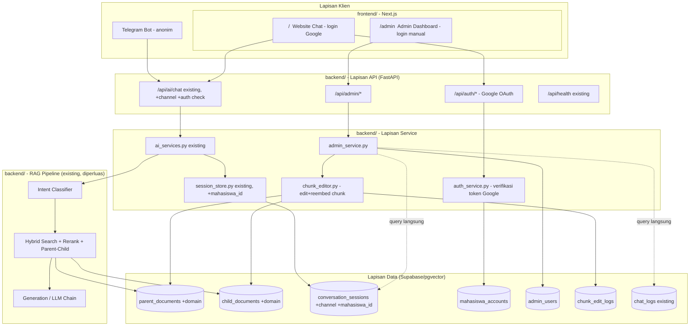
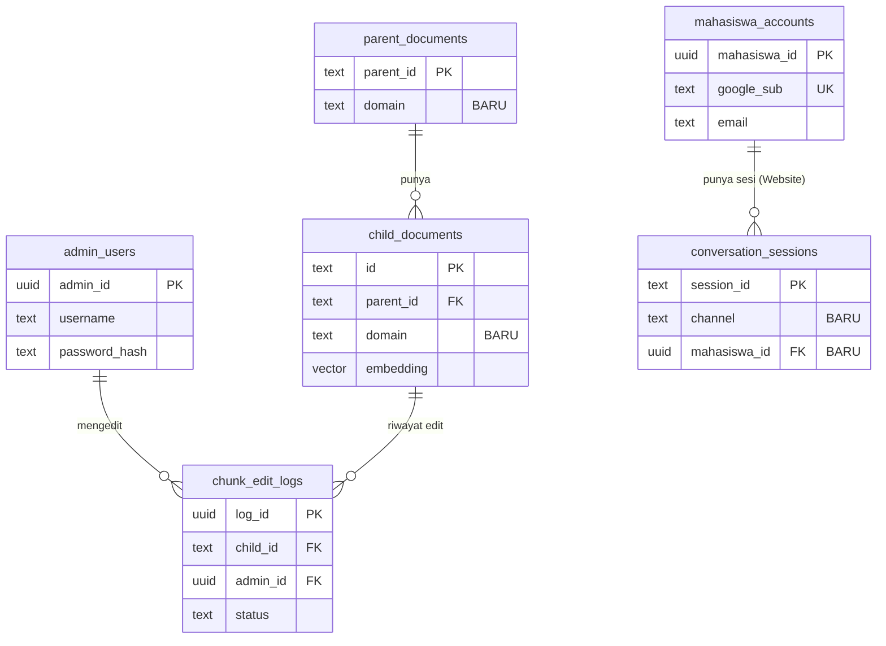
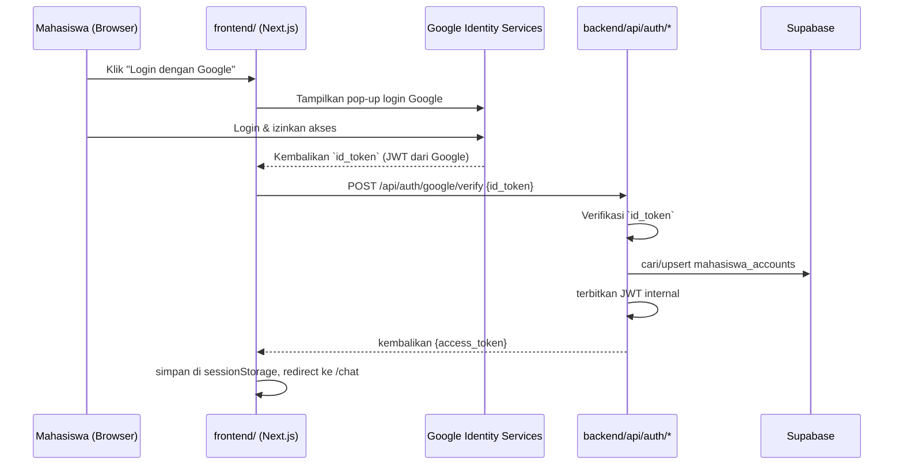
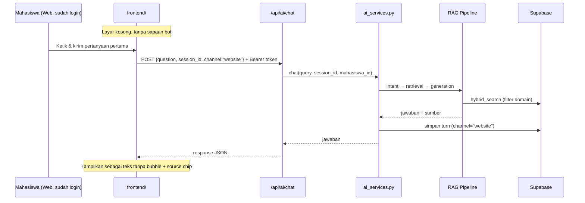
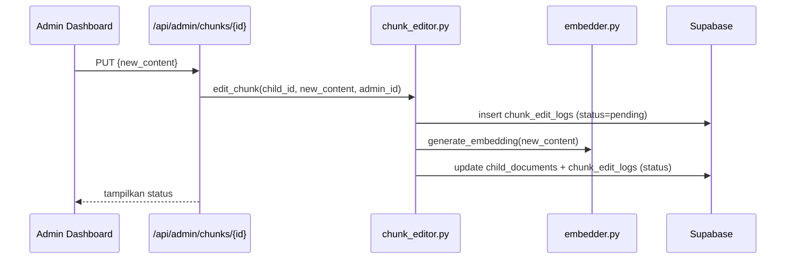

# DPPL — Deskripsi Perancangan Perangkat Lunak
## Chatbot Asisten Virtual RAG Multi-Domain (PI / KKP / Skripsi / Non-Skripsi)
### STMIK Widya Cipta Dharma

| | |
|---|---|
| **Versi** | 1.3 — Draft Pengembangan Skripsi (revisi: backend pindah ke Cloud Run + Cloudflare opsional) |
| **Acuan** | `01_SKPL_Spesifikasi_Kebutuhan.md` v1.1 (disetujui) |
| **Tanggal disusun** | 31 Juli 2026 |

---

## 1. Tujuan Dokumen
Menerjemahkan kebutuhan pada SKPL menjadi rancangan teknis: arsitektur, skema database, desain API, dan perubahan pada modul yang sudah ada di sistem PI. Dokumen ini jadi acuan langsung saat coding per increment.

**Perubahan pada revisi ini:**
- Struktur direktori dipisah tegas jadi `frontend/` dan `backend/` di root project.
- UI chat tanpa bubble untuk pesan bot (hanya teks polos + avatar kecil), user tetap pakai bubble — mengikuti pola ChatGPT/Gemini/Claude. Tidak ada sapaan pembuka otomatis dari bot.
- Dashboard admin **tidak lagi** menampilkan skor evaluasi Ragas (Faithfulness dkk) — diganti metrik yang diambil langsung dari database (chat_logs, conversation_sessions).
- Platform deployment backend: **GCP Cloud Run + beberapa layanan Cloudflare free tier (opsional)**, menggantikan rekomendasi Compute Engine+Tunnel sebelumnya.
- Metodologi pengujian: **Black Box Testing + UAT**, evaluasi Ragas tidak dipakai lagi untuk skripsi ini.

---

## 2. Arsitektur Sistem

### 2.1 Arsitektur Tingkat Tinggi



**Prinsip desain**: `frontend/` dan `backend/` adalah dua project terpisah di root repo, masing-masing punya siklus deploy sendiri (frontend ke Vercel, backend ke GCP). Telegram dan Website tetap berbagi endpoint chat yang sama di backend. Admin Dashboard punya jalur endpoint terpisah dengan auth sendiri, dan analitiknya query langsung ke tabel database yang sudah ada — tidak ada pipeline evaluasi tambahan (Ragas) yang perlu dijalankan.

### 2.2 Struktur Direktori (Dipisah Frontend/Backend)

```text
penelitian-ilmiah/
├── frontend/                     Next.js (satu project)
│   ├── app/
│   │   ├── (site)/
│   │   │   ├── chat/              : halaman chat — empty state di awal (tanpa sapaan), sidebar (Chat + Dokumen Panduan)
│   │   │   └── panduan/           : penampil dokumen panduan — fetch LANGSUNG ke Supabase Storage, tidak lewat backend
│   │   └── (admin)/               : dashboard admin (kelola chunk, analitik, kuota)
│   └── lib/api-client.ts         : wrapper fetch ke backend FastAPI (TIDAK dipakai oleh halaman /panduan)
│
├── backend/
│   ├── src/
│   │   ├── api/
│   │   │   ├── ai.py                 (existing, tambah param `channel` + cek token untuk channel="website")
│   │   │   ├── auth.py               : endpoint Google OAuth (login redirect, callback, logout, /me)
│   │   │   ├── admin.py              : endpoint dashboard (login admin, kelola chunk, analitik, kuota)
│   │   │   └── health.py             (existing)
│   │   ├── auth/
│   │   │   ├── google_oauth.py       : tukar authorization code → verifikasi token Google → ambil profil
│   │   │   └── jwt_utils.py          : terbitkan & validasi JWT untuk sesi mahasiswa (Website) & admin
│   │   ├── admin/
│   │   │   ├── auth.py               : login admin, hash password
│   │   │   ├── chunk_editor.py       : edit isi chunk existing, trigger re-embed, catat ke chunk_edit_logs
│   │   │   └── analytics.py          : agregasi data untuk dashboard — query langsung ke chat_logs/conversation_sessions, TIDAK memanggil modul evaluasi Ragas
│   │   ├── ingestion/
│   │   │   ├── loader.py             (existing, generalisasi ke 4 domain; TETAP CLI-only, tidak dipanggil dari UI)
│   │   │   └── embedder.py           (existing; dipakai ulang oleh chunk_editor.py untuk re-embed satu chunk)
│   │   ├── retrieval/
│   │   │   ├── self_query.py         (existing, tambah ekstraksi filter domain Skripsi/Non-Skripsi)
│   │   │   └── source_utils.py       (existing, generalisasi dari 2 → 4 tipe dokumen)
│   │   ├── generation/
│   │   │   └── intent_classifier/
│   │   │       └── constants.py      (existing, tambah kata kunci pemicu topik Skripsi/Non-Skripsi)
│   │   └── evaluation/                (existing, berisi `ragas_eval.py` dari sistem PI — DIBIARKAN ada di kode, TIDAK dipanggil di alur skripsi ini; lihat §4)
│   ├── config/
│   │   └── section_keywords.yaml     (existing, tambah mapping BAB untuk Panduan Skripsi & Non-Skripsi)
│   ├── scripts/
│   │   ├── supabase_migration_multidomain.sql   : kolom `domain`/`channel`/`mahasiswa_id`, tabel `mahasiswa_accounts`, `admin_users`, `chunk_edit_logs`
│   │   └── reset_admin_password.py   : reset password admin dari CLI tanpa perlu UI "lupa password" (lihat §6)
│   ├── tests/                        BARU (belum ada di sistem eksisting) — berisi test Black Box per fitur (lihat §4)
│   ├── Dockerfile
│   └── docker-compose.yml
│
└── docs/                          dokumen SKPL/DPPL/Rencana Increment ini
```

> Catatan migrasi: `Dockerfile` dan `docker-compose.yml` yang sekarang ada di root project eksisting pindah ke dalam `backend/`, karena hanya membungkus service backend. Frontend punya proses build/deploy sendiri (Vercel), tidak perlu Docker.

---

## 3. Perancangan Basis Data

### 3.1 Perubahan Skema

**`parent_documents` & `child_documents`** — tambah kolom `domain`:
```sql
ALTER TABLE parent_documents ADD COLUMN domain TEXT NOT NULL DEFAULT 'PI'
    CHECK (domain IN ('PI', 'KKP', 'SKRIPSI', 'NON_SKRIPSI'));
ALTER TABLE child_documents ADD COLUMN domain TEXT NOT NULL DEFAULT 'PI'
    CHECK (domain IN ('PI', 'KKP', 'SKRIPSI', 'NON_SKRIPSI'));
CREATE INDEX idx_child_documents_domain ON child_documents(domain);
```

**`conversation_sessions`** — tambah `channel` dan `mahasiswa_id` (nullable):
```sql
ALTER TABLE conversation_sessions ADD COLUMN channel TEXT NOT NULL DEFAULT 'telegram'
    CHECK (channel IN ('telegram', 'website'));
ALTER TABLE conversation_sessions ADD COLUMN mahasiswa_id UUID REFERENCES mahasiswa_accounts(mahasiswa_id);
```

**`mahasiswa_accounts`** (identitas dari Google OAuth):
```sql
CREATE TABLE mahasiswa_accounts (
    mahasiswa_id UUID PRIMARY KEY DEFAULT gen_random_uuid(),
    google_sub TEXT UNIQUE NOT NULL,
    email TEXT NOT NULL,
    nama TEXT,
    avatar_url TEXT,
    created_at TIMESTAMPTZ DEFAULT now(),
    last_login TIMESTAMPTZ
);
```

**`admin_users`**:
```sql
CREATE TABLE admin_users (
    admin_id UUID PRIMARY KEY DEFAULT gen_random_uuid(),
    username TEXT UNIQUE NOT NULL,
    password_hash TEXT NOT NULL,
    full_name TEXT,
    created_at TIMESTAMPTZ DEFAULT now(),
    last_login TIMESTAMPTZ
);
```
> Password **selalu di-hash** (bcrypt/argon2), tidak pernah disimpan plaintext. Reset password memakai `scripts/reset_admin_password.py`, bukan dengan menghilangkan hashing.

**`chunk_edit_logs`**:
```sql
CREATE TABLE chunk_edit_logs (
    log_id UUID PRIMARY KEY DEFAULT gen_random_uuid(),
    child_id TEXT NOT NULL REFERENCES child_documents(id),
    parent_id TEXT NOT NULL REFERENCES parent_documents(parent_id),
    admin_id UUID REFERENCES admin_users(admin_id),
    old_content TEXT,
    new_content TEXT,
    status TEXT NOT NULL DEFAULT 'pending' CHECK (status IN ('pending', 'processing', 'success', 'failed')),
    error_message TEXT,
    edited_at TIMESTAMPTZ DEFAULT now(),
    reembedded_at TIMESTAMPTZ
);
```

> Tabel `chat_logs` dan `user_quotas` **sudah ada** — perlu dikonfirmasi struktur asli, dan jadi sumber utama dashboard analitik (§4) karena sekarang tidak ada lagi skor Ragas untuk ditampilkan.

**Supabase Storage — bucket `panduan-dokumen`** (untuk FR-WEB-08): file PDF asli Panduan PI/KKP/Skripsi/Non-Skripsi, diakses **langsung** oleh frontend tanpa lewat backend.

### 3.2 ERD Ringkas



---

## 4. Dashboard Analitik — Tanpa Skor Ragas

Sebelumnya dashboard direncanakan menampilkan skor evaluasi Ragas (Faithfulness, Answer Relevancy, dst). Sesuai arahan terbaru, **metodologi pengujian untuk skripsi ini adalah Black Box Testing + UAT** (bukan evaluasi otomatis berbasis LLM), jadi dashboard tidak menampilkan skor semacam itu. Modul `evaluation/ragas_eval.py` dari sistem PI **tetap ada di kode** (tidak perlu dihapus) tapi tidak dipanggil di alur skripsi — baik dari dashboard maupun dari proses testing.

Sebagai gantinya, dashboard menampilkan **informasi yang bisa diturunkan langsung dari database**, tanpa proses evaluasi tambahan:

| Metrik | Sumber Data | Kenapa berguna |
|---|---|---|
| Total percakapan (harian/mingguan) | `chat_logs` / `conversation_sessions` | Tren pemakaian dari waktu ke waktu |
| Distribusi percakapan per channel (Telegram vs Website) | `conversation_sessions.channel` | Lihat kanal mana yang lebih sering dipakai |
| Distribusi pertanyaan per domain (PI/KKP/Skripsi/Non-Skripsi) | `child_documents.domain` yang ter-retrieve, dicatat di `chat_logs` | Domain mana yang paling banyak ditanyakan |
| Mahasiswa aktif unik (Website) | `COUNT(DISTINCT mahasiswa_id)` di `conversation_sessions` | Jangkauan pemakaian nyata (bukan cuma jumlah pesan) |
| Pertanyaan terpopuler / kata kunci sering muncul | Agregasi teks dari `chat_logs.question` | Konten mana yang paling dicari mahasiswa — berguna buat prioritas update dokumen |
| Tingkat "tidak ditemukan jawaban" (fallback rate) | Hitung response yang trigger fallback guardrail di `chat_logs` | Proxy sederhana untuk kualitas cakupan dokumen, tanpa perlu LLM evaluator |
| Rata-rata panjang percakapan (jumlah turn/sesi) | `conversation_sessions.turns` | Indikasi apakah mahasiswa perlu banyak follow-up untuk dapat jawaban |
| Aktivitas edit chunk terbaru | `chunk_edit_logs` | Admin bisa lihat riwayat perubahan konten sendiri |

Semua metrik ini dihitung dengan query SQL langsung (agregasi `COUNT`/`GROUP BY`) di `admin/analytics.py` — tidak ada proses async/LLM tambahan, jadi tidak menambah biaya API maupun waktu proses.

---

## 5. Perancangan API

### 5.1 Endpoint Existing (disesuaikan)
| Method | Path | Perubahan |
|---|---|---|
| POST | `/api/ai/chat` | Tambah field `channel`. `channel="website"` wajib header `Authorization: Bearer <token>`; `channel="telegram"` tetap seperti sekarang |
| GET | `/api/health` | Tidak berubah |

### 5.2 Endpoint Baru — Autentikasi Mahasiswa (Google OAuth)
| Method | Path | Deskripsi | Auth |
|---|---|---|---|
| POST | `/api/auth/google/verify` | Verifikasi `id_token` Google → buat/update `mahasiswa_accounts` → terbitkan JWT | Publik |
| POST | `/api/auth/logout` | Invalidasi sesi mahasiswa | Mahasiswa |
| GET | `/api/auth/me` | Profil mahasiswa yang login | Mahasiswa |

### 5.3 Endpoint Baru — Admin
| Method | Path | Deskripsi | Auth |
|---|---|---|---|
| POST | `/api/admin/login` | Login admin | Publik (kredensial) |
| POST | `/api/admin/logout` | Invalidasi sesi admin | Admin |
| GET | `/api/admin/documents` | List dokumen, filter domain | Admin |
| GET | `/api/admin/documents/{parent_id}/chunks` | List chunk di bawah satu dokumen | Admin |
| PUT | `/api/admin/chunks/{child_id}` | Edit chunk → re-embed → log | Admin |
| DELETE | `/api/admin/chunks/{child_id}` | Hapus satu chunk | Admin |
| DELETE | `/api/admin/documents/{parent_id}` | Hapus dokumen + seluruh chunk | Admin |
| GET | `/api/admin/chunks/{child_id}/edit-status` | Status proses edit/re-embed | Admin |
| GET | `/api/admin/analytics/summary` | Metrik §4 (agregasi langsung dari DB, **bukan** skor Ragas) | Admin |
| GET | `/api/admin/analytics/conversations` | List percakapan (filter tanggal/domain/channel) | Admin |
| GET | `/api/admin/quotas` | Status kuota semua user | Admin |
| PUT | `/api/admin/quotas/{id}` | Sesuaikan kuota user | Admin |

### 5.4 Skema Autentikasi
| | Mahasiswa (Website) | Admin | Telegram |
|---|---|---|---|
| Metode | Google OAuth 2.0 | Username/password (di-hash) | Webhook secret (existing) |
| Reset kredensial | Login ulang lewat Google | `scripts/reset_admin_password.py` | — |
| Token sesi | JWT | JWT | — |

---

## 6. Perubahan pada Modul Existing

| File | Perubahan |
|---|---|
| `backend/src/retrieval/source_utils.py` | Generalisasi deteksi 2 → 4 domain |
| `backend/src/retrieval/self_query.py` | Ekstraksi filter `domain` dari pertanyaan |
| `backend/src/retrieval/query_expansion.py` | Mapping istilah baru Skripsi/Non-Skripsi |
| `backend/config/section_keywords.yaml` | Tambah mapping BAB Panduan Skripsi & Non-Skripsi |
| `backend/src/generation/intent_classifier/constants.py` | Kata kunci pemicu topik baru |
| `backend/src/ingestion/loader.py` | Kenali field `domain`. Tetap CLI-only |
| `backend/src/ingestion/embedder.py` | Fungsi embed 1 chunk bisa dipanggil ulang oleh `chunk_editor.py` |
| `backend/src/api/ai.py` | Terima `channel`; validasi token untuk `channel="website"`; log ke `chat_logs` |
| `backend/src/services/session_store.py` | Simpan/baca `channel` & `mahasiswa_id` |
| `backend/scripts/reset_admin_password.py` (BARU) | `python reset_admin_password.py --username admin --new-password xxxxx` → hash → update `admin_users.password_hash`. Password tetap tidak pernah plaintext |
| `backend/src/evaluation/ragas_eval.py` (existing) | **Tidak dihapus**, tapi tidak dipanggil dari dashboard maupun pipeline testing skripsi ini (lihat §4 dan §8) |

---

## 7. Rancangan Antarmuka (Wireframe Tekstual)

Mockup interaktif lengkap: `mockup-ui-sidebar.html` (menyertai dokumen ini). Perubahan utama dari draft sebelumnya: **pesan bot tanpa bubble** (teks polos + avatar kecil di kiri, mengikuti pola ChatGPT/Gemini/Claude), **user tetap pakai bubble** di kanan, dan **tidak ada sapaan otomatis** saat chat baru dibuka — layar kosong langsung menampilkan kolom input di tengah.

### 7.1 Website — Chat Baru (Empty State, Tanpa Sapaan)
```
┌───────────────┬─────────────────────────────────────┐
│ ● Asisten WCD  │                                       │
│ [+ Chat baru]  │                                       │
│ 💬 Chat  ◀     │            Asisten WCD                │
│ 📄 Dok. Panduan│  Tanyakan apa saja seputar PI, KKP,   │
│   - Panduan PI │  Skripsi, atau jalur Non-Skripsi      │
│   - Panduan KKP│                                       │
│   - Skripsi    │     [ input teks..........] [Kirim]  │
│   - Non-Skripsi│                                       │
│                │                                       │
│ [Avatar] Nama  │                                       │
└───────────────┴─────────────────────────────────────┘
```

### 7.2 Website — Setelah Ada Percakapan (Bot Tanpa Bubble)
```
┌───────────────┬─────────────────────────────────────┐
│ ● Asisten WCD  │                                       │
│ [+ Chat baru]  ├─────────────────────────────────────┤
│ 💬 Chat  ◀     │                    [Bubble User] ... │
│ 📄 Dok. Panduan│                                       │
│   - Panduan PI │  W  Untuk mengambil KKP, kamu perlu  │
│   - Panduan KKP│     sudah menempuh minimal 90 SKS..  │
│   - Skripsi    │     📄 Panduan KKP · BAB II          │
│   - Non-Skripsi│                                       │
├─────────────────────────────────────────────────────┤
│  [input teks............] [Kirim]                     │
└───────────────┴─────────────────────────────────────┘
```
*(baris "W" di kiri = avatar kecil bot, bukan bubble — teks jawaban langsung menyatu dengan latar halaman)*

### 7.3 Website — Dokumen Panduan (statis, tidak berubah dari draft sebelumnya)
```
┌───────────────┬─────────────────────────────────────┐
│ ● Asisten WCD  │  Dokumen Panduan    ⚡ tanpa API chat │
│ [+ Chat baru]  ├─────────────────────────────────────┤
│ 💬 Chat        │ [Panduan PI][KKP][Skripsi][Non-Skr.] │
│ 📄 Dok. Panduan▾│   Panduan Penulisan Ilmiah (PI)      │
│   - Panduan PI◀│   PDF · 42 halaman                   │
│   - Panduan KKP│   BAB I — Pendahuluan ...             │
│   - Skripsi    │                                       │
│   - Non-Skripsi│                                       │
│ [Avatar] Nama  │                                       │
└───────────────┴─────────────────────────────────────┘
```

### 7.4 Admin Dashboard — Kelola Dokumen & Chunk
```
┌───────────────────────────────────────────────┐
│ Sidebar          │  Dokumen Sumber              │
│ - Dashboard       │  [Filter: Semua Domain ▾]    │
│ - Dokumen ◀       │  (tanpa tombol upload)        │
│ - Analitik         │                             │
│ - Kuota User       │  ▸ Panduan PI      [12 chunk]│
│ - Logout           │  ▾ Panduan Skripsi [15 chunk]│
│                     │     - Chunk #3  [Edit][Hapus]│
└───────────────────────────────────────────────┘
```

### 7.5 Admin Dashboard — Analitik (Tanpa Skor Ragas)
```
┌───────────────────────────────────────────────┐
│  Total Percakapan: 1.204   Mhs aktif: 340       │
│  Telegram: 640   Website: 564                   │
│  Fallback rate: 6.2%                             │
│  ┌─────────────┐  ┌─────────────────────────┐ │
│  │ Grafik per   │  │ Pertanyaan Terpopuler    │ │
│  │ Domain       │  │ 1. Syarat pembimbing PI  │ │
│  │ (bar chart)  │  │ 2. Format Skripsi BAB I  │ │
│  └─────────────┘  └─────────────────────────┘ │
└───────────────────────────────────────────────┘
```

---

## 8. Sequence Diagram — Alur Kunci

### 8.1 Mahasiswa Login via Google (Website)


### 8.2 Mahasiswa Bertanya via Website (Empty State → Active Chat)


### 8.3 Admin Mengedit Chunk


---

## 9. Strategi Deployment

Konteks: sistem akan dibagikan ke mahasiswa untuk diuji dan dimintai feedback lewat Google Form (bukan produksi permanen bertrafik tinggi) — prioritas **gratis**, bukan performa maksimal.

| Komponen | Platform | Catatan |
|---|---|---|
| Frontend (`frontend/`, Next.js) | **Vercel** (Hobby/free) | Dibuat khusus untuk Next.js, deploy dari GitHub, gratis untuk skala uji coba kampus |
| Backend (`backend/`, FastAPI + Docker) | **GCP Cloud Run** | Serverless container — deploy langsung dari `backend/Dockerfile` (`gcloud run deploy`), tanpa perlu kelola VM/OS/systemd sama sekali. Free tier: 2 juta request/bulan, 180.000 vCPU-detik & 360.000 GiB-detik compute/bulan — sangat cukup untuk skala uji coba mahasiswa. Otomatis dapat URL HTTPS publik (`*.run.app`) tanpa setup domain/SSL manual |
| Eksposur ke publik | **URL `*.run.app` bawaan Cloud Run** (cukup ini saja) | Mahasiswa **tidak perlu tahu URL backend ini** — mereka hanya buka link frontend Vercel; frontend yang memanggil URL Cloud Run di baliknya lewat `NEXT_PUBLIC_API_URL` (CORS diaktifkan khusus origin Vercel) |
| Lapisan tambahan (opsional) | **Cloudflare free tier** di depan Cloud Run, lewat 1 domain custom | Bukan keharusan (Cloud Run sudah publik+HTTPS sendiri), tapi berguna sebagai lapisan proteksi tambahan selama UAT terbuka ke banyak mahasiswa — lihat rincian di bawah |
| Database + Storage dokumen panduan | **Supabase** (free tier, sudah dipakai) | Tidak berubah |
| ~~Compute Engine~~ / ~~Cloudflare Tunnel~~ / ~~Railway~~ / ~~Render~~ | Tidak dipakai | Cloud Run menghilangkan kebutuhan kelola VM manual (tidak perlu `cloudflared`/systemd/firewall) sekaligus tidak ada biaya minimum bulanan seperti Railway |

**Kenapa Cloud Run dibanding Compute Engine**: tidak perlu setup VM/OS/`cloudflared` secara manual — cukup `gcloud run deploy`, Google yang urus scaling, patching OS, dan sertifikat HTTPS. Trade-off: Cloud Run **scale-to-zero** saat idle (supaya tetap gratis, `min-instances=0`), jadi tetap ada cold start ketika request pertama datang setelah idle. Karena backend memuat model ML (`sentence-transformers`, cross-encoder reranker) saat start, **ukur langsung durasi cold start di Increment 0** sebelum asumsi ini "cukup cepat" — kalau ternyata berat, opsi mitigasinya: perkecil ukuran image Docker, atau load model secara lazy (baru dimuat saat dipakai pertama kali, bukan saat container start).

**Kalau `docker-compose.yml` existing cuma menjalankan 1 service (backend FastAPI saja — situasi umum karena Supabase itu managed/eksternal)**: migrasi ke Cloud Run tinggal deploy `backend/Dockerfile`-nya langsung. `docker-compose.yml` tidak lagi dipakai untuk production, cukup disimpan untuk development lokal.

**Layanan Cloudflare free tier yang relevan dipakai** (opsional, di depan Cloud Run lewat domain custom):

| Layanan | Manfaat untuk sistem ini |
|---|---|
| **Cloudflare DNS + Proxy** | Domain custom yang lebih rapi di depan URL `*.run.app` (opsional — sistem tetap jalan tanpa ini) |
| **WAF managed rules (free)** | Blokir pola serangan umum sebelum sampai ke Cloud Run |
| **Rate Limiting rules (free, terbatas jumlah rule)** | Lapisan pembatas tambahan di edge, melengkapi `RateLimitMiddleware` yang sudah ada di aplikasi — mengurangi request "sampah" yang ikut memakan kuota gratis Cloud Run |
| **Cloudflare Access (Zero Trust, gratis s/d 50 user)** | *Opsional* — tambahan gerbang login di depan rute `/admin`, sebagai lapisan kedua selain login admin di level aplikasi |

> Kalau mau paling sederhana dulu (tanpa domain custom sama sekali), backend bisa langsung dipakai lewat URL `*.run.app` bawaan tanpa Cloudflare sama sekali — baru tambahkan lapisan Cloudflare di atas kalau memang dibutuhkan (mis. sebelum Increment 6 dibuka ke banyak mahasiswa).

---

## 10. Metodologi Pengujian: Black Box Testing + UAT

Ragas **tidak dipakai** untuk skripsi ini. Modul `ragas_eval.py` peninggalan sistem PI dibiarkan ada di kode tapi tidak diaktifkan.

- **Black Box Testing** — pengujian fungsional per requirement (FR-CORE, FR-WEB, FR-ADM di SKPL), tanpa melihat isi kode: siapkan test case (input pertanyaan/aksi → hasil yang diharapkan), jalankan, catat pass/fail. Cocok dijadikan tabel test case di laporan skripsi (BAB Pengujian).
- **UAT (User Acceptance Testing)** — dilakukan lewat Increment 6 (deploy ke mahasiswa nyata + Google Form). Hasil UAT (tingkat kepuasan, bug yang dilaporkan, saran) jadi data pendukung BAB Hasil & Pembahasan, menggantikan posisi yang sebelumnya diisi skor Ragas.

Detail test case & jadwal ada di `03_Rencana_Pengembangan_Incremental.md`.

---

## 11. Ringkasan Keputusan Desain

| Keputusan | Alasan |
|---|---|
| `frontend/` dan `backend/` dipisah di root project | Siklus deploy beda (Vercel vs GCP), tim/diri sendiri bisa kerja di satu sisi tanpa campur aduk dependency |
| Mahasiswa login Google **hanya** di Website | Telegram sudah punya identitas bawaan (`chat_id`) |
| `google_sub` sebagai kunci unik, bukan `email` | `sub` permanen, email bisa berubah |
| Admin Dashboard hanya kelola chunk existing, tanpa upload | Scope realistis untuk timeline skripsi |
| Password admin tetap di-hash + script CLI reset | Kebutuhan "gampang direset" tanpa menyimpan plaintext |
| Dokumen panduan asli di Supabase Storage, diakses langsung dari frontend | Memenuhi syarat "tidak boleh hit API" untuk menu Dokumen Panduan |
| Bot tanpa bubble, tanpa sapaan pembuka | Mengikuti pola UI chat modern (ChatGPT/Gemini/Claude), sesuai permintaan |
| Dashboard analitik pakai query langsung ke DB, bukan skor Ragas | Selaras dengan keputusan pindah ke Black Box Testing + UAT — tidak perlu pipeline evaluasi LLM tambahan |
| Backend di GCP Cloud Run (bukan Compute Engine/Render) | Serverless, tanpa kelola VM manual, free tier generous (2 juta request/bulan); trade-off cold start diterima demi kesederhanaan operasional untuk proyek solo |
| Cloudflare dipakai sebagai lapisan opsional (WAF/rate limit/Access), bukan keharusan | Cloud Run sudah publik+HTTPS bawaan; Cloudflare cuma menambah proteksi ekstra saat dibuka ke banyak mahasiswa (Increment 6), bukan komponen wajib arsitektur |
| `ragas_eval.py` dibiarkan di kode, tidak dihapus | Tidak ada urgensi menghapus kode existing yang berfungsi; cukup tidak diaktifkan di alur baru |