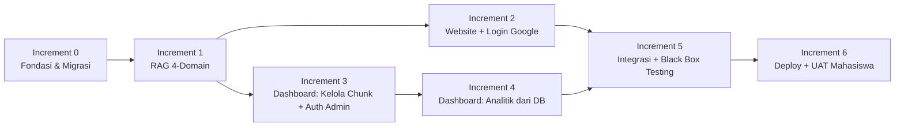

# Rencana Pengembangan Incremental
## Chatbot Asisten Virtual RAG Multi-Domain (PI / KKP / Skripsi / Non-Skripsi)
### STMIK Widya Cipta Dharma

| | |
|---|---|
| **Versi** | 1.3 — Draft Pengembangan Skripsi (revisi: backend pindah ke Cloud Run + Cloudflare opsional) |
| **Acuan** | `01_SKPL_Spesifikasi_Kebutuhan.md` v1.1 (disetujui), `02_DPPL_Perancangan_Sistem.md` v1.3 |
| **Tanggal disusun** | 31 Juli 2026 |

---

## 1. Mengapa Incremental Development

1. **Sistem PI eksisting sudah berfungsi dan dipakai** — Telegram Bot tetap harus bisa dipakai selama pengembangan berlangsung.
2. **Setiap increment menghasilkan sesuatu yang bisa didemokan** ke dosen pembimbing.
3. **Risiko lebih terkendali** — kalau satu increment molor, increment lain tetap jadi hasil utuh yang bisa dilaporkan.

Prinsip pembagian: setiap increment = satu subsistem yang **utuh dan bisa diuji end-to-end**.

---

## 2. Peta Increment

---

## 3. Detail per Increment

### Increment 0 — Fondasi & Migrasi
**Tujuan**: menyiapkan pondasi teknis tanpa mengubah perilaku sistem yang sudah berjalan.

| | |
|---|---|
| **Lingkup masuk** | Restrukturisasi repo jadi `frontend/` dan `backend/` (pindahkan kode existing ke `backend/src/`, `Dockerfile` ikut pindah ke `backend/`); migrasi skema DB (`domain`, `channel`, `mahasiswa_id`; tabel `mahasiswa_accounts`, `admin_users`, `chunk_edit_logs`); scaffold `frontend/` (Next.js); siapkan dokumen Panduan Skripsi & Non-Skripsi jadi format siap-ingest |
| **Lingkup keluar** | Belum ada fitur baru yang user-facing |
| **Definition of Done** | Repo terstruktur `frontend/`+`backend/`; migrasi SQL berjalan tanpa error; deploy percobaan ke Cloud Run berhasil diakses lewat URL `*.run.app` (halaman placeholder cukup), durasi cold start sudah terukur; sistem Telegram existing tetap berfungsi normal setelah migrasi & pindah folder |
| **Estimasi durasi** | 1–1.5 minggu |

### Increment 1 — Ekspansi RAG Core ke 4 Domain
**Tujuan**: backend dapat menjawab pertanyaan dari 4 domain lewat Telegram — website & dashboard belum ada.

| | |
|---|---|
| **Lingkup masuk** | Ingest dokumen Skripsi & Non-Skripsi (CLI); update `source_utils.py`, `self_query.py`, `query_expansion.py`, `section_keywords.yaml`, `intent_classifier/constants.py` |
| **Requirement terkait** | FR-CORE-01 s/d FR-CORE-05 |
| **Definition of Done** | Mahasiswa bisa tanya soal Skripsi/Non-Skripsi via Telegram dan dapat jawaban benar bersumber |
| **Testing** | **Black Box Testing**: siapkan minimal 10-15 test case pertanyaan per domain (total ±40-60 test case), verifikasi jawaban & sumber sesuai ekspektasi, catat pass/fail di tabel test case |
| **Estimasi durasi** | 2–3 minggu |

### Increment 2 — Website: Chat + Login Google
**Tujuan**: mahasiswa login Google lalu chat lewat browser, dengan UI sidebar tanpa bubble-bot.

| | |
|---|---|
| **Lingkup masuk** | Scaffold `frontend/app/(site)`; alur Google OAuth; halaman chat sesuai `mockup-ui-sidebar.html` — **empty state tanpa sapaan** saat baru buka, **pesan bot tanpa bubble** (teks polos + avatar kecil), user tetap bubble; sidebar dengan menu Dokumen Panduan; bucket Supabase Storage `panduan-dokumen` + halaman `/panduan` (fetch langsung, tanpa lewat backend); endpoint `/api/ai/chat` terima `channel:"website"` + validasi token |
| **Requirement terkait** | FR-WEB-01 s/d FR-WEB-08 |
| **Definition of Done** | Mahasiswa login Google, chat baru dimulai tanpa sapaan bot, jawaban bot tampil tanpa bubble dengan sumber, menu Dokumen Panduan terbukti **tidak** memicu request ke `/api/ai/chat` (dicek lewat network tab) |
| **Testing** | Black Box Testing: alur login, alur chat kosong→terisi, alur buka Dokumen Panduan (pastikan 0 request ke `/api/ai/chat` saat baca dokumen) |
| **Estimasi durasi** | 2.5–3 minggu |

### Increment 3 — Admin Dashboard: Kelola Chunk & Autentikasi
**Tujuan**: admin login dan mengelola chunk dokumen sumber tanpa CLI.

| | |
|---|---|
| **Lingkup masuk** | Login admin manual (JWT); `frontend/app/(admin)`; list dokumen & chunk per domain; edit chunk → re-embed; hapus chunk/dokumen; status proses edit; script `reset_admin_password.py` |
| **Requirement terkait** | FR-ADM-01 s/d FR-ADM-04 |
| **Definition of Done** | Admin login, edit chunk sampai ter-reembed dan langsung terpakai di jawaban berikutnya; admin bisa reset password sendiri lewat CLI |
| **Testing** | Black Box Testing: edit chunk valid/invalid, akses endpoint admin tanpa token (harus ditolak), reset password via CLI lalu login pakai password baru |
| **Estimasi durasi** | 2–2.5 minggu |

### Increment 4 — Admin Dashboard: Analitik dari Database
**Tujuan**: admin punya visibilitas penggunaan sistem — **tanpa** skor evaluasi Ragas.

| | |
|---|---|
| **Lingkup masuk** | Dashboard ringkasan: total percakapan, distribusi channel (Telegram/Website), distribusi domain, mahasiswa aktif unik, pertanyaan terpopuler, fallback rate, rata-rata panjang percakapan (lihat DPPL §4 untuk daftar lengkap & sumber query); manajemen kuota per user |
| **Requirement terkait** | FR-ADM-05 s/d FR-ADM-06 |
| **Definition of Done** | Semua metrik di atas tampil benar di dashboard, tervalidasi cocok dengan query manual ke `chat_logs`/`conversation_sessions`; **tidak ada** tampilan skor Ragas di UI |
| **Testing** | Black Box Testing: bandingkan angka dashboard vs query SQL manual; cek dashboard tidak error saat ada sesi Telegram tanpa `mahasiswa_id` |
| **Estimasi durasi** | 1.5–2 minggu |

### Increment 5 — Integrasi & Black Box Testing Menyeluruh
**Tujuan**: semua komponen jalan sebagai satu sistem utuh, teruji sistematis sebelum dibuka ke mahasiswa.

| | |
|---|---|
| **Lingkup masuk** | Uji regresi menyeluruh (Telegram + Website + Dashboard bersamaan); **matriks Black Box Testing lengkap** mencakup seluruh FR & NFR di SKPL (test case per requirement, hasil pass/fail didokumentasikan buat BAB Pengujian skripsi); dokumentasi deployment; unit test dasar untuk modul kritikal (`retrieval/`, `auth/`, `admin/`) di `backend/tests/` |
| **Requirement terkait** | Seluruh FR & NFR di SKPL |
| **Definition of Done** | Seluruh test case Black Box Testing lulus (atau bug tercatat & diprioritaskan); sistem stabil jalan di `backend/` (Docker di GCP) + `frontend/` (build Next.js sukses) |
| **Estimasi durasi** | 2 minggu |

### Increment 6 — Deploy & UAT (User Acceptance Testing) Mahasiswa
**Tujuan**: sistem diakses mahasiswa nyata lewat 1 link publik, feedback dikumpulkan sebagai data UAT.

| | |
|---|---|
| **Lingkup masuk** | Deploy `frontend/` ke Vercel; deploy `backend/` ke **Cloud Run** (production revision); *(opsional)* pasang domain custom + WAF/Rate Limiting Cloudflare di depan Cloud Run kalau mau lapisan proteksi tambahan; pastikan Google OAuth consent screen sudah **"In production"** (bukan "Testing" yang dibatasi 100 user); buat Google Form UAT (keakuratan jawaban, kemudahan pakai, bug, saran); sebar link (URL Vercel) ke mahasiswa |
| **Requirement terkait** | Validasi lapangan atas seluruh FR & NFR — bagian UAT dari metodologi pengujian |
| **Definition of Done** | Mahasiswa di luar tim pengembang berhasil login, chat, dan buka Dokumen Panduan lewat link publik tanpa dibantu; minimal N responden mengisi Google Form (sesuaikan target dengan bimbingan) |
| **Testing** | **UAT** — hasil Google Form direkap jadi data kuantitatif (rata-rata skor kepuasan dsb.) & kualitatif (bug/saran) untuk BAB Hasil & Pembahasan, menggantikan posisi yang sebelumnya diisi skor Ragas |
| **Estimasi durasi** | 1–2 minggu aktif deploy + masa tunggu feedback (bisa paralel dengan penulisan laporan) |

---

## 4. Risiko & Mitigasi

| Risiko | Dampak | Mitigasi |
|---|---|---|
| Dokumen Panduan Skripsi/Non-Skripsi belum tersedia digital dari kampus | Increment 1 tertunda | Minta dokumen di awal, paralel dengan Increment 0 |
| Restrukturisasi folder (`frontend/`+`backend/`) di awal berisiko merusak sistem Telegram yang sedang jalan | Downtime tidak disengaja | Lakukan di branch terpisah, tes penuh sebelum merge ke branch utama; punya rollback plan |
| Mode "Testing" Google OAuth dibatasi maks. 100 user terdaftar manual | Mahasiswa di luar daftar tidak bisa login saat Increment 6 | Pindahkan consent screen ke status **"In production"** sebelum Increment 6 (untuk scope OAuth dasar seperti email/profil biasanya tidak perlu review manual yang lama) |
| Cloud Run scale-to-zero bikin cold start saat idle — backend memuat model ML (`sentence-transformers`, cross-encoder) yang bisa memperlambat startup instance baru | Kesan pertama mahasiswa penguji lambat, mirip risiko Render sebelumnya tapi biasanya lebih cepat | Ukur durasi cold start senyatanya di Increment 0; kalau berat, perkecil image Docker atau lazy-load model; kasih catatan singkat di UI kalau respons pertama agak lama |
| Biaya API OpenAI membengkak (korpus 2x + 3 kanal) | Anggaran terbatas | Pantau token usage sejak Increment 1 |
| Data analitik campur antara sesi anonim (Telegram) dan sesi berakun (Website) | Statistik dashboard salah tafsir | Semua query analitik wajib bisa difilter per `channel` |
| Scope creep di Admin Dashboard | Molor dari target sidang | DoD per increment dikunci di awal |
| Belum ada automated test di sistem eksisting | Regresi sulit terdeteksi | Mulai tulis unit test dasar sejak Increment 1, bukan nunggu Increment 5 |
| Hasil UAT (Google Form) responnya sedikit/bias (cuma diisi teman dekat) | Data BAB Hasil & Pembahasan kurang representatif | Sebar ke lebih dari satu angkatan/kelas kalau memungkinkan; ajukan ke pembimbing berapa jumlah responden minimal yang dianggap cukup |

---

## 5. Ringkasan Milestone

| Increment | Estimasi Durasi | Output yang Bisa Didemokan |
|---|---|---|
| 0 — Fondasi & Migrasi | 1–1.5 minggu | Repo terstruktur frontend/backend, deploy percobaan Cloud Run berhasil, sistem lama tidak rusak |
| 1 — RAG 4-Domain | 2–3 minggu | Bot Telegram bisa jawab soal Skripsi & Non-Skripsi |
| 2 — Website + Login Google | 2.5–3 minggu | Mahasiswa login, chat tanpa bubble-bot, buka Dokumen Panduan statis |
| 3 — Dashboard: Kelola Chunk + Auth | 2–2.5 minggu | Admin edit/hapus chunk dari UI, reset password sendiri |
| 4 — Dashboard: Analitik dari DB | 1.5–2 minggu | Admin lihat statistik pemakaian nyata (bukan skor Ragas) |
| 5 — Integrasi & Black Box Testing | 2 minggu | Matriks test case lengkap, siap didemokan untuk sidang |
| 6 — Deploy & UAT Mahasiswa | 1–2 minggu aktif | Link publik live, data UAT asli buat BAB Hasil & Pembahasan |

**Total estimasi**: ± 12.5–16.5 minggu kerja aktif (di luar waktu tunggu dokumen, approval Google OAuth, revisi bimbingan, dan masa tunggu feedback UAT). Sesuaikan dengan kalender bimbingan/sidang kampus kamu.

> Review ulang dokumen ini tiap akhir increment — requirement baru dari dosen pembimbing cukup ditambahkan sebagai increment baru, tanpa merombak increment yang sudah selesai.