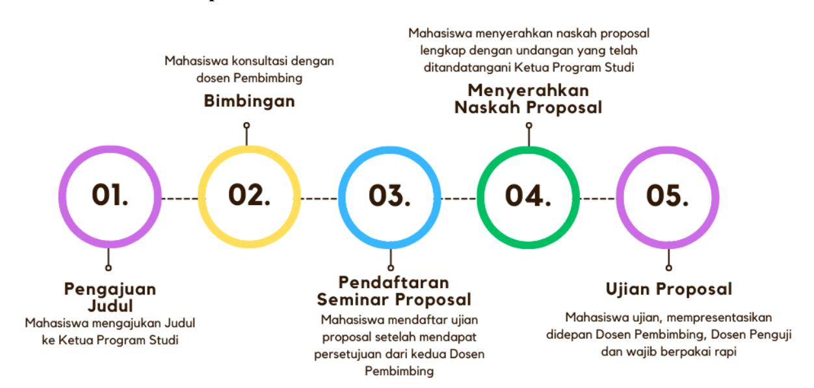
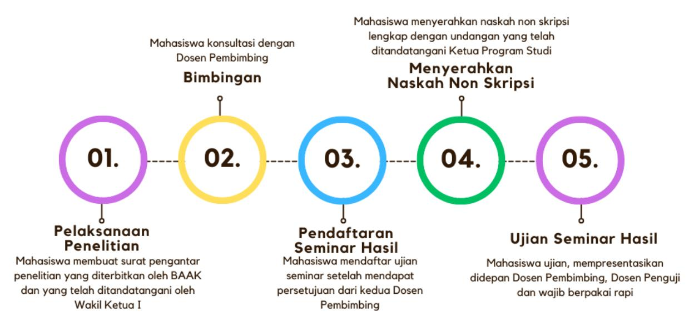
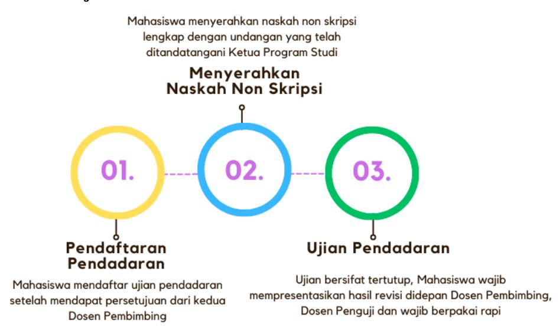

# Panduan Penulisan Tugas Akhir Non Skripsi

**STMIK Widya Cipta Dharma**
**CENTER OF EXCELLENCE**
**REKTORAT**

# **PANDUAN PENULISAN TUGAS AKHIR NON SKRIPSI**

**SEKOLAH TINGGI MANAJEMEN INFORMATIKA DAN KOMPUTER WIDYA CIPTA DHARMA**

#### **KATA PENGANTAR**

Puji syukur kami panjatkan ke hadirat Tuhan Yang Maha Esa atas Rahmat dan Karunia-Nya sehingga buku panduan penulisan laporan Tugas Akhir Non Skripsi ini dapat diselesaikan dengan baik. Buku panduan ini disusun sebagai acuan bagi seluruh civitas akademika dalam pelaksanaan penyusunan Tugas Akhir Non Skripsi yang digunakan sebagai syarat akademik terakhir yang harus dipenuhi oleh mahasiswa dalam menyelesaikan studi jenjang program sarjana.

Panduan ini dirancang dengan memperhatikan setiap ketentuan dan prosedur yang telah disesuaikan dengan Buku Pedoman Akademik STMIK Widya Cipta Dharma tahun 2024. Kami berharap dengan adanya beberapa jalur yang tersedia, mahasiswa dapat memilih jalur yang paling sesuai dengan minat dan kemampuannya sehingga dapat lulus tepat waktu dengan hasil yang memuaskan.

Tugas Akhir Non Skripsi memiliki tujuan utama untuk memberikan kesempatan kepada mahasiswa agar dapat mengaplikasikan ilmu yang telah diperoleh selama masa studi ke dalam bentuk karya yang relevan dengan bidang keilmuannya. Selain itu, tujuan lainnya adalah untuk mengidentifikasi dan merumuskan masalah yang dijadikan objek penulisan, menentukan jenis penelitian yang sesuai dengan tujuan penelitian, menggunakan teori yang relevan dengan permasalahan dan mengoperasionalisasikan konsep, memilih serta menggunakan metode penelitian yang relevan dengan permasalahan, menyajikan dan menganalisis data secara cermat, tepat, dan benar, serta menuliskan hasil penelitian secara sistematis dan logis sesuai dengan format dan etika ilmu pengetahuan.

Kami mengucapkan terima kasih kepada semua pihak yang telah berkontribusi dalam penyusunan panduan ini, baik secara langsung maupun tidak langsung. Kami juga menyadari bahwa buku panduan ini masih jauh dari sempurna. Oleh karena itu, kami sangat mengharapkan saran dari berbagai pihak untuk penyempurnaan panduan ini dimasa mendatang.

Akhir kata, kami berharap semoga buku panduan ini dapat memberikan manfaat yang besar bagi seluruh civitas akademika, khususnya para mahasiswa yang tengah menempuh pendidikan di STMIK Widya Cipta Dharma.

Samarinda, Desember 2024

**Tim Penyusun**

#### **DAFTAR ISI**

- KATA PENGANTAR
- DAFTAR ISI
- DAFTAR TABEL
- DAFTAR GAMBAR
- SURAT KEPUTUSAN
- BAB I PENDAHULUAN
  - 1.1. LATAR BELAKANG
  - 1.2. TUJUAN PEMBUATAN BUKU PANDUAN TUGAS AKHIR NON SKRIPSI
- BAB II KETENTUAN UMUM
  - 2.1. DOSEN PEMBIMBING
  - 2.2. MAHASISWA BIMBINGAN
  - 2.3. SYARAT DAN KETENTUAN TUGAS AKHIR NON SKRIPSI
  - 2.4. PROSES PENYUSUNAN TUGAS AKHIR NON SKRIPSI
- BAB III BENTUK TUGAS AKHIR
  - 3.1. KARYA ILMIAH
  - 3.2. PROFESIONAL
  - 3.3. WIRAUSAHA
- BAB IV PENJELASAN SISTEMATIKA PENULISAN LAPORAN
  - 4.1. BAGIAN AWAL (Karya Ilmiah, Profesional, dan Wirausaha)
  - 4.2. BAGIAN UTAMA
  - 4.3. BAGIAN AKHIR
- BAB V FORMAT DAN TATA CARA PENULISAN
  - 5.1. JENIS DAN UKURAN KERTAS
  - 5.2. ATURAN PENULISAN
  - 5.3. BAHASA
  - 5.4. HURUF MIRING
  - 5.5. ATURAN PENULISAN PUSTAKA ATAU SUMBER RUJUKAN
- Lampiran 1. Contoh Halaman Sampul Depan Tugas Akhir Non Skripsi
- Lampiran 2. Contoh Halaman Pengesahan Tugas Akhir Non Skripsi
- Lampiran 3. Contoh Halaman Pernyataan Keaslian Tugas Akhir Non Skripsi
- Lampiran 4. Contoh Abstrak
- Lampiran 5. Contoh Abstract
- Lampiran 6. Contoh Halaman Riwayat Hidup
- Lampiran 7. Contoh Kata Pengantar
- Lampiran 8. Contoh Daftar Isi
- Lampiran 9. Contoh Daftar Tabel
- Lampiran 10. Contoh Daftar Gambar (Jalur Karya Ilmiah)
- Lampiran 11. Contoh Daftar Lampiran (Jalur Karya Ilmiah)
- Lampiran 12. Contoh BAB I Identitas Publikasi (Jalur Karya Ilmiah)
- Lampiran 13. Contoh BAB II Isi Karya Ilmiah (Jalur Karya Ilmiah)
- Lampiran 14. Contoh BAB III Proses Submit (Jalur Karya Ilmiah)
- Lampiran 15. Contoh Bukti Submit Jurnal / LoA (Letter of Acceptance)
- Lampiran 16. Contoh Jadwal Penelitian
- Lampiran 17. Form Bimbingan Seminar Proposal/Hasil/Pendadaran
- Lampiran 18. Contoh Berita Acara
- Lampiran 19. Form Daftar Hadir Menyaksikan Seminar Proposal/Hasil
- Lampiran 20. Contoh Lembar Wawancara
- Lampiran 21. Contoh Lembar Persetujuan Maju Proposal
- Lampiran 22. Contoh Lembar Persetujuan Maju Seminar Hasil
- Lampiran 23. Contoh Lembar Persetujuan Maju Pendadaran
- Lampiran 24. Contoh Form Nilai Tugas Akhir Non Skripsi
- Lampiran 25. Form Permohonan Penggantian Dosen Pembimbing
- Lampiran 26. Surat Penugasan Dosen Pengganti Pembimbing Tugas Akhir
- Lampiran 27. Contoh Poster Skripsi

#### **DAFTAR TABEL**

- Tabel 3.1 Kategori Kualitas Jurnal dan Prosiding
- Tabel 3.2 Sistematika Penulisan Proposal Jalur Karya Ilmiah
- Tabel 3.3 Sistematika Penulisan Jalur Karya Ilmiah
- Tabel 3.4 Aturan Penilaian
- Tabel 3.5 Kriteria Nilai Akhir
- Tabel 3.6 Saran Penilaian berdasarkan Kategori Jurnal
- Tabel 3.7 Sistematika Penulisan Proposal Jalur Profesional
- Tabel 3.8 Sistematika Penulisan Jalur Profesional
- Tabel 3.9 Aturan Penilaian Jalur Profesional
- Tabel 3.10 Kriteria Nilai Akhir Jalur Profesional
- Tabel 3.11 Sistematika Penulisan Proposal Jalur Wirausaha
- Tabel 3.12 Sistematika Penulisan Jalur Wirausaha
- Tabel 3.13 Aturan Penilaian Jalur Wirausaha
- Tabel 3.14 Kriteria Nilai Akhir Jalur Wirausaha
- Tabel 4.1 Analisis SWOT
- Tabel 4.2 Contoh Template Untuk Tabel Peran Dan Kontribusi

#### **DAFTAR GAMBAR**

- Gambar 1. Alur Pelaksanaan Proposal
- Gambar 2. Alur Pelaksanaan Seminar Hasil
- Gambar 3. Alur Pelaksanaan Ujian Pendadaran

## SURAT KEPUTUSAN

### SEKOLAH TINGGI MANAJEMEN INFORMATIKA dan KOMPUTER **WIDYA CIPTA DHARMA**

Status Terakreditasi Badan Akreditasi Nasional Perguruan Tinggi  
Jl. M. Yamin No. 25 Samarinda - Kalimantan Timur 75123 Telp. 0541 - 736071 Fax. 203492,734468  
E-mail : wicida@wicida.ac.id

#### Surat Keputusan Ketua STMIK Widya Cipta Dharma

Nomor : 082/SK-KT/ST.WCD/XII/2024

#### Tentang

#### Penetapan Tugas Akhir dan Panduan Penulisan Tugas Akhir Non Skripsi Di lingkungan STMIK Widya Cipta Dharma

#### Ketua STMIK Widya Cipta Dharma

Menimbang : a. Bahwa dalam rangka meningkatkan kelancaran studi mahasiswa diperlukan kebijakan jalur non skripsi sebagai alternatif penyelesaian studi.  
b. Bahwa berdasarkan evaluasi akademik, mahasiswa yang memenuhi syarat dapat menyelesaikan studi melalui jalur non skripsi berupa Karya Ilmiah, Profesional, atau Wirausaha.  
c. Bahwa diperlukan panduan penulisan tugas akhir non skripsi di lingkungan STMIK Widya Cipta Dharma.  
d. Bahwa untuk maksud tersebut perlu disahkan dan diterbitkan dalam Surat Keputusan Ketua STMIK Widya Cipta Dharma.

Mengingat : 1. Undang-Undang Republik Indonesia Nomor 12 Tahun 2012 tentang Pendidikan Tinggi  
2. Undang-Undang No: 20 tahun 2003 tentang Sistem Pendidikan Nasional  
3. Peraturan Pemerintah Nomor 4 tahun 2014 tentang Penyelenggaraan Pendidikan Tinggi dan Pengelolaan Perguruan Tinggi.  
4. Peraturan Pemerintah Nomor 16 tahun 2018 tentang Perubahan atas Peraturan Menteri Pendidikan dan Kebudayaan Nomor 47 tahun 2016 tentang Pedoman Organisasi Perangkat Bidang Organisasi dan Kebudayaan.  
5. Keputusan Mendikbud RI Nomor : 0686/U/1991 tentang Pedoman Pendirian Perguruan Tinggi.  
6. Keputusan Mendikbud RI Nomor : 05/D/0/1995 tentang perubahan bentuk AMIK-WCD menjadi STMIK-WCD.  
7. Statuta STMIK Widya Cipta Dharma tahun 2024.

Status Terakreditasi Badan Akreditasi Nasional Perguruan Tinggi  
Jl. M. Yamin No. 25 Samarinda - Kalimantan Timur 75123 Telp. 0541 - 736071 Fax. 203492,734468  
E-mail : wicida@wicida.ac.id

### MEMUTUSKAN

Menetapkan :

Pertama : Memberlakukan tugas akhir jalur non skripsi sebagai salah satu syarat kelulusan mahasiswa.

Kedua : Jalur non skripsi berupa tugas akhir dalam bentuk Karya Ilmiah, Profesional, atau Wirausaha yang dinilai setara dengan skripsi

Ketiga : Ketentuan teknis mengenai pelaksanaan tugas akhir jalur non skripsi diatur lebih lanjut.

Keempat : Panduan penulisan tugas akhir non skripsi di lingkungan STMIK Widya Cipta Dharma sebagaimana dalam lampiran.

Kelima : Surat Keputusan ini berlaku sejak ditetapkan dan apabila dikemudian hari ternyata terdapat kekeliruan dalam penetapannya, maka akan diperbaiki sebagaimana mestinya.

Ditetapkan di : Samarinda  
Pada tanggal : 31 Desember 2024  
Ketia,

H. Tommy Bustomi, S.Kom.,M.Kom  
NIK-97.09.1/007

#### Tembusan disampaikan Kepada :

1. 1. Wakil Ketua I, II dan III
2. 2. Ketua Program Studi TI, SI dan Bisdig
3. 3. Pertinggal

# **BAB I PENDAHULUAN**

#### **1.1. LATAR BELAKANG**

Penulisan karya tulis ilmiah merupakan bagian integral dari proses pendidikan tinggi, termasuk pula Tugas Akhir Non Skripsi dengan jalur Karya Ilmiah, Profesional, dan Wirausaha. Tugas Akhir ini memiliki peran penting dalam mengidentifikasi dan merumuskan masalah yang dijadikan objek penulisan, menentukan jenis penelitian yang sesuai dengan tujuan penelitian, menggunakan teori yang relevan dengan permasalahan, mengoperasionalisasikan konsep, memilih dan menggunakan metode penelitian yang relevan, menyajikan serta menganalisis data secara cermat, tepat, dan benar, dan menuliskan hasil penelitian secara sistematis dan logis sesuai dengan format dan etika ilmu pengetahuan. Sebagai syarat akademik terakhir yang harus dipenuhi oleh mahasiswa dalam menyelesaikan studi jenjang program sarjana, mahasiswa diwajibkan untuk melakukan penelitian salah satunya yang dituangkan dalam bentuk non-skripsi.

Dalam konteks akademik, keperluan akan panduan penulisan Tugas Akhir Non Skripsi yang jelas dan komprehensif menjadi penting. Hal ini disebabkan oleh beberapa alasan. Pertama, untuk menghasilkan karya tulis yang berkualitas dan memenuhi standar akademik, diperlukan panduan yang dapat diikuti oleh mahasiswa dalam menyusun karya tulis Tugas Akhir Non Skripsi. Standarisasi ini mencakup format penulisan, gaya bahasa, tata cara pengutipan, serta penyajian data dan hasil penelitian. Kedua, karya tulis yang disusun dengan baik akan meningkatkan daya saing akademik mahasiswa.

Dengan latar belakang tersebut, penyusunan panduan penulisan Tugas Akhir Non Skripsi ini diharapkan dapat menjadi acuan yang bermanfaat bagi mahasiswa dalam menghasilkan karya tulis yang berkualitas dan sesuai dengan standar akademik. Panduan ini akan memberikan arahan yang jelas dan terperinci mengenai berbagai aspek penulisan, sehingga dapat memfasilitasi proses belajar mengajar di lingkungan STMIK Widya Cipta Dharma serta meningkatkan kualitas karya tulis mahasiswa.

#### **1.2. TUJUAN PEMBUATAN BUKU PANDUAN TUGAS AKHIR NON SKRIPSI**

Panduan ini bertujuan untuk membantu mahasiswa mengembangkan keterampilan menulis yang baik dan benar. Dengan adanya panduan yang sistematis, mahasiswa dapat lebih mudah memahami langkah-langkah yang diperlukan dalam menyusun karya tulis yang baik, mulai dari pemilihan topik, pengumpulan data, analisis, hingga penyajian hasil.

# **BAB II KETENTUAN UMUM**

#### **2.1. DOSEN PEMBIMBING**

Dosen Pembimbing adalah dosen yang bertugas membimbing mahasiswa mulai dari pengajuan judul hingga menyelesaikan Tugas Akhir Non Skripsi.

#### **2.1.1.Ketentuan Dosen Pembimbing**

- 1. Dosen Pembimbing harus membimbing mahasiswa dengan penuh tanggung jawab, menunjukkan loyalitas, dan dedikasi yang baik selama proses pembimbingan.
- 2. Dosen Pembimbing harus memenuhi segala peraturan yang dibuat oleh STMIK Widya Cipta Dharma
- 3. Apabila Dosen Pembimbing tidak dapat melaksanakan tugasnya, maka Ketua Program Studi dapat menunjuk penggantinya.
- 4. Dosen Pembimbing Utama bertanggung jawab terhadap isi tugas akhir secara keseluruhan yang sesuai dengan kompetensinya.
- 5. Dosen Pembimbing Pendamping bertanggung jawab terhadap tulisan yang sesuai dengan bahasa Indonesia yang disempurnakan dan panduan penulisan Tugas Akhir Non Skripsi.
- 6. Ketua Program Studi berhak memberikan saran apabila proposal tidak sesuai dengan *roadmap* penelitian dan panduan penulisan Tugas Akhir Non Skripsi.

#### **2.1.2.Syarat Dosen Pembimbing**

- 1. Terdaftar sebagai dosen STMIK Widya Cipta Dharma.
- 2. Telah memiliki jabatan fungsional minimal asisten ahli atau lektor dengan kualifikasi pendidikan S2 atau kualifikasi pendidikan S3, dan memiliki kompetensi yang relevan dengan materi Tugas Akhir Non Skripsi yang ditulis mahasiswa.
- 3. Dosen Pembimbing penyusunan proposal Tugas Akhir Non Skripsi ditetapkan sebagai Dosen Pembimbing setelah mahasiswa memprogramkan Tugas Akhir Non Skripsi pada KRS.
- 4. Penetapan pengangkatan Dosen Pembimbing Tugas Akhir Non Skripsi dilakukan melalui Surat Keputusan Ketua STMIK Widya Cipta Dharma.

#### **2.2. DOSEN PENGUJI**

### **2.2.1 Ketentuan Dosen Penguji**

- 1. Dosen Penguji adalah dosen yang bertugas menguji mahasiswa pada saat ujian tugas akhir.
- 2. Dosen penguji harus bertanggung jawab, menunjukkan loyalitas, dan dedikasi yang baik selama ujian berlangsung.
- 3. Dosen Penguji harus memenuhi segala peraturan yang dibuat oleh STMIK Widya Cipta Dharma.

- 4. Dosen Penguji berhak memberikan masukan apabila naskah mahasiswa tidak sesuai dengan data yang diperoleh.

### **2.2.2 Syarat Dosen Penguji**

- 1. Terdaftar sebagai dosen STMIK Widya Cipta Dharma
- 2. Telah memiliki jabatan fungsional minimal asisten ahli atau lektor dengan kualifikasi pendidikan minimal S2, dan memiliki kompetensi yang relevan dengan materi Tugas Akhir yang ditulis mahasiswa.
- 3. Penetapan pengangkatan Dosen Penguji dilakukan melalui Surat Keputusan Ketua STMIK Widya Cipta Dharma.

# **2.3 PENGGANTIAN DOSEN PEMBIMBING DAN DOSEN PENGUJI**

- 1. Mahasiswa dapat mengajukan penggantian Dosen Pembimbing dan Dosen Penguji dengan mengisi formulir (*Contoh Form terlampir*) permohonan kepada Ketua Program Studi, apabila terjadi salah satu dari hal-hal berikut:
  - 1) Meninggal dunia.
  - 2) Sakit, sehingga yang bersangkutan harus istirahat panjang.
  - 3) Cuti diluar tanggungan.
  - 4) Pindah tugas.
- 2. Dosen Pembimbing dan Dosen Penguji dapat mengajukan permohonan pengunduran diri secara tertulis apabila terjadi salah satu dari hal berikut:
  - 1) Sakit sehingga yang bersangkutan harus istirahat panjang.
  - 2) Cuti di luar tanggungan
  - 3) Pindah tugas.
- 3. Penggantian Dosen Pembimbing dan Dosen Penguji dilakukan berdasarkan kebijakan Ketua Program Studi dengan pertimbangan masa studi mahasiswa.
- 4. Ketua Program Studi mengeluarkan surat tugas Dosen Pembimbing atau Dosen Penguji pengganti.
- 5. Mahasiswa dapat melanjutkan kembali bimbingannya dibawah bimbingan Dosen Pembimbing pengganti.

# **2.4 MAHASISWA BIMBINGAN**

#### **2.4.1 Hak Mahasiswa Bimbingan**

- 1. Mendapatkan bimbingan, arahan, masukan, dan bantuan yang proporsional dari kedua Dosen Pembimbing untuk Penyusunan dan Ujian Tugas Akhir Non Skripsi.
- 2. Mendapatkan tanda tangan pengesahan Dosen Pembimbing setelah semua persyaratan dan tanggung jawab terpenuhi.

- 3. Mendapat perlakuan yang baik dari semua pihak yang terlibat terkait dengan proses pembimbingan
- 4. Mendapatkan hasil penilaian yang proporsional atas usaha dan pekerjaannya.

### **2.4.2 Bukti Pembimbingan**

- 1. Mahasiswa diwajibkan membawa lembar bimbingan setiap akan melakukan bimbingan dan lembar tersebut akan diisi oleh Dosen Pembimbing sesuai dengan bimbingan yang dilakukan. (*Contoh form terlampir*)
- 2. Lembar bimbingan berisi masukan untuk setiap kali pertemuan dengan Dosen Pembimbing.
- 3. Pertemuan dengan Dosen Pembimbing Tugas Akhir Non Skripsi dijadwalkan minimal 8 kali, mulai dari pengajuan judul, *out line*, proposal, supervisi hingga penyusunan Tugas Akhir.

# **2.4.3 Mekanisme Pembimbingan Tugas Akhir**

- 1. Bimbingan pada prinsipnya dilaksanakan di kampus, selain dari ketentuan ini dapat dilakukan atas kesepakatan antara mahasiswa dan Dosen Pembimbing.
- 2. Maksimal masa bimbingan berlangsung selama 6 bulan (1 semester). Perpanjangan masa bimbingan dapat diberikan kepada mahasiswa dengan persetujuan Ketua Program Studi setelah mendengar pertimbangan (rekomendasi) dari Dosen Pembimbing Utama dan Dosen Pembimbing Pendamping.
- 3. Pada setiap kegiatan pembimbingan, mahasiswa wajib membawa lembar bimbingan yang harus diisi materi bimbingan, tanggal bimbingan, dan ditandatangani oleh Dosen Pembimbing.
- 4. Dosen Pembimbing dalam memberikan bimbingan kepada mahasiswa menekankan kepada standar karya tulis ilmiah (menyangkut kriteria, syarat, dan metodologi penulisan) sedangkan substansi (materi) Tugas Akhir diserahkan kepada mahasiswa bersangkutan.
- 5. Dosen Pembimbing dapat menyempurnakan judul sepanjang tidak merubah inti permasalahannya.
- 6. Apabila mahasiswa mengalami kesulitan dalam menyelesaikan penulisan Tugas Akhir, mahasiswa yang bersangkutan dapat mengubah judul dengan mengajukan permohonan judul baru kepada Ketua Program Studi.
- 7. Ketua Program Studi mengawasi pelaksanaan pembimbingan dari aspek tanggung jawab, efisiensi, dan efektivitas bimbingan.

### **2.5 SYARAT DAN KETENTUAN TUGAS AKHIR NON SKRIPSI**

- 1. Mahasiswa yang berhak mengambil Tugas Akhir Non Skripsi adalah mahasiswa yang telah menyelesaikan mata kuliah dengan jumlah SKS minimal 138 SKS dengan IP Kumulatif minimal 2,00
- 2. Mahasiswa yang mengambil Kuliah Kerja Praktek (KKP) dan memilih Tugas Akhir Non Skripsi, diwajibkan menyelesaikan tugas akhirnya melalui Jalur Karya Ilmiah

- 3. Tujuan Tugas Akhir Non Skripsi adalah:
  - 1) Mengidentifikasi dan merumuskan masalah yang dijadikan objek penulisan,
  - 2) Menentukan jenis penelitian yang sesuai dengan tujuan penelitian,
  - 3) Menggunakan teori yang relevan dengan permasalahan dan mengoperasionalisasikan konsep,
  - 4) Memilih dan menggunakan metode penelitian yang relevan dengan permasalahan,
  - 5) Menyajikan dan menganalisis data secara cermat, tepat, dan benar, dan
  - 6) Menuliskan hasil penelitian secara sistematis dan logis, sesuai dengan format dan etika ilmu pengetahuan.
- 4. Jalur Tugas Akhir Non Skripsi yang dapat diambil mahasiswa adalah sebagai berikut:
  - 1) Jalur Karya Ilmiah.
  - 2) Jalur Profesional.
  - 3) Jalur Wirausaha.

#### **2.6 PROSES PENYUSUNAN TUGAS AKHIR NON SKRIPSI**

# **2.6.1 Tahap Awal Pengajuan Proposal**

#### **1. Pengajuan Judul dan Dosen Pembimbing**

Mekanisme pengajuan judul dan penetapan pembimbing dilakukan dengan prosedur sebagai berikut:

- 1) Mahasiswa dapat mengajukan judul dan mengusulkan calon Dosen Pembimbing kepada Ketua Program Studi, yang dilakukan pada awal semester VII.
- 2) Ketua Program Studi menelaah dan mewawancarai mahasiswa mengenai judul yang diajukan, selanjutnya Ketua Program Studi menetapkan 2 orang Dosen Pembimbing yaitu sebagai Dosen Pembimbing Utama dan Dosen Pembimbing Pendamping
- 3) Berdasarkan pengajuan dari Ketua Program Studi maka, Ketua STMIK Widya Cipta Dharma menerbitkan Surat Keputusan Pengangkatan Dosen Pembimbing dan Dosen Penguji Tugas Akhir.

#### **2. Bimbingan Proposal**

Mekanisme bimbingan proposal dilakukan dengan prosedur sebagai berikut:

- 1) Mahasiswa wajib menemui Dosen Pembimbing paling lambat satu minggu setelah penetapan Dosen Pembimbing.
- 2) Ketika berkonsultasi dengan Dosen Pembimbing, mahasiswa diwajibkan menyusun proposal sesuai dengan Jalur Tugas Akhir Non Skripsi yang dipilih.
  - (1) Karya Ilmiah, yaitu 1.1 Identitas Karya Ilmiah yang dituju 1.2 Isi Karya Ilmiah

- 1.3 Lampiran Sertifikat atau Bukti Peringkat Jurnal
- (2) Profesional 2.1 BAB I. Pendahuluan 2.2 BAB II. Landasan Teori dan Analisis
- (3) Wirausaha 3.1 BAB I. Pendahuluan 3.2 BAB II. Landasan Teori dan Analisis
- 3) Untuk setiap kali melaksanakan bimbingan, mahasiswa wajib membawa lembar bimbingan yang harus diisi materi bimbingan, tanggal bimbingan, dan ditandatangani oleh Dosen Pembimbing.

#### **3. Prosedur Pendaftaran dan Seminar Proposal**

Mekanisme pendaftaran seminar proposal sebagai berikut:

- 1) Naskah Proposal telah disetujui oleh kedua Dosen Pembimbing
- 2) Mahasiswa mendaftar dan melengkapi berkas di laman web KPST STMIK Widya Cipta Dharma dengan melampirkan berkas sebagai berikut:
  - (1) Form Pengecekan Syarat Administrasi, Form Pendaftaran Ujian Proposal, dan Form Permohonan Ujian Proposal,
  - (2) Lembar Persetujuan Seminar Proposal yang telah ditandatangani oleh Dosen Pembimbing Utama, Dosen Pembimbing Pendamping, dan Ketua Program Studi,
  - (3) Form Bimbingan Proposal Tugas Akhir Non Skripsi yang sudah di ACC Dosen Pembimbing Utama, Dosen Pembimbing Pendamping, dan Ketua Program Studi,
  - (4) Form Daftar Hadir Menyaksikan Ujian Seminar Proposal Tugas Akhir Non Skripsi,
  - (5) Transkrip Nilai Terakhir, dengan Jumlah SKS Minimal 138 SKS dan IP Kumulatif minimal 2.00,
  - (6) Kuitansi BPP, SKS, dan Seminar Proposal di semester saat Seminar Proposal dilaksanakan,
  - (7) Kartu Rencana Studi (KRS) yang mencantumkan Skripsi dan validasi BAAK.
  - (8) Sertifikat PKKMB/ESQ (Pendidikan Karakter),
  - (9) Lembar Persetujuan Waktu Ujian Seminar Proposal Tugas Akhir Non Skripsi,
  - (10) Bukti pemeriksaan anti-plagiarisme dengan tingkat kemiripan maksimal 30%, berupa hasil dari perangkat lunak atau aplikasi pendeteksi plagiarisme yang valid, seperti Turnitin, Plagscan, atau alat sejenis lainnya. Bukti harus mencantumkan persentase kemiripan dan sumber kecocokan yang terdeteksi.
  - (11) Draf Laporan Proposal. (*untuk form dapat didownload di web prodi masing-masing*)
- 3) Ketua Program Studi menunjuk satu dosen sebagai Ketua Dosen Penguji.

- 4) Mahasiswa menyerahkan berkas/naskah Proposal lengkap ke tim dosen yang terdiri dari Dosen Pembimbing Utama, Dosen Pembimbing Pendamping, dan Ketua Dosen Penguji. Seminar proposal merupakan forum bagi mahasiswa untuk mempresentasikan rencana penelitiannya. Mekanisme pelaksanaan seminar proposal sebagai berikut:
- 1) Seminar proposal dilakukan paling lambat 7 hari setelah mendapatkan persetujuan Kedua Dosen Pembimbing.
- 2) Proposal dibuat minimal 15 halaman (*jumlah halaman menyesuaikan dengan jalur tugas akhir non skripsi yang dipilih)*, mahasiswa menyiapkan bahan presentasi dan wajib mempresentasikan di depan Dosen Pembimbing dan Dosen Penguji menggunakan media/alat bantu presentasi (LCD)
- 3) Seminar proposal bersifat terbuka yang dihadiri oleh Dosen Pembimbing, Dosen Penguji, dan mahasiswa lain. Ujian dipimpin oleh Dosen Pembimbing Utama sebagai ketua panitia ujian dan dibantu Dosen Pembimbing Pendamping.
- 4) Pada saat ujian proposal, mahasiswa diwajibkan berpakai rapi. Pria mengunakan kemeja putih, berdasi, menggunakan almamater, celana hitam serta menggunakan sepatu tertutup berwarna hitam. Wanita menggunakan kemeja putih, berdasi, menggunakan almamater, rok hitam berukuran di bawah lutut serta menggunakan sepatu tertutup berwarna hitam. (Bagi mahasiswi berjilbab, dapat menggunakan jilbab berwarna hitam).
- 5) Setelah Ketua panitia ujian menanyakan kesiapan fisik dan mental kepada mahasiswa yang diuji, mahasiswa diberikan kesempatan untuk mempresentasikan proposalnya. Seminar proposal dilaksanakan paling lama 60 menit, terdiri dari 10 menit untuk presentasi dan 50 menit untuk tanya jawab.
- 6) Dosen Penguji diberikan kesempatan untuk bertanya, mengklarifikasi, memberikan saran dan perbaikan
- 7) Dosen Pembimbing mengumumkan hasil keputusan kelayakan proposal apakah proposalnya dapat dilanjutkan ketahap pelaksanaan, dengan menetapkan batasan waktu.
- 8) Seminar proposal dilaksanakan sesuai dengan kalender akademik yang berlaku pada semester tersebut. Masa berlaku proposal adalah satu tahun akademik sejak ujian proposal dinyatakan lulus.

#### **4 Alur Pelaksanaan Proposal**

Gambar 1. Alur Pelaksanaan Proposal

#### **2.6.2 Tahap Pelaksanaan Seminar Hasil**

#### **1. Pelaksanaan Penelitian**

- 1) Untuk memudahkan dalam mendapatkan pelayanan yang baik selama penelitian dari Dinas/ Instansi Pemerintah, Swasta, dan Masyarakat, mahasiswa diwajibkan membuat surat pengantar penelitian yang diterbitkan oleh BAAK, diparaf oleh Dosen Pembimbing, dan telah ditandatangani oleh Wakil Ketua I Bidang Akademik dan Kemahasiswaan.
- 2) Selama melaksanakan penelitian di lapangan atau laboratorium, mahasiswa dapat membuat jadwal kegiatan penelitian.
- 3) Mahasiswa secara berkala melaporkan kegiatan penelitiannya kepada Dosen Pembimbing

#### **2. Prosedur Pendaftaran dan Seminar Hasil**

Mekanisme pendaftaran seminar hasil sebagai berikut:

- 1) Naskah Tugas Akhir Non Skripsi telah disetujui oleh kedua Dosen Pembimbing
- 2) Mahasiswa mendaftar dan melengkapi berkas di laman web KPST STMIK Widya Cipta Dharma, dengan melampirkan berkas sebagai berikut:
  - (1) Form Pengecekan Syarat Administrasi, Form Pendaftaran Ujian Seminar Hasil, dan Form Permohonan Ujian Seminar Hasil.
  - (2) Lembar Persetujuan Seminar Hasil yang telah ditandatangani oleh Dosen Pembimbing Utama, Dosen Pembimbing Pendamping, dan Ketua Program Studi.
  - (3) Lembar Persetujuan Waktu Ujian Seminar Hasil Tugas Akhir.

- (4) Transkrip Nilai Terakhir, dengan Jumlah SKS minimal 138 SKS dan IP Kumulatif minimal 2.00
- (5) Kuitansi BPP, SKS, dan Seminar Hasil di semester saat Seminar Hasil dilaksanakan
- (6) Kartu Rencana Studi (KRS) yang mencantumkan Tugas Akhir.
- (7) Form Daftar Hadir Menyaksikan Seminar Hasil Tugas Akhir.
- (8) Surat Keterangan Penelitian atau Surat balasan yang ditandatangani dan distempel dari tempat penelitian.
- (9) Lembar Daftar Wawancara yang sudah ditandatangani dan distempel asli
- (10) Form Bimbingan Hasil Tugas Akhir Non Skripsi yang sudah ditandatangani Dosen Pembimbing Utama, Dosen Pembimbing Pendamping, dan Ketua Program Studi
- (11) 1 Sertifikat Profesi Bidang IT dan 2 Sertifikat Pelatihan Khusus IT yang diakui dan dilaksanakan di STMIK Widya Cipta Dharma.
- (12) Bukti pemeriksaan anti-plagiarisme dengan tingkat kemiripan maksimal 30%, berupa hasil dari perangkat lunak atau aplikasi pendeteksi plagiarisme yang valid, seperti Turnitin, Plagscan, atau alat sejenis lainnya. Bukti harus mencantumkan persentase kemiripan dan sumber kecocokan yang terdeteksi.
- (13) Draf laporan Seminar Hasil Tugas Akhir Non Skripsi
- (14) Mengirimkan *softcopy* poster ukuran A4 dan video singkat presentasi mengenai pengenalan/ penggunaan program/penelitian Tugas Akhir Non Skripsi ke email Program Studi masingmasing.

Berikut ini adalah ketentuan pembuatan poster dan video untuk keperluan seminar hasil:

#### **A. Ketentuan pembuatan poster:**

- 1. Ukuran: A2/Tipe Art Paper (layout kertas potrait)
- 2. Isi Poster:
  - 1) Bagian judul:
    - (1) Lambang STMIK Widya Cipta Dharma, lambang kampus merdeka, lambang program studi
    - (2) Judul penelitian maksimal 3 baris (Size 13, font roboto, rata tengah, bold)
    - (3) Tugas Akhir Non Skripsi Program Studi (Sistem Informasi/Teknik Informatika/Bisnis Digital)
    - (4) Tahun
  - 2) Bagian identitas peneliti:
    - (1) Foto mahasiswa, nama lengkap, dan NIM
    - (2) Foto Dosen Pembimbing utama, nama lengkap beserta gelar, dan NIDN/NUPTK.

- (3) Foto Dosen Pembimbing pendamping, nama lengkap beserta gelar, dan NIDN/NUPTK.
- 3) Bagian abstrak: Isi abstrak sesuai panduan (Font roboto, paragraf rata kanan kiri, style bold)
- 4) Bagian Metode penelitian: Jelaskan secara singkat dan jelas, masukkan diagram penelitian, dan tahapan penelitian yang dilakukan (gambar/tabel/text) (Font roboto, paragraf rata kanan kiri, style bold)
- 5) Bagian Hasil Penelitian: Input gambar/text/tabel/flowchart dari hasil penelitian yang telah dilakukan
- 6) Bagian bawah poster: web program studi, web STMIK Widya Cipta Dharma, dan media sosial program studi.
- 7) Warna Poster menyesuaikan dengan warna Program Studi.

#### **B. Ketentuan pembuatan video:**

- 1. Durasi video maksimal 5 menit
- 2. Pada opening video wajib ada:
  - 1) Judul penelitian
  - 2) Nama mahasiswa dan NIM
  - 3) Nama Dosen Pembimbing Utama dan Dosen Pembimbing Pendamping beserta NIDN/NUPTK.
  - 4) Program Studi
  - 5) Tahun
  - 6) Lambang STMIK Widya Cipta Dharma
  - 7) Lambang Program Studi
- 3. Saat presentasi wajah mahasiswa wajib terlihat dan menggunakan kemeja putih berdasi dan almamater
- 4. Video berisi penjelasan atau tutorial hasil penelitian (bukan berupa slide yang ditampilkan saat seminar)
- 5. Ada closing atau penutup video
- 6. Poster ditampilkan di akhir video (template poster terlampir)
- 7. Video diupload di youtube, dan link video dikumpulkan saat pendaftaran seminar hasil
- 3) Ketua Program Studi menunjuk satu dosen sebagai anggota Dosen Penguji.
- 4) Mahasiswa menyerahkan naskah Tugas Akhir Non Skripsi lengkap ke tim dosen yang terdiri dari Dosen Pembimbing Utama, Dosen Pembimbing Pendamping, Ketua Dosen Penguji, dan Anggota Dosen Penguji

Seminar hasil dilakukan untuk menyajikan hasil penelitian yang diperoleh. Mekanisme pelaksanaan seminar hasil sebagai berikut:

- (1) Mahasiswa diizinkan melaksanakan ujian Seminar hasil setelah memenuhi syarat yang telah ditetapkan Program Studi.
- (2) Mahasiswa menyiapkan bahan presentasi hasil Karya Plmiah/Profesional/Wirausaha dan wajib mempresentasikan di depan Dosen Pembimbing dan Dosen Penguji menggunakan media/alat bantu presentasi (LCD)
- (3) Seminar bersifat terbuka yang dihadiri oleh Dosen Pembimbing Utama, Dosen Pembimbing Pendamping, Ketua Dosen Penguji, Anggota Dosen Penguji, dan Mahasiswa. Ujian dipimpin oleh Dosen Pembimbing Utama sebagai ketua panitia ujian dan dibantu Dosen Pembimbing Pendamping
- (4) Pada saat ujian seminar, mahasiswa diwajibkan berpakai rapi. Pria mengunakan kemeja putih, berdasi, menggunakan almamater, celana hitam, serta menggunakan sepatu tertutup berwarna hitam. Wanita menggunakan kemeja putih, berdasi, menggunakan almamater, rok hitam berukuran di bawah lutut serta menggunakan sepatu tertutup berwarna hitam. (Bagi mahasiswi berjilbab, dapat menggunakan jilbab berwarna hitam).
- (5) Setelah Ketua panitia ujian menanyakan kesiapan fisik dan mental kepada mahasiswa yang diuji, ketua memberikan kesempatan kepada mahasiswa untuk mempresentasikan hasil karya Ilmiah/Profesional/wirausaha. Seminar hasil dilaksanakan paling lama 1 jam (60 menit).
- (6) Masing-masing Dosen Penguji diberikan kesempatan untuk bertanya, mengklarifikasi, memberikan saran dan perbaikan.
- (7) Dosen Pembimbing mengumumkan hasil keputusan ujian apakah seminar dapat dilanjutkan ketahap ujian pendadaran, dengan menetapkan batasan waktu.
- (8) Seminar hasil penelitian dilaksanakan sesuai dengan kalender akademik yang berlaku pada semester tersebut.

#### **3. Alur Pelaksanaan Seminar Hasil**

Gambar 2. Alur Pelaksanaan Seminar Hasil

#### **2.6.3 Tahap Ujian Pendadaran**

#### **1. Prosedur Pendaftaran dan Pelaksanaan Pendadaran**

Mekanisme pendaftaran pendadaran sebagai berikut:

- 1) Naskah Tugas Akhir Non Skripsi telah disetujui oleh Dosen Pembimbing dan Dosen Penguji.
- 2) Mahasiswa mendaftar dan melengkapi berkas di laman web KPST STMIK Widya Cipta Dharma dengan melampirkan berkas sebagai berikut:
  - (1) Form Pengecekan Syarat Administrasi, Form Pendaftaran Ujian Pendadaran, dan Form Permohonan Ujian Seminar Pendadaran.
  - (2) Lembar Persetujuan Seminar Pendadaran yang telah ditandatangani oleh Dosen Pembimbing Utama, Dosen Pembimbing Pendamping, Ketua Dosen Penguji, Anggota Dosen Penguji, dan Ketua Program Studi.
  - (3) Lembar Persetujuan Waktu Ujian Seminar Pendadaran.
  - (4) Transkrip Nilai Terakhir yang telah dilegalisir BAAK, dengan Jumlah SKS minimal 138 SKS dan IP Kumulatif minimal 2.00.
  - (5) Kuitansi BPP, SKS, dan Seminar Pendadaran disemester saat Seminar Pendadaran dilaksanakan.
  - (6) Kartu Rencana Studi (KRS) yang mencantumkan Tugas Akhir yang telah divalidasi BAAK.
  - (7) Sertifikat TOEFL.
  - (8) Draf Laporan Seminar Pendadaran. (*untuk form dapat didownload di web prodi masing-masing*)

- 3) Mahasiswa menyerahkan naskah Tugas Akhir Non Skripsi lengkap ke tim dosen yang terdiri dari Dosen Pembimbing Utama, Dosen Pembimbing Pendamping, Ketua Dosen Penguji, dan Anggota Dosen Penguji.
- 4) Ujian Pendadaran merupakan ujian menyeluruh terhadap seluruh mata kuliah yang telah ditempuh. Mekanisme pelaksanaan pendadaran sebagai berikut:
- 1) Mahasiswa diizinkan Ujian Pendadaran Tugas Akhir Non Skripsi, setelah memenuhi syarat yang telah ditetapkan Program Studi.
- 2) Mahasiswa menyiapkan bahan presentasi hasil revisi seminar hasil dan wajib mempresentasikan di depan Dosen Pembimbing dan Dosen Penguji menggunakan media/alat bantu presentasi (LCD).
- 3) Ujian bersifat tertutup, dihadiri oleh Dosen Pembimbing Utama, Dosen Pembimbing Pendamping, Ketua Dosen Penguji, dan Anggota Dosen Penguji. Ujian dipimpin oleh Dosen Pembimbing Utama sebagai Ketua Panitia Ujian dan dibantu Dosen Pembimbing Pendamping.
- 4) Pada saat ujian pendadaran, mahasiswa diwajibkan berpakai rapi. Pria mengunakan kemeja putih, berdasi, menggunakan jas hitam, celana hitam serta menggunakan sepatu tertutup berwarna hitam. Wanita menggunakan kemeja putih, berdasi, menggunakan jas hitam, rok hitam berukuran di bawah lutut serta menggunakan sepatu tertutup berwarna hitam. (Bagi mahasiswi berjilbab, dapat menggunakan jilbab berwarna hitam).
- 5) Setelah Ketua Panitia Ujian menanyakan kesiapan fisik dan mental kepada mahasiswa yang diuji, ketua memberikan kesempatan kepada mahasiswa untuk mempresentasikan hasil revisi penelitiannya, pendadaran dilaksanakan 1 jam (60 menit).
- 6) Pada saat ujian pendadaran masing-masing Dosen Pembimbing dan Dosen Penguji diberikan kesempatan untuk bertanya, serta memberikan penilaian
- 7) Dosen Pembimbing mengumumkan hasil keputusan ujian apakah mahasiswa dinyatakan lulus atau mengulang.
- 8) Seminar pendadaran dilaksanakan sesuai dengan Kalender Akademik yang berlaku pada semester tersebut.

#### **2. Alur Pelaksanaan Ujian Pendadaran**

Gambar 3. Alur Pelaksanaan Ujian Pendadaran

#### **2.6.4 Tahap Akhir**

#### **1. Perbaikan/Revisi Naskah Tugas Akhir Non Skripsi**

Mekanisme perbaikan naskah Tugas Akhir Non Skripsi dilakukan dengan prosedur sebagai berikut:

- 1) Mahasiswa memperbaiki naskah Tugas Akhir Non Skripsi berdasarkan saran atau revisi dari Dosen Pembimbing dan Dosen Penguji pada saat ujian.
- 2) Mahasiswa mengajukan hasil perbaikan kepada Dosen Pembimbing dan Dosen Penguji dengan membawa naskah Tugas Akhir Non Skripsi yang sudah dikoreksi pada saat ujian.
- 3) Dosen Pembimbing dan Dosen Penguji memeriksa perbaikan naskah Tugas Akhir Non Skripsi.
- 4) Apabila perbaikan sudah memenuhi syarat maka, Dosen Pembimbing dan Dosen Penguji menandatangani halaman pengesahan Tugas Akhir Non Skripsi.

# **BAB III BENTUK TUGAS AKHIR NON SKRIPSI**

#### **3.1. KARYA ILMIAH**

#### **3.1.1.Gambaran Umum**

Jalur Karya Ilmiah merupakan salah satu jalur pada Tugas Akhir Non Skripsi yang dapat diakui sebagai syarat kelulusan bagi mahasiswa dalam memperoleh gelar Sarjana. Jalur ini juga menjadi opsi bagi mahasiswa yang ingin fokus dalam mengembangkan minat dan kemampuannya terutama pada aspek penelitian ilmiah. Jalur ini memberi peluang kepada mahasiswa untuk melakukan kolaborasi aktivitas penelitian dengan dosen baik secara mandiri ataupun tergabung dalam tim riset yang ada di lingkungan STMIK Widya Cipta Dharma.

Pengakuan Jalur Karya Ilmiah ini berdasarkan pada luaran yang dihasilkan berupa naskah ilmiah yang telah termuat pada Jurnal maupun pada Prosiding pada level Nasional maupun Internasional serta sesuai dengan ketentuan yang berlaku.

#### **3.1.2.Ketentuan Karya Ilmiah (Jurnal atau Prosiding)**

Mahasiswa yang akan memilih jalur Karya Ilmiah sebagai syarat kelulusan diwajibkan memperhatikan ketentuan sebagai berikut:

- 1. Naskah Karya Ilmiah yang diusulkan harus memuat Nama dan Identitas Email Mahasiswa berdomain wicida.ac.id (**\*@wicida.ac.id**) sebagai Penulis Pertama (First Author), serta memuat nama Dosen Pembimbing Utama dan Dosen Pembimbing Pendamping yang berafiliasi dengan STMIK Widya Cipta Dharma. (**\*@wicida.ac.id)**
- 2. Karya Ilmiah memuat referensi pustaka dari penelitian dosen STMIK Widya Cipta Dharma.
- 3. Naskah Karya Ilmiah merupakan Karya Ilmiah yang TELAH TERMUAT (*Published*) pada sebuah Jurnal atau Prosiding baik di tingkat Nasional atau Internasional, serta telah memenuhi kualifikasi yang telah ditetapkan pada bagian konversi.
- 4. Naskah Karya Ilmiah berstatus AKTIF atau DIPUBLIKASI dalam 2 (dua) tahun terakhir.
- 5. Untuk Naskah Karya Ilmiah yang dipublikasikan pada konferensi ilmiah/prosiding, maka mahasiswa wajib berstatus sebagai PENYAJI (*Presenter)* pada konferensi ilmiah yang diselenggarakan.

#### **3.1.3.Kategori Kualitas Karya Ilmiah (Jurnal atau Prosiding)**

Bagian Kategori Kualitas Karya Ilmiah memuat informasi mengenai standar kualifikasi Jurnal maupun Prosiding yang dapat digunakan melalui jalur Karya Ilmiah yang dapat dilihat pada tabel 3.1.

Tabel 3.1 Kategori Kualitas Jurnal dan Prosiding

| No | Kategori Jurnal                                                                      |
|----|--------------------------------------------------------------------------------------|
| 1. | Jurnal Internasional Terindeks Scopus / Web of Science (WOS) pada kategori Q1 hingga Q2 |
| 2. | Jurnal Internasional Terindeks Scopus / Web of Science (WOS) pada kategori Q3 hingga Q4 |
| 3. | Jurnal Internasional Terindeks Scopus / Web of Science (WOS) pada kategori Q4        |
| 4. | Jurnal Nasional Terakreditasi Sinta 1 hingga Sinta 2                                 |
| 5. | (Prosiding) Seminar International Terindex Scopus / Web of Science (WOS)             |
| 6. | Jurnal Nasional Terakreditasi Sinta 3                                                |
| 7. | Jurnal Nasional Terakreditasi Sinta 4                                                |
| 8. | Jurnal Nasional Terakreditasi Sinta 5                                                |
| 9. | Jurnal Nasional Terakreditasi Sinta 6                                                |

Nilai Akhir Jalur Karya Ilmiah diperoleh dari beberapa komponen kriteria yakni:

- 1. Peringkat Jurnal atau Prosiding.
- 2. Nilai pada saat Karya Ilmiah disampaikan pada Seminar Proposal, Seminar Hasil, dan Pendadaran.

# **3.1.4.Sistematika Penulisan Proposal Laporan Jalur Karya Ilmiah**

Sistematika Penulisan Proposal dapat dilihat pada tabel 3.2 berikut ini.

Tabel 3. 2 Sistematika Penulisan Proposal Jalur Karya Ilmiah

| Bagian       | Keterangan Isi                                                             |
|--------------|----------------------------------------------------------------------------|
| Bagian Awal  | Halaman Sampul Depan Tugas Akhir Non Skripsi (Cover)                       |
| Bagian Utama | BAB I IDENTITAS PUBLIKASI                                                  |
|              | Tahun Terbit, ISSN, Terindeks, dan URL Artikel ( Lampiran 12 ).            |
| 2.2          | Pendahuluan                                                                |
| 2.3          | Metode Penelitian                                                          |
| 2.4          | Hasil dan Pembahasan                                                       |
| 2.5          | Kesimpulan                                                                 |
| 2.6          | Referensi                                                                  |
| Bagian Akhir | Lampiran-Lampiran:                                                         |
| 1.           | Naskah publikasi original yang telah terbit / published (dalam format PDF) |
| 2.           | Dataset (opsional)                                                         |
| 3.           | Hasil seluruh eksperimen yang telah dilakukan                              |
| 4.           | Lampiran Sertifikat atau Bukti Peringkat Jurnal                            |
| 5.           | Lampiran lain yang diperlukan sesuai saran dari Dosen Pembimbing dan Dosen Penguji |

# **3.1.5.Sistematika Penulisan Laporan Jalur Karya Ilmiah**

Penulisan disesuaikan dengan ketentuan pada *publisher* jurnal yang dituju, Sistematika penulisan terdiri atas Bagian Awal, Bagian Utama dan Bagian Akhir. Sistematika penulisan tersebut dapat dilihat dalam Tabel 3.3

Tabel 3. 3 Sistematika Penulisan Jalur Karya Ilmiah

| Bagian       | Keterangan Isi                                                             |
|--------------|----------------------------------------------------------------------------|
| Bagian Awal  | Halaman Sampul Depan Tugas Akhir Non Skripsi (Cover)                       |
| Bagian Utama | BAB I IDENTITAS PUBLIKASI                                                  |
|              | Tahun Terbit, ISSN, Terindeks, dan URL Artikel ( Lampiran 12 ).            |
| 2.1          | Abstrak                                                                    |
| 2.2          | Pendahuluan                                                                |
| 2.3          | Metode Penelitian                                                          |
| 2.4          | Hasil dan Pembahasan                                                       |
| 2.5          | Kesimpulan                                                                 |
| 2.6          | Referensi                                                                  |
| 3.1          | Lembar Review                                                              |
| 3.2          | Lembar Persetujuan (LoA)                                                   |
| 3.3          | Sertifikat (Opsional) Khusus prosiding wajib menyertakan sertifikat authors atau presenter |
| Bagian Akhir | Lampiran-Lampiran:                                                         |
| 1.           | Naskah publikasi original yang telah terbit / published (dalam format PDF) |
| 2.           | Dataset (opsional)                                                         |
| 3.           | Hasil seluruh eksperimen yang telah dilakukan                              |
| 4.           | Lampiran Sertifikat atau Bukti Peringkat Jurnal                            |
| 5.           | Lampiran lain yang diperlukan sesuai saran dari Dosen Pembimbing dan Dosen Penguji |

Penjelasan secara umum sistematika penulisan laporan dapat dilihat pada Bab 4

# **3.1.6.Sistem Penilaian Tugas Akhir**

Nilai akhir dari skema Tugas Akhir Non Skripsi Jalur Karya Ilmiah ditunjukkan pada tabel 3.4.

Tabel 3. 4 Aturan Penilaian

| Rentang Nilai    | Nilai Huruf | Predikat      | Status Kelulusan |
|------------------|-------------|---------------|------------------|
| 80 ≤ Nilai ≤ 100 | A           | Sangat Baik   | Lulus            |
| 70 ≤ Nilai ≤ 79  | B           | Baik          | Lulus            |
| 60 ≤ Nilai ≤ 69  | C           | Cukup         | Lulus            |
| 40 ≤ Nilai ≤ 59  | D           | Kurang        | Tidak Lulus      |
| 0 ≤ Nilai ≤ 39   | E           | Sangat Kurang | Tidak Lulus      |

Pemberian nilai akhir dari skema Tugas Akhir Non Skripsi Jalur Karya Ilmiah diperoleh dari kriteria yang ditunjukkan pada tabel 3.5.

Tabel 3. 5 Kriteria Nilai Akhir

| Kriteria          | Penilaian |
|-------------------|-----------|
| Laporan           | 20        |
| Produk/Luaran     | 50        |
| Penguasaan Materi | 30        |

Berikutnya, dijelaskan terkait *breakdown* atau turunan dan pembagian rentang nilai yang disarankan berdasarkan kriteria penilaian secara umum, yaitu.

#### 1. **Laporan**

Kriteria penilaian Laporan Tugas Akhir Non Skripsi jalur Karya Ilmiah berdasarkan pada kelengkapan dokumen yang diajukan, didukung dengan hasil review dimana naskah artikel tersebut telah dipublikasikan. Pada kriteria ini, nilai maksimal adalah 20.

#### 2. **Produk/Luaran**

Kriteria penilaian Produk/Luaran berdasarkan pada Kualitas Jurnal atau Prosiding dimana Karya Ilmiah tersebut dipublikasikan dan disesuaikan berdasarkan aspek kelayakan. Tabel 3.6 merupakan saran penilaian pada Aspek Produk/Luaran.

Tabel 3. 6 Saran Penilaian berdasarkan Kategori Jurnal

| No | Kategori Jurnal | Konversi Nilai |
|----|-----------------|----------------|
| 1. | Jurnal Internasional Terindeks Scopus / Web of Science (WOS) pada kategori Q1 hingga Q2 | 50 |
| 2. | Jurnal Internasional Terindeks Scopus / Web of Science (WOS) pada kategori Q3 hingga Q4 | 45 |
| 3. | Jurnal Nasional Terakreditasi Sinta 1 hingga Sinta 2 | 40 |
| 4. | (Prosiding) Seminar International Terindex Scopus / Web of Science (WOS) | 40 |
| 5. | Jurnal Nasional Terakreditasi Sinta 3 | 35 |
| 6. | Jurnal Nasional Terakreditasi Sinta 4 hingga Sinta 6 | 30 |

#### 3. **Penguasaan Materi**

Kriteria Penguasaan Materi berdasarkan pada kemampuan Mahasiswa dalam menyampaikan dan mengkomunikasikan hasil penelitian yang dilakukan berdasarkan Karya Ilmiah yang dibuat. Pada komponen ini, aspek yang dinilai meliputi: Kejelasan dalam Presentasi, Kemampuan Berkomunikasi, dan Kemampuan dalam menjelaskan Karya Ilmiah yang dibuat pada saat Seminar. Nilai maksimal pada kriteria ini adalah 30.

(*Contoh form nilai terlampir*)

#### **3.2. PROFESIONAL**

# **3.2.1.Gambaran Umum**

Jalur Profesional merupakan jalur yang memperbolehkan mahasiswa lulus melalui keahlian yang telah mendapatkan pengakuan dari perusahaan/instansi dalam berbagai bidang teknologi informasi/bisnis digital.

#### **3.2.2.Ketentuan Profesional**

Adapun syarat dan ketentuan dari jalur Profesional ini yaitu:

- 1. Telah bekerja sebagai seorang IT Profesional di Perusahaan/Instansi.
- 2. Menghasilkan Produk IT yang digunakan di Perusahaan/Instansi tersebut, baik secara tim ataupun individu.
- 3. Memiliki dokumen evaluasi atau penilaian terhadap hasil kerja dari atasan Perusahaan/Instansi atau Tim Ahli.

### **3.2.3.Kualifikasi dan Kelayakan**

Bagian kualifikasi dan kelayakan memuat informasi yang mencakup tentang standar kualifikasi dari pekerjaan yang diajukan. Adapun contoh pekerjaan yang diperbolehkan mengambil jalur ini adalah sebagai berikut.

- 2. Programmer
- 3. Network and System Administrator
- 4. Junior Cyber Security
- 5. Database Administrator
- 6. Multimedia Designer
- 7. System Analist
- 8. Data Scientist
- 9. AR/VR Programmer

10.Bidang Pekerjaan Lainnya yang sesuai dengan bidang Teknologi Informasi dan Bisnis Digital

# **3.2.4.Sistematika Penulisan Proposal Laporan Jalur Profesional**

Sistematika Penulisan Proposal dapat dilihat pada tabel 3.7 berikut ini:

Tabel 3. 7 Sistematika Penulisan Proposal Jalur Profesional

| Bagian       | Keterangan Isi                                                           |
|--------------|--------------------------------------------------------------------------|
| Bagian Awal  | Halaman Sampul Depan Tugas Akhir Non Skripsi (Cover)                     |
| Bagian Utama | BAB I PENDAHULUAN                                                        |
|              | 2.1 Landasan Teori                                                       |
|              | 2.2 Analisis                                                             |
| Bagian Akhir | Lampiran-Lampiran:                                                       |
| 1.           | Surat Pengangkatan Kerja.                                                |
| 2.           | Produk IT yang digunakan di Perusahaan tersebut, baik secara tim ataupun |
| 3.           | Dokumen evaluasi atau penilaian terhadap hasil kerja dari atasan         |
|              | Perusahaan/Instansi atau Tim Ahli.                                       |
| 4.           | Lembar Wawancara (opsional)                                              |
| 5.           | Lampiran lain yang diperlukan sesuai saran dari Dosen Pembimbing dan     |

### **3.2.5.Sistematika Penulisan Laporan Jalur Profesional**

Sistematika penulisan terdiri atas Bagian Awal, Bagian Utama dan Bagian Akhir. Sistematika penulisan tersebut dapat dilihat dalam Tabel 3.8

Tabel 3. 8 Sistematika Penulisan Jalur Profesional

| Bagian       | Keterangan Isi                                                            |
|--------------|---------------------------------------------------------------------------|
| Bagian Awal  | Halaman Sampul Depan Tugas Akhir Non Skripsi (Cover)                      |
| Bagian Utama | BAB I PENDAHULUAN                                                         |
| 2.1          | Landasan Teori                                                            |
| 2.2          | Analisis                                                                  |
| Bagian Akhir Lampiran-Lampiran:                          |                                                                           |
| 1.                                                       | Surat Pengangkatan Kerja.                                                 |
| 2.                                                       | Produk IT yang digunakan di Perusahaan/Instansi tersebut, baik secara tim |
| 3.                                                       | Dokumen evaluasi atau penilaian terhadap hasil kerja dari atasan          |
|                                                          | Perusahaan/Instansi atau Tim Ahli.                                        |
| 4.                                                       | Lembar Wawancara (opsional)                                               |
| 5.                                                       | Lampiran lain yang diperlukan sesuai saran dari Dosen Pembimbing dan      |
|                                                          | Dosen Penguji.                                                            |

Penjelasan secara umum sistematika penulisan laporan dapat dilihat pada Bab 4

#### **3.2.6.Sistem Penilaian Tugas Akhir**

Nilai akhir dari skema Tugas Akhir Non Skripsi Jalur Profesional ditunjukkan pada tabel 3.9.

Tabel 3. 9 Aturan Penilaian Jalur Profesional

| Rentang Nilai    | Nilai Huruf | Predikat      | Status Kelulusan |
|------------------|-------------|---------------|------------------|
| 80 ≤ Nilai ≤ 100 | A           | Sangat Baik   | Lulus            |
| 70 ≤ Nilai ≤ 79  | B           | Baik          | Lulus            |
| 60 ≤ Nilai ≤ 69  | C           | Cukup         | Lulus            |
| 40 ≤ Nilai ≤ 59  | D           | Kurang        | Tidak Lulus      |
| 0 ≤ Nilai ≤ 39   | E           | Sangat Kurang | Tidak Lulus      |

Tabel Pemberian nilai akhir dari skema Tugas Akhir Non Skripsi Jalur Profesional diperoleh dari Kriteria yang ditunjukkan pada tabel 3.10.

Tabel 3. 10 Kriteria Nilai Akhir Jalur Profesional

| Kriteria          | Penilaian |
|-------------------|-----------|
| Laporan           | 20        |
| Produk/Luaran     | 50        |
| Penguasaan Materi | 30        |

Berikutnya, dijelaskan terkait *breakdown* atau turunan dan pembagian rentang nilai yang disarankan berdasarkan kriteria penilaian secara umum, yaitu.

#### 1. **Laporan**

Kriteria penilaian Laporan Tugas Akhir Non Skripsi jalur Profesional berdasarkan pada tata cara penulisan laporan, sistematika penulisan, dan bukti kelengkapan lampiran. Pada kriteria ini, nilai maksimal yang disarankan adalah 20.

#### 2. **Produk/Luaran**

Kriteria penilaian Produk/Luaran berdasarkan pada Fungsionalitas dan Kompleksitas dalam pembuatan dan penggunaan Produk Teknologi Informasi. Pada kriteria ini, nilai maksimal yang disarankan adalah 50.

#### 3. **Penguasaan Materi**

Kriteria Penguasaan Materi berdasarkan pada Kemampuan Mahasiswa dalam menyampaikan dan mengkomunikasikan hasil kegiatan yang dilakukan berdasarkan laporan yang disusun. Pada komponen ini, aspek yang dinilai meliputi: Kejelasan dalam Presentasi, Kemampuan Berkomunikasi, dan Kemampuan dalam menjelaskan Proyek IT Perusahaan/Instansi yang dibuat. Nilai maksimal yang disarankan pada kriteria ini adalah 30.

(*Contoh Form Nilai Terlampir*)

#### **3.3. WIRAUSAHA**

### **3.3.1.Gambaran Umum**

Skema Tugas Akhir Non Skripsi jalur Wirausaha merupakan Jalur Kelulusan bagi mahasiswa yang memiliki usaha dalam bentuk produk atau jasa baik berupa Startup, UD, CV, PT, dan sejenisnya yang berkaitan dengan Teknologi Informasi/Bisnis Digital. Adapun bentuk kepemilikan bisa berupa perorangan ataupun kelompok/tim.

#### **3.3.2.Ketentuan Wirausaha**

Adapun syarat dan ketentuan dari jalur ini adalah sebagai berikut:

- 1. Memiliki Produk/Jasa yang ditawarkan kepada Konsumen
- 2. Tersedianya Sumber Daya yang digunakan dalam Usaha baik berupa Sumber Daya Manusia (Tim Inti, Karyawan, Mentor), Sumber Daya Finansial (Modal, Investor), Sumber Daya Fisik (Lokasi Kantor/Tempat Usaha, Infrastruktur), Sumber Daya Teknologi (teknologi yang digunakan, server, jaringan, layanan cloud), Sumber Daya Jaringan dan Hubungan (Kemitraan dan Jaringan Bisnis).
- 3. Memiliki dokumen akta kepemilikan usaha atau akta pemegang saham atau dokumen legalitas Badan Usaha/Startup
- 4. NPWP atas nama perusahaan,
- 5. Memiliki dokumen Pelaporan Pajak Perusahaan,
- 6. Memiliki *Company Profile* (Website, Media Sosial, Video Profil, dan sejenisnya).

#### **3.3.3.Kualifikasi dan Kelayakan Usaha**

Bagian Kualifikasi dan Kelayakan Usaha memuat informasi terkait standar kualifikasi yang diperbolehkan untuk diajukan sebagai Skema Tugas Akhir Non Skripsi Jalur Wirausaha. Berikut ini adalah kualifikasi usaha-usaha yang diperbolehkan untuk mengambil jalur ini, yaitu:

- 1. Bidang Usaha yang dioperasikan harus sudah mengimplementasikan Teknologi Informasi dalam proses bisnisnya.
- 2. Bentuk Usaha yang dimiliki harus telah memiliki izin operasional resmi dari pihak berwenang yang dibuktikan dengan dokumen pendirian perusahaan (Akta Pendirian) bagi perusahaan yang sudah berbadan hukum serta Nomor Induk Berusaha (NIB).
- 3. Usaha dengan jenis Startup harus yang sudah pernah mengikuti inkubasi pada sebuah inkubator atau akselerator atau sudah memiliki traction (prospek bisnis dari produk) atau pernah mendapatkan pendanaan atau memiliki *revenue* (omset).

### **3.3.4.Sistematika Penulisan Proposal Laporan Jalur Wirausaha**

Sistematika Penulisan Proposal dapat dilihat pada gambar 3.11 berikut ini.

Tabel 3. 11 Sistematika Penulisan Proposal Jalur Wirausaha

| Bagian       | Keterangan Isi                                                         |
|--------------|------------------------------------------------------------------------|
| Bagian Awal  | Halaman Sampul Depan Tugas Akhir Non Skripsi (Cover)                   |
| Bagian Utama | BAB I PENDAHULUAN                                                      |
|              | 2.1 Landasan Teori                                                     |
|              | 2.2 Analisis                                                           |
| Bagian Akhir | Lampiran-Lampiran:                                                     |
| 1.           | Dokumen Produk/Jasa yang ditawarkan kepada Konsumen.                   |
| 2.           | Dokumen Sumber Daya yang digunakan dalam Usaha baik berupa Sumber Daya Manusia, Finansial, Fisik, Teknologi, Jaringan dan Hubungan |
| 3.           | Fotokopi Dokumen akta kepemilikan usaha atau akta pemegang saham       |
| 4.           | Fotokopi NPWP atas nama perusahaan,                                    |
| 5.           | Fotokopi Dokumen Pelaporan Pajak Perusahaan,                           |
| 6.           | Company Profile (Website, Media Sosial, Video Profil, dan sejenisnya). |
| 7.           | Daftar Wawancara (opsional)                                            |
| 8.           | Lampiran lain yang diperlukan sesuai saran dari Dosen Pembimbing.      |

#### **3.3.5.Sistematika Penulisan Laporan Jalur Wirausaha**

Sistematika penulisan terdiri atas Bagian Awal, Bagian Utama dan Bagian Akhir. Sistematika penulisan tersebut dapat dilihat dalam Tabel 3.12

Tabel 3. 12 Sistematika Penulisan Jalur Wirausaha

| Bagian       | Keterangan Isi                                                         |
|--------------|------------------------------------------------------------------------|
| Bagian Awal  | Halaman Sampul Depan Tugas Akhir Non Skripsi (Cover)                   |
| Bagian Utama | BAB I PENDAHULUAN                                                      |
|              | 2.1 Landasan Teori                                                     |
|              | 2.2 Analisis                                                           |
| Bagian Akhir | Lampiran-Lampiran:                                                     |
| 1.           | Dokumen Produk/Jasa yang ditawarkan kepada Konsumen.                   |
| 2.           | Dokumen Sumber Daya yang digunakan dalam Usaha baik berupa Sumber Daya Manusia, Finansial, Fisik, Teknologi, Jaringan dan Hubungan |
| 3.           | Fotokopi Dokumen akta kepemilikan usaha atau akta pemegang saham atau dokumen legalitas usaha lainnya |
| 4.           | Fotokopi NPWP atas nama perusahaan,                                    |
| 5.           | Fotokopi Dokumen Pelaporan Pajak Perusahaan,                           |
| 6.           | Company Profile (Website, Media Sosial, Video Profil, dan sejenisnya). |
| 7.           | Daftar Wawancara (opsional)                                            |
| 8.           | Lampiran lain yang diperlukan sesuai saran dari Dosen Pembimbing dan Dosen Penguji |

Penjelasan secara umum sistematika penulisan laporan dapat dilihat pada Bab 4

#### **3.3.6.Sistem Penilaian Tugas Akhir**

Nilai akhir dari skema Tugas Akhir Non Skripsi Jalur Wirausaha ditunjukkan pada tabel 3.13

Tabel 3. 13 Aturan Penilaian Jalur Wirausaha

| Rentang Nilai    | Nilai Huruf | Predikat      | Status Kelulusan |
|------------------|-------------|---------------|------------------|
| 80 ≤ Nilai ≤ 100 | A           | Sangat Baik   | Lulus            |
| 70 ≤ Nilai ≤ 79  | B           | Baik          | Lulus            |
| 60 ≤ Nilai ≤ 69  | C           | Cukup         | Lulus            |
| 40 ≤ Nilai ≤ 59  | D           | Kurang        | Tidak Lulus      |
| 0 ≤ Nilai ≤ 39   | E           | Sangat Kurang | Tidak Lulus      |

Pemberian nilai akhir dari skema Tugas Akhir Non Skripsi Jalur Wirausaha diperoleh dari Kriteria yang ditunjukkan pada tabel 3.14.

Tabel 3. 14 Kriteria Nilai Akhir Jalur Wirausaha

| Kriteria          | Penilaian |
|-------------------|-----------|
| Laporan           | 20        |
| Produk/Luaran     | 50        |
| Penguasaan Materi | 30        |

Berikutnya, dijelaskan terkait *breakdown* atau turunan dan pembagian rentang nilai yang disarankan berdasarkan kriteria penilaian secara umum, yaitu.

#### 1. **Laporan**

Kriteria penilaian Laporan Tugas Akhir Non Skripsi jalur Wirausaha berdasarkan pada tata cara penulisan laporan, sistematika penulisan, dan bukti kelengkapan lampiran. Pada kriteria ini, nilai maksimal yang disarankan adalah 20.

#### 2. **Produk/Luaran**

Kriteria penilaian Produk/Luaran pada Jalur Wirausaha berdasarkan pada Inovasi dan Keunikan (Kreativitas dan Orisinalitas), Kualitas dan Fungsi (Penggunaan Teknologi Informasi dalam Proses Bisnis, Kualitas Produk, Fungsi, Desain Produk, dan Pengalaman Pengguna), Potensi Pasar dan Keberlanjutan (Relevansi Pasar, Ukuran dan Potensi Pasar, Skalabilitas, Dampak Lingkungan dan Keberlanjutan), Implementasi dan Strategi Pemasaran (Rencana Implementasi, Saluran Distribusi, Strategi Pemasaran, Harga yang Kompetitif dan Nilai untuk Pelanggan). Pada kriteria ini, nilai maksimal yang disarankan adalah 50.

### 3. **Penguasaan Materi**

Kriteria Penguasaan Materi pada jalur Wirausaha berdasarkan pada Kemampuan Mahasiswa dalam menyampaikan dan mengkomunikasikan hasil kegiatan yang dilakukan berdasarkan laporan yang disusun. Pada komponen ini, aspek yang dinilai meliputi: Kejelasan dalam Presentasi, Kemampuan Berkomunikasi, dan Kemampuan dalam menjelaskan Startup/Usaha yang dibuat. Nilai maksimal yang disarankan untuk kriteria ini adalah 30.

# **BAB IV PENJELASAN SISTEMATIKA PENULISAN LAPORAN**

#### **4.1. BAGIAN AWAL (Karya Ilmiah, Profesional, dan Wirausaha)**

#### **1. Halaman Sampul Depan (Cover)**

Halaman ini merupakan halaman identitas yang memuat judul, jenis usulan, identitas mahasiswa, lambang, program studi, nama institusi, dan tahun diterbitkan.

- 1) **Judul** yang baik dibuat dengan jelas dan harus dapat mengungkapkan masalah serta objek yang sedang dihadapi dan yang akan dipelajari, diketik dengan huruf besar (kapital) dan tidak disingkat.
- 2) **Jenis Usulan**: dapat ditulis Proposal (*untuk keperluan Seminar Proposal)* atau Tugas Akhir Non Skripsi (*untuk keperluan Seminar Hasil dan Seminar Pendadaran).*
- 3) **Jalur**: diisi sesuai dengan jalur Tugas Akhir Non Skripsi yang dipilih
- 4) **Penjelasan maksud Tugas Akhir Non Skripsi:**  Diajukan Sebagai Salah Satu Syarat Untuk Memperoleh Gelar Sarjana Komputer/Bisnis (Pilih salah satu).
- 5) **Identitas Mahasiswa**: Nama dan Nomor Induk Mahasiswa (NIM) diletakkan ditengah halaman judul tanpa disertai garis bawah, nama tidak boleh disingkat dan derajat kesarjanaan tidak boleh disertakan. Nomor induk mahasiswa ditempatkan di bawah nama mahasiswa.

#### 6) **Lambang STMIK Widya Cipta Dharma**

#### 7) **Program Studi, Nama Institusi, dan Tahun Diterbitkan**

*(Contoh Terlampir)*

#### **2. Halaman Pengesahan**

Pada halaman ini memuat Judul, Nama, Nim, Jenjang, Program Studi, Tanda Tangan Dosen Pembimbing dan Dosen Penguji, mengetahui Ketua Program Studi, dan Ketua STMIK Widya Cipta Dharma.

*(Contoh Terlampir)*

#### **3. Halaman Pernyataan Keaslian Tugas Akhir**

Pada halaman ini berisi pernyataan yang menjelaskan bahwa karya Tugas Akhir Non Skripsi tersebut asli karya sendiri, tidak merupakan hasil jiplakan, dan bukan berupa karya orang lain. Halaman ini memuat Nama, NIM, Jenjang, Program Studi, dan Jalur Tugas Akhir Non Skripsi yang dilengkapi dengan tanggal, nama lengkap, dan NIM serta materai Rp. 10.000,- *(Contoh Terlampir)*

#### **4. Abstrak**

Pada umumnya abstrak terdiri dari 3 alinea, dan panjangnya tidak lebih dari satu halaman, ditulis dengan jarak 1 spasi, dan dibuat dalam 2 bahasa yaitu Bahasa Indonesia dan Bahasa Inggris. *(Contoh Terlampir)*

### **5. Halaman Riwayat Hidup**

Pada halaman ini berisi riwayat hidup mahasiswa yang bersangkutan yaitu nama, tempat tanggal lahir, pendidikan, pengalaman kerja, dan riwayat lain yang diperlukan disertai dengan pas foto mahasiswa beralmamater. *(Contoh Terlampir)*

#### **6. Kata Pengantar**

Halaman Kata Pengantar dibuat ringkas dalam satu atau dua halaman. Fungsi utama kata pengantar adalah mengantarkan pembaca pada masalah yang akan dicari jawabannya dan kekhususankekhususan tertentu dari Karya Ilmiah/Profesional/Wirausaha (produk yang dihasilkan). Dilanjutkan dengan ucapan terima kasih kepada pihak-pihak yang telah membantu dalam penyusunan Karya Ilmiah/Profesional/wirausaha. Ucapan terima kasih didalamnya harus memuat nama, jabatan, dan jasa yang telah diberikan. Bahasa yang digunakan harus mengikuti kaidah bahasa Indonesia yang baku. Kata Pengantar diakhiri dengan mencantumkan kota dan tanggal penulisan diikuti di bawahnya nama penulis tanpa perlu tanda tangan *(Contoh Terlampir)*

#### **7. Daftar Isi**

Daftar isi memuat urutan bab, sub-bab dan anak-sub-bab beserta nomor halaman naskah *(Contoh Terlampir)*

### **8. Daftar Tabel**

Daftar tabel memuat nomor urut, judul dan nomor halaman tabel. *(Contoh Terlampir)*

#### **9. Daftar Gambar**

Daftar tabel memuat nomor urut, judul dan nomor halaman gambar. *(Contoh Terlampir)*

#### **10.Daftar Lampiran**

Daftar lampiran berisi seluruh lampiran-lampiran dokumen yang ditulis pada naskah. *(Contoh Terlampir)*

#### **4.2. BAGIAN UTAMA**

### **4.2.1.Karya Ilmiah**

# **1. BAB I IDENTITAS PUBLIKASI**

Berisi penjelasan terkait dengan identitas luaran karya ilmiah, berupa Nama Jurnal/Prosiding, URL Jurnal/Prosiding, Nomor Terbitan, Volume, Tahun Terbit, ISSN, Terindeks, dan URL Artikel *(Contoh Terlampir)*

#### **2. BAB II ISI KARYA ILMIAH**

Merupakan isi dari karya ilmiah yang terdiri dari Abstrak, Pendahuluan, Metode, Hasil dan Pembahasan, Kesimpulan, Referensi. *(Contoh Terlampir)*

#### **3. BAB III PROSES SUBMIT**

Memuat Lembar Hasil Review, Lembar Persetujuan (LoA), dan khusus Prosiding wajib menyertakan sertifikat authors atau presenter. *(Contoh Terlampir)*

#### **4.2.2.Profesional dan Wirausaha**

# **1. BAB I PENDAHULUAN**

#### 1) **Latar Belakang**

Bagian ini menceritakan hal-hal yang melatar belakangi mengapa membuat produk pada kegiatan tersebut dan manfaat dari produk yang dihasilkan. Latar belakang wajib disertai referensi data dan fakta pendukung yang shahih serta ditulis dengan tata cara penulisan sitasi dan referensi IEEE. Dapat ditambahkan kelebihan metode yang digunakan (jika ada). Latar Belakang tidak lebih dari 4 paragraf, dan sebuah paragraf tidak lebih dari 6 – 7 baris (3-5 kalimat).

Dilarang menggunakan kata ganti orang seperti: penulis, saya, mereka, kalian, dia, kami, kita, kamu, anda, dan lain-lain yang sejenis. Contoh: "*Peneliti menemukan adanya temuan yang tidak signifikan di tempat penelitian".* Pada kalimat sebelumnya dapat diubah menjadi kalimat pasif "*Temuan yang tidak signifikan telah ditemukan di tempat penelitian*"

#### 2) **Rumusan Masalah**

Rumusan masalah adalah masalah yang diangkat pada produk atau penelitian tugas akhir. Rumusan masalah ditulis dalam **kalimat pernyataan bukan kalimat tanya**. Contoh kalimat pernyataan pada rumusan masalah :

*Untuk Jalur Profesional* → Pengelolaan Proyek yang Paling Efisien dan Efektif Pada Produk XYZ *Untuk Jalur Wirausaha* → Pembuktian Prospek Bisnis Berbasis TIK dalam Penyelesaian Masalah Di Masyarakat

#### 3) **Batasan Masalah**

Tuliskan batasan masalah yang ada pada pengembangan produk. Batasan masalah menerangkan tentang berbagai hal yang disengaja tidak dimasukkan ke dalam pengembangan produk, karena diperkirakan tidak berpengaruh pada hasil pengembangan produk secara signifikan. Contoh batasan masalah antara lain: objek, metode, data, asumsi. Batasan masalah dapat dituliskan ke dalam bentuk poin.

Contoh batasan masalah:

*Batasan masalah pada pengembangan produk adalah sebagai berikut :* 

- *2. Objek pengembangan produk pada …*
- *3. Metode pengembangan yang digunakan yaitu …*

#### 4) **Tujuan**

Tujuan berisi tentang tujuan pengembangan produk. Tujuan ini harus sinkron dengan rumusan masalah yang diangkat. Contoh tujuan:

*Tujuan yang akan dicapai pada pengembangan back end dengan metode scrum ini adalah menghasilkan produk yang dapat …..*

#### 5) **Profil**

Bagian ini ditulis dalam bentuk deskripsi Sub Bab Profil yang diisi menyesuaikan spesifik jalur yang dipilih.

*Profesional,* yaitu: Profil Perusahaan, Lokasi Kerja, Struktur Organisasi, Bidang Pekerjaan, Masa Kerja, dan lainnya sesuai dengan arahan Dosen Pembimbing.

*Wirausaha,* yaitu : Produk/jasa dan solusi yang ditawarkan kepada konsumen, Sumber daya yang digunakan dalam usaha, Business Model Canvas (BMC),Analisis pesaing bisnis dan kelebihan produk terhadap pesaing sejenis, Segmentasi dan Target Pasar, Strategi pemasaran dan penjualan,Penerapan atau pemanfaatan teknologi dalam usaha yang dijalankan, Bukti pencapaian dalam bisnis dan strategi yang telah diterapkan, Rencana pengembangan usaha (1 tahun ke depan), dan lainnya sesuai dengan arahan Dosen Pembimbing.

#### **2. BAB II LANDASAN TEORI DAN ANALISIS**

#### 1) **Landasan Teori**

Berisi tentang uraian teori yang diperlukan untuk membuat/ melaksanakan kegiatan tersebut. Dasar teori dapat berupa penjelasan mengenai *software* **yang digunakan, teknik, teori mengenai definisi peran/ hal yang dilakukan dan lain-lain**. Penulisan tiap uraian dapat dipisahkan menggunakan sub bab. Dasar teori harus memiliki rujukan yang jelas seperti buku, jurnal, artikel, atau lainnya. Contoh rujukan dengan format standar IEEE, seperti berikut [1] jika dalam satu kalimat terdapat dua rujukan maka format penulisannya seperti berikut [2], [3]. Sedangkan jika terdapat lebih dari dua rujukan maka format penulisan menjadi seperti berikut [4]-[7]. **Landasan teori wajib bersumber dari buku atau e-book atau jurnal.**

Untuk mempermudah penulisan sitasi dan referensi dapat menggunakan aplikasi pihak ketiga: Mendeley atau Zotero.

#### 2) **Analisis**

Berisi analisis SWOT (*Strength, Weakness, Opportunity, Threat*) untuk produk yang dikembangkan. Analisis SWOT ditulis dalam bentuk seperti tabel 4.1 | Analisis SWOT | Strength (Kekuatan) | Weakness (Kelemahan) |
|---|---|---|
| **Opportunity (Peluang)** | **Strategi Strength - Opportunity:** Berisi poin-poin strategi berdasarkan kekuatan dan peluang yang dimiliki produk | **Strategi Weakness - Opportunity:** Berisi poin-poin strategi berdasarkan kelemahan dan peluang yang dimiliki produk |
| **Threat (Ancaman)** | **Strategi Strength - Threat:** Berisi poin-poin strategi berdasarkan kekuatan dan ancaman yang dimiliki produk | **Strategi Weakness - Threat:** Berisi poin-poin strategi berdasarkan kelemahan dan ancaman yang dimiliki produk |       | strategi kelemahan-ancaman yang dimiliki produk | berdasarkan |

#### 3) **Alur Pengembangan Produk**

Berisi penjelasan prosedur dan urutan langkah-langkah kegiatan pengembangan produk yang divisualisasikan dengan gambar bagan alir (*flowchart*) / *pipeline*. Setiap tahapan pada alur disertai dengan uraian penjelasan.

Jelaskan secara umum alur yang telah digambarkan. Pada bagian ini juga menjelaskan bagianbagian divisi yang terkait dengan tahapan kegiatan yang dilakukan.

#### **3. BAB III HASIL DAN PEMBAHASAN**

Pembahasan berisi tentang **penjabaran implementasi dari alur atau langkah pengembangan produk** mulai dari tahapan perencanaan sampai tahapan pengujian (*testing*/evaluasi).

#### **3.1. Judul Sub Bab Langkah 1** *(isikan nama sub bab sesuai alur*)

Berisi penjabaran hasil pengerjaan langkah 1 pada alur disertai bukti.

#### **3.2. Judul Sub Bab Langkah 2** *(isikan nama sub bab sesuai alur)*

Berisi penjabaran hasil pengerjaan langkah 2 yang sudah dilakukan disertai bukti. Tahapan ini berisi penjelasan dari sub bab langkah selanjutnya yang ada pada alur.

#### **3.3. Peran dan Kontribusi**

Berisi penjelasan peran apa saja yang diperlukan dalam pengembangan produk tersebut, dan uraikan apa kontribusi peneliti dalam peran tersebut.

Tabel 4. 2 Contoh Template untuk Tabel Peran dan Kontribusi

#### **4. BAB IV PENUTUP**

#### 1) Kesimpulan

Kesimpulan berisi ringkasan pembahasan berdasarkan masalah dan solusi yang telah diuraikan pada Bab III. Kesimpulan boleh diberi nomor atau boleh juga tidak menggunakan nomor.

#### 2) Saran

Berisi hal-hal yang dapat dikembangkan lebih lanjut.

#### **4.3. BAGIAN AKHIR**

### **4.3.1.Karya Ilmiah**

Berisi lampiran-lampiran yang memuat:

- 1. Naskah publikasi original yang telah terbit / published (dalam format PDF)
- 2. Dataset (opsional)
- 3. Hasil seluruh eksperimen yang telah dilakukan
- 4. Lampiran Sertifikat atau Bukti Peringkat Jurnal
- 5. Lampiran lain yang diperlukan sesuai saran dari Dosen Pembimbing dan Dosen Penguji.

# **4.3.2.Profesional**

Berisi lampiran-lampiran yang memuat:

- 1. Surat Pengangkatan Kerja.
- 2. Menghasilkan Produk IT yang digunakan di Perusahaan tersebut, baik secara tim ataupun individu.
- 3. Dokumen evaluasi atau penilaian terhadap hasil kerja dari atasan Perusahaan atau Tim Ahli.
- 4. Lembar Wawancara (opsional)
- 5. Lampiran lain yang diperlukan sesuai saran dari Dosen Pembimbing dan Dosen penguji.

#### **4.3.3.Wirausaha**

Berisi lampiran-lampiran yang memuat:

- 1. Dokumen Produk/Jasa yang ditawarkan kepada Konsumen.
- 2. Dokumen Sumber Daya yang digunakan dalam Usaha baik berupa Sumber Daya Manusia (Tim Inti, Karyawan, Mentor), Sumber Daya Finansial (Modal, Investor), Sumber Daya Fisik (Lokasi Kantor/Tempat Usaha, Infrastruktur), Sumber Daya Teknologi (teknologi yang

digunakan, server, jaringan, layanan cloud), Sumber Daya Jaringan dan Hubungan (Kemitraan dan Jaringan Bisnis).

- 3. Fotokopi Dokumen akta kepemilikan usaha atau akta pemegang saham atau dokumen legalitas Badan Usaha/Startup.
- 4. Fotokopi NPWP atas nama perusahaan,
- 5. Fotokopi Dokumen Pelaporan Pajak Perusahaan,
- 6. *Company Profile* (Website, Media Sosial, Video Profil, dan sejenisnya).
- 7. Daftar Wawancara (opsional)
- 8. Lampiran lain yang diperlukan sesuai saran dari Dosen Pembimbing dan Dosen Penguji.

# **BAB V FORMAT DAN TATA CARA PENULISAN**

#### **5.1. JENIS DAN UKURAN KERTAS**

 Spesifikasi kertas yang digunakan dalam penyajian laporan Hardcover Tugas Akhir Non Skripsi adalah jenis HVS-A4 (21 cm x 29,7 cm) dengan berat 80 gram berwarna putih polos. Untuk halaman judul hardcover menggunakan kertas cover warna yang telah ditentukan oleh STMIK Widya Cipta Dharma. Penulisan dilakukan pada satu sisi halaman kertas dan menggunakan tinta HITAM yang tidak mudah luntur untuk mencetak, kecuali untuk lambang dan gambar yang harus disajikan berwarna.

#### **5.2. ATURAN PENULISAN**

# **1. Margin**

Naskah diketik rata kiri dan kanan dengan batas margin pengetikan naskah ditentukan sebagai berikut: Margin atas: 3 cm Margin Bawah: 3 cm Margin Kiri: 4 cm Margin Kanan: 3 cm

#### **2. Jenis Huruf**

Naskah skripsi diketik dengan huruf standar (*Times New Roman*) dan ukuran (*font size*) yang sama, untuk seluruh naskah *font size* 12, kecuali bila didalam tabel ukuran huruf tersebut dapat dikecilkan menjadi kurang dari 12 point.

#### **3. Spasi Pengetikan**

Jarak antara baris satu dengan yang lain dibuat 1,5 spasi, kecuali daftar isi, daftar tabel, daftar gambar, daftar lampiran, judul tabel, judul gambar dan daftar pustaka menggunakan spasi tunggal atau satu spasi.

#### **4. Pengetikan Alenia Baru**

Tiap-tiap baris dari suatu alinea dimulai dengan ketukan huruf pertama agak menjorok kedalam (ke arah kanan) sebanyak 6 ketukan huruf dari *margin*/batas kiri atau + 1,2 cm.

#### **5. Pengetikan Bab dan sub-bab**

Nama bab diketik dengan huruf kapital dengan jarak 3 cm dari tepi atas kertas. Nomor urut bab ditulis dengan huruf romawi dan ditulis ditengah-tengah kertas di atas nama bab. Pengetikan nama sub-bab dan nomor sub-bab dimulai dari tepi kiri. Nama bab dan sub-bab diketik dengan huruf tebal.

#### **6. Angka**

- 1) Angka dalam Tugas Akhir Non Skripsi menggunakan pembulatan dua angka atau lebih di belakang koma disesuaikan dengan keperluan.

- 2) Bilangan desimal ditandai dengan tanda koma (,) bukan titik (.).
- 3) Satuan dinyatakan dengan singkatan resminya dan diakhiri tanpa tanda titik

#### **7. Penomoran Halaman**

- 1) Bagian awal Tugas Akhir Non Skripsi, mulai dari halaman judul sampai daftar gambar, diberi nomor halaman dengan angka Romawi kecil (i, ii, iii, ... dst) dan diletakkan di tengah bawah.
- 2) Bagian utama dan akhir, mulai dari Bab I sampai ke halaman terakhir, memulai angka Arab (1,2,3,4, … dst) sebagai nomor halaman.
- 3) Nomor halaman ditempatkan di sebelah kanan atas, kecuali bila ada judul atau bab pada bagian atas halaman tersebut. Untuk halaman yang demikian nomornya ditulis di tengah bawah.
- 4) Nomor halaman diketik dengan jarak 3 cm dari tepi kanan dan 1,5 cm dari tepi atas. Sedangkan nomor pada tengah bawah berjarak 1,5 cm dari bawah

#### **8. Tabel dan Gambar**

### 1) **Tabel**

- (1) Tabel dan gambar diberi nomor urut dengan angka Arab dengan format berupa 2 angka. Angka pertama menunjukkan bab dan angka kedua menunjukkan urutan nomor tabel/gambar (Contoh: Gambar 2.1 artinya gambar pada bab 2 dengan urutan nomor 1).
- (2) Nomor tabel (daftar) yang diikuti dengan keterangan, ditempatkan simetris diatas (daftar), tanpa diakhiri titik.
- (3) Tabel tidak boleh terpotong, kecuali jika panjangnya tidak memungkinkan untuk diketik dalam satu halaman. Pada halaman lanjutan, header tabel harus tetap ditampilkan di setiap halaman.
- (4) Penulisan isi tabel menggunakan jarak 1 spasi.
- (5) Jika tabel memiliki ukuran yang lebih besar dari lebar kertas sehingga harus dibuat memanjang, maka bagian atas tabel harus ditempatkan di sisi kiri kertas dengan posisi landscape.
- (6) Judul tabel yang ditulis setelah nomor tabel letaknya di atas tabelnya. huruf tidak tebal dengan diawali oleh huruf kapital di setiap awal kata (kecuali kata depan dan kata penghubung) tanpa diakhiri dengan tanda titik. Bila judul lebih dari satu baris, baris kedua dimulai tepat di bawah huruf pertama judul dengan jarak 1 (satu) spasi, dengan ukuran huruf (*font size)* adalah 11.
- (7) Sumber pustaka dari tabel tersebut diletakkan setelah judul tabel dengan format nama pengarang pustaka yang dikutip, dan tahun dengan ukuran huruf *font size* adalah 11. Contoh dapat dilihat pada tabel 1.1

Tabel 1.1 Judul Tabel (*jarak 1 (satu) spasi, dengan ukuran huruf 11*)

| Algoritma | Waktu  | Ketelitian | Memori |
|-----------|--------|------------|--------|
| A         | 120 ms | 98%        | 200 KB |
| B         | 105 ms | 98%        | 200 KB |

Sumber : Nama Pengarang, Nama Pustaka (Tahun) (*jarak 1 (satu) spasi, dengan ukuran huruf 11*)

#### 2) **Gambar**

- (1) Pemilihan sajian data hasil penelitian dalam bentuk grafik, diagram alir, bagan, peta, foto, atau gambar perlu dipertimbangkan dengan memperhatikan relevansinya sesuai dengan topik penelitian yang dilakukan.
- (2) Nomor gambar yang diikuti dengan judul diletakkan simetris di bawah gambar tanpa diakhiri dengan titik, ditulis di bawah, tidak di halaman lain. Bila judul lebih dari satu baris, baris kedua dimulai tepat di bawah huruf pertama judul dengan jarak 1 (satu) spasi.
- (3) Ukuran gambar (lebar dan tinggi) diusahakan proporsional dan jelas.
- (4) Letak gambar diatur supaya simetris.
- (5) Sumber pustaka dari gambar tersebut diletakkan setelah judul gambar dengan format nama pengarang, nama pustaka, dan tahun. Contoh gambar dapat dilihat pada tabel 1.1

Gambar 1.1 Judul Gambar Sumber: Nama Pengarang, Nama Pustaka (Tahun) (*jarak 1 (satu) spasi, dengan ukuran huruf Font Size adalah 11*)

### **5.3. BAHASA**

- 1. Bahasa yang digunakan mengikuti Pedoman Umum Ejaan Bahasa Indonesia (PUEBI).
- 2. Bentuk dalam kalimat tidak boleh menampilkan orang pertama atau orang kedua (contoh: saya, aku, kita, engkau, peneliti, penulis dan lain-lainnya), tetapi dibuat berbentuk kalimat pasif.
- 3. Istilah
  - 1) Istilah yang digunakan adalah istilah Indonesia atau istilah asing yang sudah diIndonesiakan
  - 2) Jika harus menggunakan istilah asing, pada istilah tersebut harus dicetak miring, dan konsisten.

#### **5.4. HURUF MIRING**

Penggunaan huruf miring dalam bagian isi Tugas Akhir Non Skripsi mengikuti aturan yang ditetapkan dalam PUEBI. Penggunaan huruf miring dalam penulisan daftar pustaka, mengikuti aturan tersendiri seperti yang dicontohkan dalam bagian penulisan daftar pustaka.

### **5.5. ATURAN PENULISAN PUSTAKA ATAU SUMBER RUJUKAN**

#### **1. Penyusunan Daftar Pustaka**

Penulisan nama dalam kutipan dan daftar pustaka adalah sebagai berikut:

- 1) Menggunakan American Psychological Association (APA). Disarankan membuat referensi dengan tools Mendeley atau *tools reference* lainnya.
- 2) Jumlah referensi minimal 15 dan 80% dari referensi tersebut harus berasal dari buku dan jurnal.
- 3) Disarankan merujuk pada referensi yang berusia kurang dari 5 tahun kecuali referensi tersebut dianggap sangat penting meskipun berusia lebih dari 5 tahun
- 4) Disarankan terdapat sumber rujukan dari penulis dosen STMIK Widya Cipta Dharma
- 5) **Nama Penulis:** Penulisan dimulai dengan nama belakang, diikuti inisial nama depan. Jika ada lebih dari satu penulis, pisahkan dengan koma, dan sebelum penulis terakhir gunakan "&.", Gelar tidak perlu disebutkan.
- 6) **Tahun:** Diletakkan setelah nama penulis dalam tanda kurung.
- 7) **Judul:** Ditulis miring (*italic*) untuk buku dan jurnal. Untuk artikel, judul artikel tidak dicetak miring, tetapi judul jurnal tetap dicetak miring. Hanya huruf pertama dari judul dan subjudul yang ditulis dengan huruf kapital.
- 8) **Informasi Publikasi:** Berisi nama penerbit, volume, halaman, dan DOI (jika ada).
- 9) **Urutan Abjad:** Daftar pustaka disusun berdasarkan urutan abjad nama penulis pertama.
- 10) **Hanging Indent:** Setiap entri dalam daftar pustaka menggunakan hanging indent (baris kedua dan seterusnya menjorok ke dalam).
- 11) **DOI atau URL:** Jika ada DOI atau URL, selalu sertakan untuk referensi elektronik.
- 12) **Jika Tidak Ada Tanggal:** Gunakan "n.d." (no date). **Contoh:** Smith, J. (n.d.). *Introduction to psychology*.
- 13) Setiap pustaka diketik dengan jarak satu spasi (rata kiri)

### **2. Bentuk Daftar Pustaka**

#### 1) **Artikel Jurnal**

Penulis, A. A., & Penulis, B. B. (Tahun). Judul artikel. *Nama Jurnal*, volume(edisi), halaman. <https://doi.org/xx.xxxxx>

#### **Contoh:**

Bryman, A. (2006). Integrating quantitative and qualitative research: How is it done? *Qualitative Research*, **6**(1), 97–113. [https://doi.org/10.1177/1468794106058877.](https://doi.org/10.1177/1468794106058877)

#### 2) **Buku**

Penulis, A. A. (Tahun). *Judul buku: Subjudul jika ada*. Penerbit: Kota Terbit.

#### **Contoh dengan satu penulis**

Sugiyono. (2016). *Metode penelitian kuantitatif, kualitatif, dan R&D*. Alfabeta: Bandung.

#### **Contoh dengan dua penulis**

Smith, J. A., & Brown, P. L. (2020). *Introduction to database systems*. Pearson Education: London.

#### 3) **Artikel di Website**

Penulis, A. A. (Tahun, Tanggal). Judul artikel. *Nama Situs Web*. URL

#### **Contoh:**

World Health Organization. (2021, March 25). Mental health and COVID-19. *WHO*. <https://www.who.int/news-room/mental-health>

#### 4) **Sumber dari Bab Buku (Book Chapter)**

Penulis, A. A. (Tahun). Judul bab. Dalam A. Editor & B. Editor (Ed.), *Judul Buku* (hal. xx–xx). Penerbit.

#### **Contoh:**

Jones, G. R. (2019). Organizational design. Dalam J. R. Schermerhorn, *Management Foundations* (hal. 145–172). Wiley.

#### 5) **Sumber dari Skripsi/Tesis/Disertasi**

Penulis, A. A. (Tahun). *Judul disertasi atau tesis* (Disertasi/Tesis tidak dipublikasikan). Institusi.

#### **Contoh:**

Pratama, R. F. (2020). *Pengaruh media pembelajaran berbasis teknologi terhadap hasil belajar siswa* (Skripsi tidak dipublikasikan). STMIK Widya Cipta Dharma.

#### 6) **Sumber dari Media Online (Tanpa Penulis)**

Nama Organisasi atau Judul Artikel. (Tahun, Tanggal). Judul artikel. *Nama Situs Web*. URL

### **Contoh:**

Kementerian Pendidikan dan Kebudayaan. (2021, 15 Mei). Peningkatan kompetensi guru di era digital. *Kemendikbud*. https://www.kemendikbud.go.id

#### **Lampiran 1. Contoh Halaman Sampul Depan Tugas Akhir Non Skripsi**

**JUDUL TUGAS AKHIR NON SKRIPSI** *(Times New Roman, Uppercase, Size 14, Bold, Spasi 1,5, Center*

**TUGAS AKHIR**

**KARYA ILMIAH / PROFESIONAL / WIRAUSAHA[1](#page-47-1)** *(Times New Roman, Uppercase, Size 14, Bold, Spasi Single, Center)*

#### *Sebagai Salah Satu Syarat Untuk Memperoleh Gelar Sarjana Komputer/Bisnis [2](#page-47-2)*

*(Times New Roman, Capitalize Each Word, Italic, Size 12, Bold, Center)*

oleh:

**NAMA MAHASISWA**

**NIM**

*(Times New Roman, Uppercase, Size 12, Bold, Spasi Single, Center)*

#### **PROGRAM STUDI SI/TI/BisDig [3](#page-47-3) SEKOLAH TINGGI MANAJEMEN INFORMATIKA DAN KOMPUTER WIDYA CIPTA DHARMA TAHUN KELULUSAN**

*(Times New Roman, Uppercase, Size 12, Bold, Spasi 1, Center)*

1,3 Pilih salah satu dan nama prodi tidak disingkat

2 Gelar Sarjana pilih salah satu

#### **Lampiran 2. Contoh Halaman Pengesahan**

#### **HALAMAN PENGESAHAN**

*(Times New Roman, Uppercase, Size 12, Bold, Spasi 1,5, Center)*

#### **TUGAS AKHIR**

#### **KARYA ILMIAH / PROFESIONAL / WIRAUSAHA[4](#page-48-1)**

*(Times New Roman, Uppercase, Size 12, Bold, Spasi 1,5, Center)*

yang disusun dan diajukan oleh:

**Nama Mahasiswa**

**NIM. xxxxxxxx**

Telah dipertahankan di depan Dewan Penguji

Pada tanggal *<tanggal ujian pendadaran>*

#### **Susunan Dewan Penguji :**

#### **Nama dan Gelar Dosen Pembimbing Utama**

NIDN/NUPTK.

#### **Nama dan Gelar Dosen Pembimbing Pendamping**

NIDN/NUPTK.

#### **Nama dan Gelar Ketua Dosen Penguji**

NIDN/NUPTK.

# **Nama dan Gelar Anggota Dosen Penguji**

NIDN/NUPTK.

Mengetahui, Mengesahkan, Ketua STMIK Widya Cipta Dharma

Ketua Program Studi (SI/TI/BisDig) **[5](#page-48-2)**

#### **Nama dan Gelar**

NIK.

**Nama dan Gelar** NIK.

*(Font Times New Roman, Capitalize Each Word, Size 12, Spasi Single)*

*Tanda Tangan*

*Tanda Tangan*

*Tanda Tangan*

*Tanda Tangan*

4 Pilih salah satu

5 Pilih salah satu dan nama prodi tidak disingkat

#### **Lampiran 3. Contoh Halaman Pernyataan Keaslian Tugas Akhir Non Skripsi**

#### **HALAMAN PERNYATAAN KEASLIAN TUGAS AKHIR**

*(Font Times New Roman, Uppercase, Size 12, Bold, Spasi 1,5, Center)*

Saya yang bertandatangan berikut ini:

Nama : ………………….

Nim : ………………….

Jenjang : Sarjana

Program Studi : ………………….

Judul Tugas Akhir : ………………….

Non Skripsi

#### Jalur : **KARYA ILMIAH / PROFESIONAL /WIRAUSAHA [6](#page-49-1)**

Menyatakan bahwa saya bertanggung jawab terhadap keaslian karya yang merupakan hasil karya saya sendiri kecuali cuplikan dan ringkasan yang masing-masing telah saya jelaskan sumbernya. Jika dikemudian hari terdapat penyimpangan dan ketidakbenaran serta ada pihak lain yang mengklaim bahwa karya ini sebagai karyanya, yang disertai dengan bukti-bukti yang cukup, maka saya siap untuk mendapatkan sanksi akademik sesuai dengan ketentuan yang berlaku di STMIK Widya Cipta Dharma.

> Samarinda, < *tanggal disetujui daftar ujian* > Yang Membuat Pernyataan

*Meterai Asli Rp 10.000,-*

> **Nama Lengkap Mahasiswa** NIM.

*(Font Times New Roman, Capitalize Each Word, Size 12, Spasi 1,5)*

6 Pilih salah satu

#### **Lampiran 4. Contoh Abstrak**

#### **Untuk Jalur Karya Ilmiah:**

Tuliskan abstrak karya ilmiah sesuai dengan yang tertulis pada naskah asli.

#### **Untuk Jalur Profesional dan Wirausaha:**

Dapat dilihat sebagai berikut:

#### **ABSTRAK**

*(Font Times New Roman, Uppercase, Size 12, Bold, Spasi 1,5, Center)*

Nama Mahasiswa, Tahun, Pengembangan dan Implementasi Sistem Manajemen Inventaris Berbasis Web pada PT XYZ, Sekolah Tinggi Manajemen Informatika dan Komputer Widya Cipta Dharma, Pembimbing Utama: Nama Pembimbing Utama disertai gelar., Pembimbing Pendamping: Nama Pembimbing Pendamping disertai gelar.

**Kata Kunci:** sistem manajemen inventaris, teknologi informasi, efisiensi operasional, pengelolaan stok, digitalisasi bisnis

Di era digital, pengelolaan inventaris yang efisien menjadi kebutuhan penting bagi perusahaan dalam meningkatkan produktivitas dan efektivitas operasional. PT XYZ menghadapi permasalahan dalam manajemen inventaris yang masih dilakukan secara manual, sehingga berisiko menyebabkan kesalahan pencatatan, keterlambatan dalam pemantauan stok, serta kurangnya akurasi dalam perencanaan pengadaan barang. Berdasarkan kebutuhan tersebut, tugas akhir ini berfokus pada pengembangan dan implementasi sistem manajemen inventaris berbasis web yang dapat membantu perusahaan dalam mengelola data stok barang secara lebih efektif.

Metode yang digunakan dalam pengembangan sistem ini meliputi analisis kebutuhan pengguna, perancangan sistem dengan pendekatan model berbasis web, serta implementasi menggunakan teknologi berbasis framework modern. Sistem dikembangkan dengan fitur utama seperti pencatatan stok secara otomatis, notifikasi restock, serta laporan inventaris yang real-time. Pengujian dilakukan dengan metode black-box testing untuk memastikan bahwa setiap fitur dapat berjalan sesuai dengan spesifikasi yang telah ditetapkan.

Hasil implementasi menunjukkan bahwa sistem manajemen inventaris berbasis web ini mampu meningkatkan efisiensi pengelolaan stok di PT XYZ. Dengan adanya sistem ini, perusahaan dapat mengurangi kesalahan pencatatan hingga 80%, mempercepat proses pelacakan stok, serta meningkatkan akurasi perencanaan pengadaan barang. Penelitian ini diharapkan dapat menjadi solusi bagi perusahaan lain yang memiliki permasalahan serupa serta memberikan kontribusi nyata dalam penerapan teknologi informasi di dunia industri.

*(Font Times New Roman, Size 12, Spasi 1)*

#### **Catatan :**

*Abstrak adalah ringkasan dari tugas akhir yang memberikan gambaran umum kepada pembaca mengenai inti penelitian. Abstrak terdiri dari tiga alinea, yakni pengantar (opsional) yang berisi latar belakang topik, diikuti dengan alinea pertama yang menjelaskan tujuan penelitian, alinea kedua yang menguraikan metode penelitian, dan alinea ketiga yang menyajikan hasil penelitian secara ringkas. Panjang abstrak tidak lebih dari satu halaman atau maksimal 300 kata, ditulis dengan jarak 1 spasi, dan dibuat dalam dua bahasa (Bahasa Indonesia dan Bahasa Inggris). Abstrak juga memiliki 3 sampai dengan 5 kata kunci yang berasal dari topik utama penelitian, ditulis dengan huruf kecil dan dipisahkan oleh koma.*

#### **Lampiran 5. Contoh Abstract**

#### **ABSTRACT**

(Font: Times New Roman, Uppercase, Size 12, Bold, Spacing 1.5, Center)

Student Name, Year, Development and Implementation of a Web-Based Inventory Management System at PT XYZ, STMIK Widya Cipta Dharma, Main Supervisor: Main Supervisor's Name with Title, Co-Supervisor: Co-Supervisor's Name with Title.

**Keywords:** inventory management system, information technology, operational efficiency, stock management, business digitalization.

In the digital era, efficient inventory management has become a crucial necessity for companies to enhance productivity and operational effectiveness. PT XYZ faces challenges in inventory management, which is still conducted manually, leading to risks such as recording errors, delays in stock monitoring, and inaccuracies in procurement planning. Based on these needs, this final project focuses on the development and implementation of a web-based inventory management system that helps the company manage stock data more effectively.

The methodology used in this system development includes user needs analysis, system design using a web-based model approach, and implementation utilizing modern framework-based technology. The system is developed with key features such as automatic stock recording, restock notifications, and real-time inventory reports. Testing is conducted using the black-box testing method to ensure that each feature functions according to the specified requirements.

The implementation results show that this web-based inventory management system significantly improves stock management efficiency at PT XYZ. With this system, the company can reduce recording errors by up to 80%, accelerate stock tracking processes, and enhance the accuracy of procurement planning. This research is expected to provide solutions for other companies facing similar challenges and contribute to the application of information technology in the industrial sector.

(Font: Times New Roman, Size 12, Spacing 1)

#### **Lampiran 6. Contoh Halaman Riwayat Hidup**

#### **HALAMAN RIWAYAT HIDUP**

*(Font Times New Roman, Uppercase, Size 12, Bold, Spasi 1,5, Center)*

*Pada halaman ini ditulis riwayat hidup mahasiswa yang bersangkutan, yaitu nama, tempat tanggal lahir, pendidikan, pengalaman kerja, dan riwayat lain yang diperlukan. Sertakan pula pas foto mahasiswa yang beralmameter ukuran 2x3 cm dan menyesuaikan dengan isian riwayat hidup.*

#### **Lampiran 7. Contoh Kata Pengantar**

#### **KATA PENGANTAR**

*(Font Times New Roman, Uppercase, Size 12, Bold, Spasi 1,5, Center)*

Halaman ini sebaiknya dibuat ringkas dalam satu atau dua halaman. Fungsi utama kata pengantar adalah mengantarkan pembaca pada masalah yang akan dicari jawabannya dan kekhususan-kekhususan tertentu dari Karya Ilmiah/Profesional/wirausaha (produk yang dihasilkan). Dilanjutkan dengan ucapan terima kasih kepada pihak-pihak yang telah membantu dalam penyusunan Karya Ilmiah/Profesional/wirausaha. Ucapan terima kasih didalamnya harus memuat nama, jabatan, dan jasa yang telah diberikan. Bahasa yang digunakan harus mengikuti kaidah bahasa Indonesia yang baku. Kata Pengantar diakhiri dengan mencantumkan kota dan tanggal penulisan diikuti di bawahnya nama penulis tanpa perlu tanda tangan.

> Samarinda, < *tanggal disetujui daftar ujian* > Penulis

#### **Lampiran 8. Contoh Daftar Isi** *(Jalur Karya Ilmiah)*

#### **DAFTAR ISI**

*(Font Times New Roman, Uppercase, Size 12, Bold, Spasi 1,5, Center) (gunakan tools table of content pada menu references di Word)*

- HALAMAN JUDUL
- HALAMAN PENGESAHAN
- HALAMAN PERNYATAAN KEASLIAN
- HALAMAN RIWAYAT HIDUP
- KATA PENGANTAR
- DAFTAR ISI
- DAFTAR TABEL
- DAFTAR GAMBAR
- DAFTAR LAMPIRAN

#### **BAB I IDENTITAS PUBLIKASI**

1.1 Identitas Karya Ilmiah ................................................................................................ Mulai Hal 1 dst

#### **BAB II ISI KARYA ILMIAH**

- 2.1 Abstrak
- 2.2 Pendahuluan
- 2.3 Landasan Teori
- 2.4 Metode Penelitian
- 2.5 Hasil dan Pembahasan
- 2.6 Kesimpulan
- 2.7 Referensi

#### **BAB III PROSES SUBMIT**

- 3.1 Lembar Review
- 3.2 Lembar Persetujuan/*Letter of Acceptance* (LoA)

#### **LAMPIRAN**

### **Lampiran 9. Contoh Daftar Tabel** *(Jalur Karya Ilmiah)*

#### **DAFTAR TABEL**

*(Font Times New Roman, Uppercase, Size 12, Bold, Spasi 1,5, Center)*

- Tabel 1.1 Identitas Publikasi
- Tabel 2.1 Jurnal

#### **Lampiran 10. Contoh Daftar Gambar** *(Jalur Karya Ilmiah)*

#### **DAFTAR GAMBAR**

*(Font Times New Roman, Uppercase, Size 12, Bold, Spasi 1,5, Center)*

- Gambar 2.1 Simbol – simbol Flow Of Dokumen (FOD)
- Gambar 2.2 Simbol – simbol Diagram Arus Data (DAD)
- Gambar 2.3 Notasi simbolik dalam Diagram E-R
- Gambar 3.4 Rancangan Flow Of Document
- Gambar 3.5 Diagram Konteks
- Gambar 3.6 DFD Level 0 Sistem Akuntansi
- Gambar 3.7 Diagram Entity - Relationship Sistem

#### **Lampiran 11. Contoh Daftar Lampiran** *(Jalur Karya Ilmiah)*

#### **DAFTAR LAMPIRAN**

*(Font Times New Roman, Uppercase, Size 12, Bold, Spasi 1,5, Center)*

- Lampiran 1 Naskah publikasi original
- Lampiran 2 Dataset
- Lampiran 3 Hasil Eksperimen
- Lampiran 4 Kuisioner

#### **Lampiran 12. Contoh BAB I Identitas Publikasi (Jalur Karya Ilmiah)**

# **BAB I IDENTITAS PUBLIKASI**

*Beri penjelasan terkait dengan identitas luaran karya ilmiah anda.* 

Nama Jurnal / Prosiding :

URL Jurnal / Prosiding :

Nomor Terbitan :

Volume :

Tahun Terbit :

ISSN :

Terindeks Oleh :

Penerbit :

URL Artikel :

#### **Lampiran 13. Contoh BAB II Isi Karya Ilmiah (Jalur Karya Ilmiah)**

# **BAB II ISI KARYA ILMIAH**

#### **2.1 Abstrak**

Tuliskan intisari karya ilmiah sesuai yang ada pada naskah asli.

#### **2.2 Pendahuluan**

Tuliskan pendahuluan karya ilmiah sesuai yang ada pada naskah asli.

#### **2.3 Metode Penelitian**

Tuliskan metode penelitian sesuai yang ada pada naskah asli.

#### **2.4 Hasil dan Pembahasan**

Tuliskan hasil dan pembahasan sesuai yang ada pada naskah asli.

#### **2.5 Kesimpulan**

Tuliskan kesimpulan sesuai yang ada pada naskah asli.

#### **2.6 Referensi**

Tuliskan daftar Pustaka / referensi sesuai yang ada pada naskah asli.

#### **Lampiran 14. Contoh BAB III Proses Submit (Jalur Karya Ilmiah)**

# **BAB III PROSES SUBMIT**

#### **3.1 Lembar Review**

*Lembar hasil review dapat berupa gambar maupun tabel.*

#### **3.1.1 Review Round 1**

*Isian kegiatan 1*

#### **3.1.2 Review Round 2**

*Isian kegiatan 2*

#### **3.2 Lembar Persetujuan (LoA)**

*Lembar persetujuan (LoA) dapat berupa gambar.*

#### **3.3 Sertifikat (Opsional)**

*Khusus prosiding wajib menyertakan sertifikat authors atau presenter.* 

#### **Lampiran 15. Contoh Daftar Isi (Jalur Profesional dan Wirausaha)**

#### **DAFTAR ISI**

*(Font Times New Roman, Uppercase, Size 12, Bold, Spasi 1,5, Center) (gunakan tools table of content pada menu references di Word)*

- HALAMAN JUDUL
- HALAMAN PENGESAHAN
- HALAMAN PERNYATAAN KEASLIAN
- ABSTRAK
- HALAMAN RIWAYAT HIDUP
- KATA PENGANTAR
- DAFTAR ISI
- DAFTAR TABEL
- DAFTAR GAMBAR
- DAFTAR LAMPIRAN

#### **BAB I PENDAHULUAN**

1.1 Latar Belakang ........................................................................................................Mulai Hal 1 dst

- 1.2 Rumusan Masalah
- 1.3 Batasan Masalah
- 1.4 Tujuan
- 1.5 Profil

#### **BAB II LANDASAN TEORI DAN ANALISIS**

- 2.1 Landasan Teori
- 2.2 Analisis
- 2.3 Alur Pengembangan Produk

#### **BAB III HASIL DAN PEMBAHASAN**

- 3.1 Hasil
- 3.2 Pembahasan

#### **BAB IV PENUTUP**

- 4.1 Kesimpulan
- 4.2 Saran

#### **LAMPIRAN**

# **Lampiran 16. Contoh Daftar Simbol dan Singkatan (Jalur Profesional dan Wirausaha)**

#### **DAFTAR SIMBOL DAN SINGKATAN**

#### **SIMBOL:**

- @ = at (digunakan dalam alamat email)
- # = hash atau pound (sering digunakan di media sosial sebagai tagar)

#### **SINGKATAN**

- CPU: Central Processing Unit
- HDD: Hard Disk Drive
- IoT: Internet of Things
- AI: Artificial Intelligence
- ML: Machine Learning
- JSON: JavaScript Object Notation
- XML: eXtensible Markup Language
- PHP: Hypertext Preprocessor (awalnya Personal Home Page)
- SQL: Structured Query Language
- DBMS: Database Management System

#### **Lampiran 17. Contoh Daftar Istilah (Jalur Profesional dan Wirausaha)**

#### **DAFTAR ISTILAH**

- Algorithm: Langkah-langkah logis yang disusun untuk menyelesaikan masalah
- Binary: Sistem bilangan berbasis 2 yang terdiri dari dua angka, 0 dan 1.

Status Terakreditasi Badan Akreditasi Nasional Perguruan Tinggi

Jl. M. Yamin No. 25 Samarinda – Kalimantan Timur 75123 Telp. 0541 – 736071 Fax.203492,734468,

E-mail : wicida@wicida.ac.id

**Lampiran 18. Form Bimbingan Seminar Proposal/Hasil/Pendadaran**

#### **FORM BIMBINGAN SEMINAR PROPOSAL/HASIL/PENDADARAN [7](#page-64-1) PROGRAM STUDI SISTEM INFORMASI/TEKNIK INFORMATIKA/BISNIS DIGITAL [8](#page-64-2)**

Nama :

NIM :

Judul Tugas Akhir :

Mengetahui, Samarinda....................................

Ketua Program Studi SI/TI/BisDig **[9](#page-64-3)** Dosen Pembimbing Utama/Pendamping **[10](#page-64-4)**

**Nama Ketua Program Studi Nama Dosen Pembimbing**

7,8,9,10 Pilih salah satu dan nama prodi tidak disingkat

# **Lampiran 19. Form Daftar Hadir Menyaksikan Seminar Proposal/Hasil FORM DAFTAR HADIR MENYAKSIKAN SEMINAR PROPOSAL/HASIL[11](#page-65-1)**

# **PROGRAM STUDI SISTEM INFORMASI/TEKNIK INFORMATIKA/BISNIS DIGITAL[12](#page-65-2)**

Nama : …………………………………………….

NIM : …………………………………………….

Kelas : …………………………………………….

Mengetahui, Ketua Program Studi SI/TI/BisDig **[13](#page-65-3)**

### **Nama Ketua Program Studi**

11,12,13 Pilih salah satu dan nama prodi tidak disingkat

Status Terakreditasi Badan Akreditasi Nasional Perguruan Tinggi
Jl. M. Yamin No. 25 Samarinda – Kalimantan Timur 75123 Telp. 0541 – 736071 Fax.203492,734468, E-mail : wicida@wicida.ac.id

#### **Lampiran 20. Contoh Halaman Daftar Wawancara**

#### **DAFTAR WAWANCARA**

**Nama Responden : Jabatan Responden : Nama Pewawancara : Lokasi Wawancara :**

- **1.**
- **2.**
- **3.**
- **4.**
- **5.**
- **6.**
- **7.**
- **8.**
- **9.**
- **10.**

Kota dilakukan wawancara, (*tanggal wawancara*) Responden,

*Stempel Perusahaan/Instansi dan Tanda Tangan*

**Nama Lengkap Responden**

#### **Lampiran 21. Contoh Lembar Persetujuan Maju Proposal**

#### **LEMBAR PERSETUJUAN SEMINAR PROPOSAL**

*(Font Times New Roman, Uppercase, Size 12, Bold, Spasi 1,5, Center)*

Judul Proposal : ………………….

Nim : …………………. Nama : ………………….

Jenjang : Sarjana

Program Studi : ………………….

#### Menyetujui,

Pembimbing Utama Pembimbing Pendamping

**Nama dan Gelar** NIDN/NUPTK

**Nama dan Gelar** NIDN/NUPTK.

Mengetahui, Ketua Program Studi (SI/TI/BisDig) **[14](#page-67-1)**

#### **Nama dan Gelar** NIK.

*(Font Times New Roman, Capitalize Each Word, Size 12, Spasi 1,5)*

*( Spasi Menyesuaikan)*

*( Spasi Menyesuaikan) ( Spasi Menyesuaikan)*

14 : Pilih salah satu dan nama prodi tidak disingkat

#### **Lampiran 22. Contoh Lembar Persetujuan Maju Seminar Hasil**

#### **LEMBAR PERSETUJUAN SEMINAR HASIL**

*(Font Times New Roman, Uppercase, Size 12, Bold, Spasi 1,5, Center)*

Judul Tugas Akhir : …………………. Nim : …………………. Nama : …………………. Jenjang : Sarjana Program Studi : ………………….

#### Menyetujui,

Pembimbing Utama Pembimbing Pendamping

**Nama dan Gelar** NIDN/NUPTK.

**Nama dan Gelar** NIDN/NUPTK.

Mengetahui, Ketua Program Studi (SI/TI/BisDig) **[15](#page-68-1)**

**Nama dan Gelar** NIK.

*(Font Times New Roman, Capitalize Each Word, Size 12, Spasi 1,5)*

*( Spasi Menyesuaikan) ( Spasi Menyesuaikan)*

*( Spasi Menyesuaikan)*

15 : Pilih salah satu dan nama prodi tidak disingkat

# **Lampiran 23. Contoh Lembar Persetujuan Maju Pendadaran LEMBAR PERSETUJUAN PENDADARAN**

*(Font Times New Roman, Uppercase, Size 12, Bold, Spasi 1,5, Center)*

Judul Tugas Akhir : …………………. Nim : …………………. Nama : …………………. Jenjang : Sarjana Program Studi : ………………….

#### Menyetujui,

| Pembimbing Utama      | Pembimbing Pendamping |
|-----------------------|-----------------------|
| Ketua Penguji         | Anggota Penguji       |
| ( Spasi Menyesuaikan) | ( Spasi Menyesuaikan) |
| ( Spasi Menyesuaikan) | ( Spasi Menyesuaikan) |

Mengetahui, Ketua Program Studi (SI/TI/BisDig) **[16](#page-69-1)**

### **Nama dan Gelar**

NIK**.**

*(Font Times New Roman, Capitalize Each Word, Size 12, Spasi 1,5)*

*( Spasi Menyesuaikan)*

16 : Pilih salah satu dan nama prodi tidak disingkat

#### **Lampiran 24. Contoh Berita Acara dan Nilai Tugas Akhir**

#### **1. Berita Acara Proposal**

# **BERITA ACARA SEMINAR PROPOSAL TUGAS AKHIR NON SKRIPSI PROGRAM STUDI (SI/TI/BisDig)**

Panitia Ujian Seminar Tugas Akhir Non Skripsi Sekolah Tinggi Manajemen Informatika dan Komputer Widya Cipta Dharma Setelah melaksanakan Seminar Proposal Tahun Akademik Ganjil/Genap ………… Pada Hari ………… Tanggal ……………… bertempat di Sekolah Tinggi Manajemen Informatika dan Komputer Widya Cipta Dharma

#### **Memperhatikan:**

- 1. Jawaban-jawaban dan sanggahan yang diberikan selama seminar proposal
- 2. Nilai hasil seminar yang dicapai dalam seminar proposal tugas akhir non skripsi dengan susunan dewan penguji sebagai berikut:

| No | Nama Dosen | Pembimbing/Penguji | Sebagai | Tanda Tangan |
|----|------------|--------------------|---------|--------------|
| 1. |            | Pembimbing Utama   |         |              |
| 2. |            | Pembimbing Pendamping|       |              |
| 3. |            | Ketua Penguji      |         |              |

#### **M E M U T U S K A N**

#### Menetapkan :

1. Nama : .......................................................................................
2. Nim : .......................................................................................
3. Program Studi/Jenjang : .......................................................................................
4. Kelas :........................................................................................

5. Jalur : TUGAS AKHIR NON SKRIPSI

(Karya Ilmiah/Profesional/Wirausaha) **[17](#page-70-1)**

6. Judul Tugas Akhir :........................................................................................
Hasil Kesimpulan :........................................................................................
Catatan :........................................................................................

> Samarinda, …………….. Ketua Program Studi

 **Nama dan Gelar** NIK.

17 Coret yang tidak perlu

#### **2. Berita Acara Seminar Hasil**

# **BERITA ACARA SEMINAR HASIL TUGAS AKHIR NON SKRIPSI PROGRAM STUDI (SI/TI/BisDig)**

Panitia Ujian Seminar Tugas Akhir Non Skripsi Sekolah Tinggi Manajemen Informatika dan Komputer Widya Cipta Dharma Setelah melaksanakan Seminar Hasil Tahun Akademik Ganjil/Genap ………… Pada Hari ………… Tanggal ……………… bertempat di Sekolah Tinggi Manajemen Informatika dan Komputer Widya Cipta Dharma

#### **Memperhatikan:**

- 1. Jawaban-jawaban dan sanggahan yang diberikan selama seminar hasil
- 2. Nilai hasil seminar yang dicapai dalam seminar hasil tugas akhir non skripsi dengan susunan dewan penguji sebagai berikut:

| No | Nama Dosen | Pembimbing/Penguji | Sebagai | Tanda Tangan |
|----|------------|--------------------|---------|--------------|
| 1. |            | Pembimbing Utama   |         |              |
| 2. |            | Pembimbing Pendamping|       |              |
| 3. |            | Ketua Penguji      |         |              |
| 4. |            | Anggota Penguji    |         |              |

#### **M E M U T U S K A N**

#### Menetapkan :

- 1. Nama : .......................................................................................
- 2. Nim : .......................................................................................
- 3. Program Studi/Jenjang : .......................................................................................
- 4. Kelas :........................................................................................
- 5. Jalur : TUGAS AKHIR NON SKRIPSI (Karya Ilmiah/Profesional/Wirausaha) **[18](#page-71-0)**
- 6. Judul Tugas Akhir :........................................................................................

Hasil Kesimpulan :........................................................................................
Catatan :........................................................................................

Samarinda, ……………… Ketua Program Studi

 **Nama dan Gelar** NIK.

18 Coret yang tidak perlu

#### **3. Berita Acara Pendadaran**

# **BERITA ACARA SEMINAR PENDADARAN TUGAS AKHIR NON SKRIPSI PROGRAM STUDI (SI/TI/BisDig)**

Panitia Ujian Seminar Tugas Akhir Non Skripsi Sekolah Tinggi Manajemen Informatika dan Komputer Widya Cipta Dharma setelah melaksanakan Seminar Pendadaran Tahun Akademik Ganjil/Genap ……… Pada Hari ………… Tanggal ……………… bertempat di Sekolah Tinggi Manajemen Informatika dan Komputer Widya Cipta Dharma

#### **Memperhatikan:**

- 1. Jawaban-jawaban dan sanggahan yang diberikan selama pendadaran
- 2. Nilai hasil seminar yang dicapai dalam seminar pendadaran tugas akhir non skripsi dengan susunan dewan penguji sebagai berikut :

| No | Nama Dosen | Pembimbing/Penguji | Sebagai | Tanda Tangan |
|----|------------|--------------------|---------|--------------|
| 1. |            | Pembimbing Utama   |         |              |
| 2. |            | Pembimbing Pendamping|       |              |
| 3. |            | Ketua Penguji      |         |              |
| 4. |            | Anggota Penguji    |         |              |

# **M E M U T U S K A N**

#### Menetapkan :

- 1. Nama : .......................................................................................
- 2. Nim : .......................................................................................
- 3. Program Studi/Jenjang : .......................................................................................
- 4. Kelas :........................................................................................
- 5. Jalur : TUGAS AKHIR NON SKRIPSI (Karya Ilmiah/Profesional/Wirausaha) **[19](#page-72-0)**
- 6. Judul Tugas Akhir :........................................................................................

Dengan Nilai :........................................................................................
Dinyatakan : **LULUS / TIDAK LULUS [20](#page-72-1)**
Catatan :........................................................................................

Samarinda, ………… Ketua Program Studi

 **Nama dan Gelar**

NIK.

19 Coret yang tidak perlu

20 Coret yang tidak perlu

#### **4. Form Nilai Ujian Tugas Akhir**

# **NILAI UJIAN TUGAS AKHIR NON SKRIPSI PROGRAM STUDI (SI/TI/BisDig)**

Yang bertandatangan di bawah ini sebagai Penguji Sidang Tugas Akhir Non Skripsi bagi mahasiswa STMIK Widya Cipta Dharma sebagai berikut:

NIM : ............................................................................................

Nama : ............................................................................................

Program Studi / Jenjang : ............................................................................................

Jalur : Karya Ilmiah/ Profesional/ Wirausaha**[21](#page-73-0)**

Judul Tugas Akhir : ............................................................................................

| No. | Komponen Penilaian | Nilai 22 Keterangan |
|-----|--------------------|---------------------|
| 1.  | Laporan            | Maksimum 20         |
| 2.  | Produk Luaran      | Maksimum 50         |
| 3.  | Penguasaan Materi  | Maksimum 30         |

Samarinda, …………………….. Dosen Pembimbing/Penguji

(…………………………)

21 Coret yang tidak perlu

22 Ketentuan nilai dapat dilihat pada lampiran keterangan nilai

#### **Lampiran Keterangan Nilai:**

#### **A. KARYA ILMIAH**

#### **1. Laporan (maksimum nilai 20)**

#### 1) **Memuat BAB:**

#### (1) **Identitas Publikasi**

Nama Jurnal/Prosiding, URL Jurnal/Prosiding, Nomor Terbitan, Volume, Tahun Terbit, ISSN, Terindeks, dan URL Artikel.

#### (2) **Isi Karya Ilmiah**

Abstrak, Pendahuluan (gambaran Karya Ilmiah yang dibuat), Metode penelitian, Hasil dan

#### Pembahasan, Kesimpulan serta Referensi. (3) **Proses Submit**

- 1. Lembar Review dapat berupa gambar maupun tabel.
  - a. Review Round 1
  - b. Review Round 2
- 2. Lembar Persetujuan (LOA): Lembar Persetujuan (LOA) dapat berupa gambar
- 3. Sertifikat (Opsional)
- 4. Khusus prosiding wajib menyertakan sertifikat authors atau presenter

#### 2) **Melampirkan bukti:**

- (1) Naskah publikasi original yang telah terbit / dipublikasikan (dalam format PDF),
- (2) Dataset (opsional),
- (3) Hasil seluruh eksperimen yang telah dilakukan,
- (4) Sertifikat atau bukti peringkat jurnal,
- (5) Lampiran lain yang diperlukan sesuai saran dari Dosen Pembimbing dan Dosen Penguji.

#### **2. Produk /Luaran (maksimum nilai 50)**

Produk luaran berupa artikel yang dimuat dalam sebuah jurnal atau prosiding baik di Tingkat Nasional maupun Internasional. Berikut adalah tabel saran penilaian berdasarkan kategori jurnal.

| No | Kategori Jurnal | Konversi Nilai |
|----|-----------------|----------------|
| 1. | Jurnal Internasional Terindeks Scopus / Web of Science (WOS) pada kategori Q1 hingga Q2 | 50 |
| 2. | Jurnal Internasional Terindeks Scopus / Web of Science (WOS) pada kategori Q3 hingga Q4 | 45 |
| 3. | Jurnal Nasional Terakreditasi Sinta 1 hingga Sinta 2 | 40 |
| 4. | (Prosiding) Seminar International Terindex Scopus / Web of Science (WOS) | 40 |
| 5. | Jurnal Nasional Terakreditasi Sinta 3 | 35 |
| 6. | Jurnal Nasional Terakreditasi Sinta 4 hingga Sinta 6 | 30 |

#### **3. Penguasaan Materi (maksimum nilai 30)**

Penguasaan Materi berdasarkan pada kemampuan Mahasiswa dalam menyampaikan dan mengkomunikasikan hasil penelitian yang dilakukan berdasarkan Karya Ilmiah yang dibuat. Pada komponen ini, aspek yang dinilai meliputi:

- 1) Kejelasan dalam Presentasi
- 2) Kemampuan Berkomunikasi, dan
- 3) Kemampuan dalam menjelaskan Karya Ilmiah yang dibuat.

#### **B. PROFESIONAL**

#### **1. Laporan (maksimun nilai 20)**

#### 1) **Memuat BAB:**

- (1) **Pendahuluan:** Latar Belakang, Rumusan Masalah, Batasan Masalah, Tujuan, dan Profil,
- (2) **Landasan Teori dan Analisis**: Landasan Teori, Analisis, dan Alur Pengembangan Produk,
- (3) **Hasil dan Pembahasan**: Hasil dan Pembahasan,
- (4) **Penutup :** Kesimpulan dan Saran.

#### 2) **Melampirkan bukti:**

- (1) Surat Pengangkatan Kerja,
- (2) Produk IT yang digunakan di Perusahaan tersebut, baik secara tim ataupun individu,
- (3) Dokumen evaluasi atau penilaian terhadap hasil kerja dari atasan Perusahaan/Instansi atau Tim Ahli,
- (4) Lembar Wawancara (opsional),
- (5) Lampiran lain yang diperlukan sesuai saran dari Dosen Pembimbing.

#### **2. Produk/Luaran (maksimum nilai 50)**

Produk luaran berdasarkan pada Fungsionalitas dan Kompleksitas dalam pembuatan dan penggunaan Produk Teknologi Informasi.

#### **3. Penguasaan Materi (maksimum nilai 30)**

Penguasaan Materi berdasarkan pada kemampuan Mahasiswa dalam menyampaikan dan mengkomunikasikan hasil penelitian yang dilakukan berdasarkan laporan yang disusun. Pada komponen ini, aspek yang dinilai meliputi:

- 1) Kejelasan dalam Presentasi
- 2) Kemampuan Berkomunikasi, dan
- 3) Kemampuan dalam menjelaskan Laporan yang dibuat.

#### **C. WIRAUSAHA**

#### **1. Laporan (maksimum nilai 20)**

#### 1) **Memuat BAB:**

- **(1) Pendahuluan :** Latar Belakang, Rumusan Masalah, Batasan Masalah, Tujuan, dan Profil
- **(2) Landasan Teori dan Analisis** : Landasan Teori, Analisis, dan Alur Pengembangan Produk,
- **(3) Hasil dan Pembahasan :** Hasil dan Pembahasan,
- **(4) Penutup :** Kesimpulan dan Saran.

#### 2) **Melampirkan bukti:**
- (1) Dokumen Produk/Jasa yang ditawarkan kepada Konsumen,
- (2) Dokumen Sumber Daya yang digunakan dalam Usaha baik berupa Sumber Daya Manusia (Tim Inti, Karyawan, Mentor), Sumber Daya Finansial (Modal, Investor), Sumber Daya Fisik (Lokasi Kantor/Tempat Usaha, Infrastruktur), Sumber Daya Teknologi (teknologi yang digunakan, server, jaringan, layanan cloud), Sumber Daya Jaringan dan Hubungan (Kemitraan dan Jaringan Bisnis),
- (3) Fotokopi Dokumen akta kepemilikan usaha atau akta pemegang saham atau dokumen legalitas Badan Usaha/Startup.
- (4) Fotokopi NPWP atas nama perusahaan,
- (5) Fotokopi Dokumen Pelaporan Pajak Perusahaan,
- (6) *Company Profile* (Website, Media Sosial, Video Profil, dan sejenisnya).
- (7) Daftar Wawancara (opsional)
- (8) Lampiran lain yang diperlukan sesuai saran dari Dosen Pembimbing dan Dosen Penguji.

#### **2. Produk / Luaran (maksimum nilai 50)**

Produk luaran berdasarkan pada Inovasi dan Keunikan (Kreatifitas dan Orisinalitas), Kualitas dan Fungsi (Penggunaan Teknologi Informasi dalam Proses Bisnis, Kualitas Produk, Fungsi, Desain Produk, dan Pengalaman Pengguna), Potensi Pasar dan Keberlanjutan (Relevansi Pasar, Ukuran dan Potensi Pasar, Skalabilitas, Dampak Lingkungan dan Keberlanjutan), Implementasi dan Strategi Pemasaran (Rencana Implementasi, Saluran Distribusi, Strategi Pemasaran, Harga yang Kompetitif dan Nilai untuk Pelanggan).

### **3. Penguasaan Materi (maksimum nilai 30)**

Penguasaan Materi berdasarkan pada kemampuan Mahasiswa dalam menyampaikan dan mengkomunikasikan hasil kegiatan yang dilakukan berdasarkan laporan yang disusun. Pada komponen ini, aspek yang dinilai meliputi:

- 1) Kejelasan dalam Presentasi
- 2) Kemampuan Berkomunikasi, dan
- 3) Kemampuan dalam menjelaskan Karya Ilmiah yang dibuat.

#### **Lampiran 25. Form Permohonan Penggantian Dosen Pembimbing**

# **PERMOHONAN PENGGANTIAN DOSEN PEMBIMBING TUGAS AKHIR NON SKRIPSI**

NIM : ............................................................................................ Nama : ............................................................................................ Program Studi / Jenjang : ............................................................................................ Jalur : TUGAS AKHIR NON SKRIPSI (Karya Ilmiah/Profesional/Wirausaha) **[23](#page-77-1)** Judul Tugas Akhir : ............................................................................................ Dengan ini mengajukan permohonan penggantian Dosen Pembimbing.

#### Dosen Pembimbing yang akan diganti: *Tuliskan nama dosen dan gelarnya*

Alasan penggantian Dosen Pembimbing Tugas Akhir Non Skripsi: **[24](#page-77-2)**

- a. Meninggal dunia
- b. Sakit, sehingga yang bersangkutan harus istirahat panjang
- c. Cuti diluar tanggungan Negara
- d. Pindah tugas
- e. ……………………………

Samarinda, …………………….. Pemohon

(…………………………)

23 Coret yang tidak perlu

24 Lingkari salah satu

#### **Lampiran 26. Surat Penugasan Dosen Pengganti Pembimbing Tugas Akhir**

#### **SURAT TUGAS**

**NO : ………………………………**

Bersama ini kami menugaskan kepada Bapak/Ibu Dosen:

Nama : ............................................................................................

NIDN/NUPTK : ............................................................................................

Program Studi : ............................................................................................

Untuk menjadi Dosen pembimbing pengganti **Tugas Akhir Skripsi/ Non Skripsi [25](#page-78-1)** mahasiswa dengan:

NIM : ............................................................................................

Nama : ............................................................................................

Program Studi / Jenjang : ............................................................................................

Judul Tugas Akhir : ............................................................................................

Demikian surat tugas ini kami sampaikan, atas perhatian dan kerjasama Bapak/ Ibu diucapkan terima kasih.

> Samarinda, …………………….. Ketua Program Studi

 **Nama dan Gelar** NIK.

25 Pilih salah satu

#### **Lampiran 27. Contoh Poster**

### 1. Contoh Poster Program Studi Sistem Informasi

#### 2. Contoh Poster Program Studi Teknik Informatika

#### 3. Contoh Poster Program Studi Bisnis Digital

# STMIK

# WIDYA CIPTA DHARMA

Center Of Excellence

