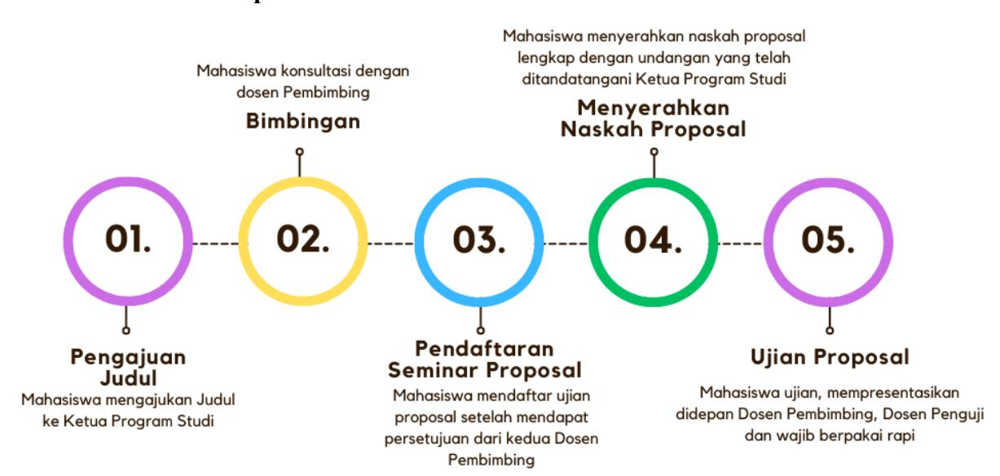
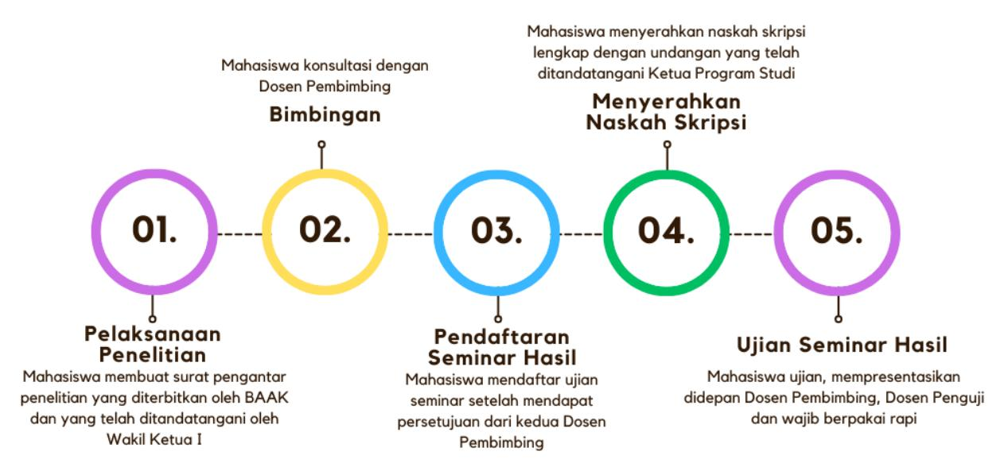
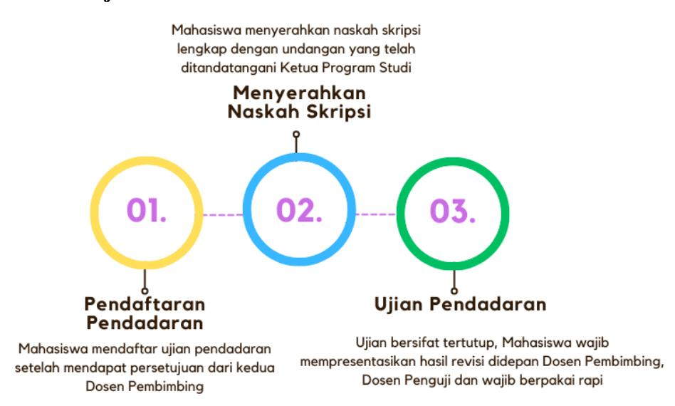

# Panduan Penulisan Tugas Akhir Skripsi

**STMIK Widya Cipta Dharma**
**CENTER OF EXCELLENCE**
**REKTORAT**

# **PANDUAN PENULISAN TUGAS AKHIR SKRIPSI**
**SEKOLAH TINGGI MANAJEMEN INFORMATIKA DAN KOMPUTER WIDYA CIPTA DHARMA**
**2024**

# **KATA PENGANTAR**

Puji syukur kami panjatkan ke hadirat Tuhan Yang Maha Esa atas Rahmat dan Karunia-Nya sehingga buku panduan penulisan tugas akhir skripsi ini dapat disusun dengan baik. Buku panduan ini disusun sebagai acuan bagi seluruh civitas akademika dalam pelaksanaan penyusunan skripsi yang merupakan syarat akademik yang harus dipenuhi oleh mahasiswa dalam menyelesaikan studi pada jenjang program sarjana di STMIK Widya Cipta Dharma.

Panduan ini dirancang dengan memperhatikan setiap ketentuan dan prosedur yang telah ditetapkan dalam Buku Pedoman Akademik STMIK Widya Cipta Dharma tahun 2024. Kami berharap dengan adanya panduan ini, mahasiswa dapat memahami proses penyusunan tugas akhir skripsi secara sistematis dan metodologis, sehingga dapat menyelesaikan studinya dengan baik dan tepat waktu.

Tugas Akhir Skripsi memiliki tujuan utama untuk memberikan kesempatan kepada mahasiswa dalam mengaplikasikan ilmu yang telah diperoleh selama masa studi ke dalam penelitian yang relevan dengan bidang keilmuannya. Selain itu, juga bertujuan untuk melatih mahasiswa dalam mengidentifikasi dan merumuskan masalah penelitian, memilih dan menerapkan metode penelitian yang sesuai, serta menyajikan hasil penelitian secara sistematis dan ilmiah sesuai dengan kaidah akademik yang berlaku.

Kami mengucapkan terima kasih kepada semua pihak yang telah berkontribusi dalam penyusunan panduan ini, baik secara langsung maupun tidak langsung. Kami juga menyadari bahwa buku panduan ini masih jauh dari sempurna. Oleh karena itu, kami sangat mengharapkan saran dari berbagai pihak guna penyempurnaan panduan ini di masa mendatang.

Akhir kata, kami berharap semoga buku panduan ini dapat memberikan manfaat yang besar bagi seluruh civitas akademika, khususnya bagi mahasiswa yang tengah menyusun skripsi di STMIK Widya Cipta Dharma.

> Samarinda, Desember 2024 **Tim Penyusun**

# **DAFTAR ISI**

- KATA PENGANTAR
- DAFTAR ISI
- DAFTAR TABEL
- DAFTAR GAMBAR
- SURAT KEPUTUSAN
- BAB I PENDAHULUAN
  - 1.1. LATAR BELAKANG
  - 1.2. TUJUAN PEMBUATAN BUKU PANDUAN TUGAS AKHIR SKRIPSI
- BAB II KETENTUAN UMUM
  - 2.1. DOSEN PEMBIMBING
  - 2.2. DOSEN PENGUJI
  - 2.3. PENGGANTIAN DOSEN PEMBIMBING DAN DOSEN PENGUJI
  - 2.4. MAHASISWA BIMBINGAN
  - 2.5. SYARAT DAN KETENTUAN TUGAS AKHIR SKRIPSI
  - 2.6. PROSES PENYUSUNAN TUGAS AKHIR SKRIPSI
- BAB III BENTUK TUGAS AKHIR
  - 3.1. PROPOSAL
  - 3.2. TUGAS AKHIR SKRIPSI
- BAB IV PENJELASAN SISTEMATIKA PENULISAN LAPORAN
  - 4.1. BAGIAN AWAL
  - 4.2. BAGIAN UTAMA
  - 4.3. BAGIAN AKHIR
- BAB V FORMAT DAN TATA CARA PENULISAN
  - 5.1. JENIS DAN UKURAN KERTAS
  - 5.2. ATURAN PENULISAN
  - 5.3. BAHASA
  - 5.4. HURUF MIRING
  - 5.5. ATURAN PENULISAN PUSTAKA ATAU SUMBER RUJUKAN

# **DAFTAR TABEL**

- Tabel 2.1 Panduan Penilaian Tugas Akhir Skripsi
- Tabel 2.2 Rekap Nilai Tugas Akhir Skripsi
- Tabel 3.1 Sistematika Penulisan Proposal
- Tabel 3.2 Sistematika Penulisan Tugas Akhir Skripsi

# **DAFTAR GAMBAR**

- Gambar 1. Alur Pelaksanaan Proposal
- Gambar 2. Alur Pelaksanaan Seminar Hasil
- Gambar 3. Alur Pelaksanaan Pendadaran

## SURAT KEPUTUSAN

**SEKOLAH TINGGI MANAJEMEN INFORMATIKA dan KOMPUTER**

# **WIDYA CIPTA DHARMA**

Status Terakreditasi Badan Akreditasi Nasional Perguruan Tinggi  
Jl. M. Yamin No. 25 Samarinda - Kalimantan Timur 75123 Telp. 0541 - 736071 Fax. 203492,734468  
E-mail : wicida@wicida.ac.id

**Surat Keputusan  
Ketua STMIK Widya Cipta Dharma**

**Nomor : 081/SK-KT/ST.WCD/XII/2024**

**Tentang**

**Panduan Penulisan Tugas Akhir Skripsi  
Di lingkungan STMIK Widya Cipta Dharma**

**Ketua STMIK Widya Cipta Dharma**

Menimbang : a. Bahwa untuk memperlancar dan memberikan referensi kepada Mahasiswa, Dosen Pembimbing dan Dosen Penguji mengenai mekanisme, sistematika, dan teknik penulisan dalam proses penyelesaian studi melalui jalur tugas akhir skripsi.  
b. Bahwa diperlukan panduan penulisan tugas akhir skripsi di lingkungan STMIK Widya Cipta Dharma.  
c. Bahwa untuk maksud tersebut perlu disahkan dan diterbitkan dalam Surat Keputusan Ketua STMIK Widya Cipta Dharma.

Mengingat : 1. Undang-Undang Republik Indonesia Nomor 12 Tahun 2012 tentang Pendidikan Tinggi  
2. Undang-Undang No: 20 tahun 2003 tentang Sistem Pendidikan Nasional  
3. Peraturan Pemerintah Nomor 4 tahun 2014 tentang Penyelenggaraan Pendidikan Tinggi dan Pengelolaan Perguruan Tinggi.  
4. Peraturan Pemerintah Nomor 16 tahun 2018 tentang Perubahan atas Peraturan Menteri Pendidikan dan Kebudayaan Nomor 47 tahun 2016 tentang Pedoman Organisasi Perangkat Bidang Organisasi dan Kebudayaan.  
5. Keputusan Mendikbud RI Nomor : 0686/U/1991 tentang Pedoman Pendirian Perguruan Tinggi.  
6. Keputusan Mendikbud RI Nomor : 05/D/0/1995 tentang perubahan bentuk AMIK-WCD menjadi STMIK-WCD.  
7. Statuta STMIK Widya Cipta Dharma tahun 2024.

# SEKOLAH TINGGI MANAJEMEN INFORMATIKA dan KOMPUTER **WIDYA CIPTA DHARMA**

Status Terakreditasi Badan Akreditasi Nasional Perguruan Tinggi  
Jl. M. Yamin No. 25 Samarinda - Kalimantan Timur 75123 Telp. 0541 - 736071 Fax. 203492,734468  
E-mail : wicida@wicida.ac.id

## MEMUTUSKAN

Menetapkan :

Pertama : Surat Keputusan Ketua STMIK Widya Cipta Dharma Tentang panduan penulisan tugas akhir skripsi di lingkungan STMIK Widya Cipta Dharma sebagaimana dalam lampiran.

Kedua : Dengan berlakunya panduan penulisan tugas akhir skripsi STMIK Widya Cipta Dharma, maka ketentuan prosedur yang bertentangan dengan keputusan ini dinyatakan tidak berlaku.

Ketiga : Surat Keputusan ini berlaku sejak ditetapkan dan apabila dikemudian hari ternyata terdapat kekeliruan dalam penetapannya, maka akan diperbaiki sebagaimana mestinya.

Ditetapkan di : Samarinda  
Pada tanggal : 31 Desember 2024  
Ketua,

### Tembusan disampaikan Kepada :

1. 1. Wakil Ketua I, II dan III
2. 2. Ketua Program Studi TI, SI dan Bisdig
3. 3. Pertinggal

# **BAB I PENDAHULUAN**

### **1.1. LATAR BELAKANG**

Penulisan Tugas Akhir Skripsi merupakan salah satu tahapan penting dalam proses akademik mahasiswa di perguruan tinggi. Tugas Akhir Skripsi berfungsi sebagai bukti kemampuan mahasiswa dalam mengaplikasikan pengetahuan yang telah diperoleh selama masa studi, serta menunjukkan kemampuan analisis, sintesis, dan pemecahan masalah secara mandiri. Tugas Akhir Skripsi juga menjadi syarat untuk memperoleh gelar sarjana, sehingga kualitas dan tata cara penulisannya sangatlah penting.

Namun, dalam praktiknya, banyak mahasiswa yang menghadapi berbagai kesulitan dalam menulis Tugas Akhir Skripsi. Kesulitan tersebut dapat berupa kurangnya pemahaman terhadap format penulisan yang benar, kekurangan referensi, serta ketidaktahuan mengenai standar akademik yang berlaku. Ketidakteraturan dalam penulisan skripsi dapat menyebabkan hasil akhir yang kurang maksimal dan berdampak pada penilaian akademis mahasiswa.

Oleh karena itu, diperlukan adanya panduan penulisan Tugas Akhir Skripsi yang jelas dan sistematis. Panduan ini bertujuan untuk memberikan arahan yang komprehensif kepada mahasiswa mengenai setiap aspek penulisan Tugas Akhir Skripsi, mulai dari pemilihan topik, penyusunan proposal, pengumpulan data, analisis, hingga penyusunan laporan akhir. Dengan adanya panduan yang baku, diharapkan mahasiswa dapat menyusun Tugas Akhir Skripsi dengan baik dan sesuai dengan standar akademik yang telah ditetapkan.

Dengan latar belakang tersebut, penyusunan panduan penulisan Tugas Akhir Skripsi ini diharapkan dapat meningkatkan kualitas skripsi mahasiswa, memperlancar proses penyusunan tugas akhir skripsi, serta membantu perguruan tinggi dalam menjaga standar akademiknya. Adanya panduan yang jelas dan mudah dipahami juga akan memberikan rasa percaya diri bagi mahasiswa dalam menyelesaikan tugas akhirnya, sehingga mereka dapat lulus dengan prestasi yang membanggakan.

### **1.2. TUJUAN PEMBUATAN BUKU PANDUAN TUGAS AKHIR SKRIPSI**

Buku panduan ini dibuat untuk memberikan referensi kepada mahasiswa, Dosen Pembimbing, dan Dosen Penguji mengenai mekanisme, sistematika, dan teknik penulisan agar lebih terstruktur dan konsisten yang diperlukan dalam proses penyelesaian studi melalui jalur Tugas Akhir Skripsi.

# **BAB II KETENTUAN UMUM**

### **2.1. DOSEN PEMBIMBING**

Dosen Pembimbing adalah orang yang yang bertugas membimbing mahasiswa mulai dari pengajuan judul hingga menyelesaikan Tugas Akhir Skripsi.

### **2.1.1.Ketentuan Dosen Pembimbing**

- 1. Dosen Pembimbing harus membimbing mahasiswa dengan penuh tanggung jawab, menunjukkan loyalitas dan dedikasi yang baik selama proses Pembimbingan.
- 2. Dosen Pembimbing harus memenuhi segala peraturan yang dibuat oleh STMIK Widya Cipta Dharma
- 3. Apabila Dosen Pembimbing tidak dapat melaksanakan tugasnya, maka Ketua Program Studi dapat menunjuk penggantinya.
- 4. Dosen Pembimbing Utama bertanggung jawab terhadap isi tugas akhir secara keseluruhan yang sesuai dengan kompetensinya.
- 5. Dosen Pembimbing Pendamping bertanggung jawab terhadap tulisan yang sesuai dengan bahasa Indonesia yang disempurnakan dan panduan penulisan Tugas Akhir Skripsi
- 6. Ketua Program Studi berhak memberikan saran apabila proposal tidak sesuai dengan *roadmap* penelitian dan panduan penulisan Tugas Akhir Skripsi.

### **2.1.2.Syarat Dosen Pembimbing**

- 1. Terdaftar sebagai dosen STMIK Widya Cipta Dharma
- 2. Telah memiliki jabatan fungsional minimal asisten ahli atau lektor dengan kualifikasi pendidikan S2 atau kualifikasi pendidikan S3, dan memiliki kompetensi yang relevan dengan materi Tugas Akhir Skripsi yang ditulis mahasiswa.
- 3. Dosen Pembimbing penyusunan proposal Tugas Akhir Skripsi ditetapkan sebagai Dosen Pembimbing setelah mahasiswa memprogramkan Tugas Akhir Skripsi pada KRS.
- 4. Penetapan pengangkatan Dosen Pembimbing Tugas Akhir Skripsi dilakukan melalui Surat Keputusan Ketua STMIK Widya Cipta Dharma.

### **2.2. DOSEN PENGUJI**

### **2.2.1 Ketentuan Dosen Penguji**

- 1. Dosen Penguji adalah dosen yang bertugas menguji mahasiswa pada saat ujian tugas akhir.

- 2. Dosen Penguji harus bertanggung jawab, menunjukkan loyalitas, dan dedikasi yang baik selama ujian berlangsung.
- 3. Dosen Penguji harus memenuhi segala peraturan yang dibuat oleh STMIK Widya Cipta Dharma
- 4. Dosen Penguji berhak memberikan masukan apabila naskah mahasiswa tidak sesuai dengan data yang diperoleh.

### **2.2.2 Syarat Dosen Penguji**

- 1. Terdaftar sebagai dosen STMIK Widya Cipta Dharma
- 2. Telah memiliki jabatan fungsional minimal asisten ahli atau lektor dengan kualifikasi pendidikan S2 atau kualifikasi pendidikan S3, dan memiliki kompetensi yang relevan dengan materi Tugas Akhir yang ditulis mahasiswa.
- 3. Penetapan pengangkatan Dosen Penguji dilakukan melalui Surat Keputusan Ketua STMIK Widya Cipta Dharma.

### **2.3 PENGGANTIAN DOSEN PEMBIMBING DAN DOSEN PENGUJI**

- 1. Mahasiswa dapat mengajukan penggantian Dosen Pembimbing dan Dosen Penguji dengan mengisi formulir (*Contoh Form terlampir*) permohonan kepada Ketua Program Studi, apabila terjadi salah satu dari hal-hal berikut:
  - 1) Meninggal dunia.
  - 2) Sakit, sehingga yang bersangkutan harus istirahat panjang.
  - 3) Cuti di luar tanggungan.
  - 4) Pindah tugas.
- 2. Dosen Pembimbing dan Dosen Penguji dapat mengajukan permohonan pengunduran diri secara tertulis apabila terjadi salah satu dari hal berikut:
  - 1) Sakit sehingga yang bersangkutan harus istirahat panjang.
  - 2) Cuti di luar tanggungan
  - 3) Pindah tugas.
- 3. Penggantian Dosen Pembimbing dan Dosen Penguji dilakukan berdasarkan kebijakan Ketua Program Studi dengan pertimbangan masa studi mahasiswa.
- 4. Ketua Program Studi mengeluarkan surat tugas Dosen Pembimbing atau Dosen Penguji pengganti.
- 5. Mahasiswa dapat melanjutkan kembali bimbingannya di bawah bimbingan Dosen Pembimbing pengganti.

### **2.4 MAHASISWA BIMBINGAN**

### **2.4.1 Hak Mahasiswa Bimbingan**

- 1. Mendapatkan bimbingan, arahan, masukan, dan bantuan yang proporsional dari kedua Dosen Pembimbing untuk Penyusunan dan Ujian Tugas Akhir Skripsi.
- 2. Mendapatkan tanda tangan pengesahan Dosen Pembimbing setelah segala persyaratan dan tangggung jawab terpenuhi
- 3. Mendapat perlakuan yang baik dari semua pihak yang terlibat terkait dengan proses bimbingan
- 4. Mendapatkan hasil penilaian yang proporsional atas usaha dan pekerjaannya.

### **2.4.2 Bukti Pembimbingan**

- 1. Mahasiswa diwajibkan membawa lembar bimbingan setiap akan melakukan bimbingan dan lembar tersebut akan diisi oleh Dosen Pembimbing sesuai dengan bimbingan yang dilakukan.
- 2. Lembar bimbingan berisi masukan untuk setiap kali pertemuan dengan Dosen Pembimbing.
- 3. Pertemuan dengan Dosen Pembimbing Tugas Akhir Skripsi dijadwalkan minimal 8 kali, mulai dari pengajuan judul, *out line*, proposal, supervisi hingga penyusunan Tugas Akhir.

### **2.4.3 Mekanisme Pembimbingan Tugas Akhir**

- 1. Bimbingan pada prinsipnya dilaksanakan di kampus, selain dari ketentuan ini dapat dilakukan atas kesepakatan antara mahasiswa dan Dosen Pembimbing.
- 2. Maksimal masa bimbingan berlangsung selama 6 bulan (1 semester). Perpanjangan masa bimbingan dapat diberikan kepada mahasiswa dengan persetujuan Ketua Program Studi setelah mendengar pertimbangan (rekomendasi) dari Dosen Pembimbing Utama dan Dosen Pembimbing Pendamping.
- 3. Pada setiap kegiatan pembimbingan, mahasiswa wajib membawa lembar bimbingan yang harus diisi materi bimbingan, tanggal bimbingan, dan ditandatangani oleh Dosen Pembimbing.
- 4. Dosen Pembimbing dalam memberikan bimbingan kepada mahasiswa menekankan kepada standar karya tulis ilmiah (menyangkut kriteria, syarat, dan metodologi penulisan) sedangkan substansi (materi) Tugas Akhir Skripsi kepada mahasiswa bersangkutan.
- 5. Dosen Pembimbing dapat menyempurnakan judul sepanjang tidak merubah inti permasalahannya.
- 6. Apabila mahasiswa mengalami kesulitan dalam menyelesaikan penulisan Tugas Akhir, mahasiswa yang bersangkutan dapat mengubah judul dengan mengajukan permohonan judul baru kepada Ketua Program Studi.
- 7. Ketua Program Studi mengawasi pelaksanaan pembimbingan dari aspek tanggung jawab, efisiensi, dan efektivitas bimbingan.

### **2.5 SYARAT DAN KETENTUAN TUGAS AKHIR SKRIPSI**

- 1. Mahasiswa yang berhak mengambil Tugas Akhir Skripsi adalah mahasiswa yang telah menyelesaikan mata kuliah dengan jumlah SKS minimal 138 SKS dengan IP Kumulatif minimal 3,25
- 2. Tujuan Tugas Akhir Skripsi adalah:
  - 1) Mengidentifikasi dan merumuskan masalah yang dijadikan objek penulisan,
  - 2) Menentukan jenis penelitian yang sesuai dengan tujuan penelitian,
  - 3) Menggunakan teori yang relevan dengan permasalahan dan mengoperasionalisasikan konsep
  - 4) Memilih dan menggunakan metode penelitian yang relevan dengan permasalahan,
  - 5) Menyajikan dan menganalisis data secara cermat, tepat, dan benar, dan
  - 6) Menuliskan hasil penelitian secara sistematis dan logis, sesuai dengan format dan etika ilmu pengetahuan.

### **2.6 PROSES PENYUSUNAN TUGAS AKHIR SKRIPSI**

# **2.6.1 Tahap Awal Pengajuan Proposal**

### **1. Pengajuan Judul dan Dosen Pembimbing**

- Mekanisme pengajuan judul dan penetapan Dosen Pembimbing dilakukan dengan prosedur sebagai berikut:
- 1) Mahasiswa dapat mengajukan judul dan mengusulkan calon Dosen Pembimbing kepada Ketua Program Studi, yang dilakukan pada awal semester VII.
- 2) Ketua Program Studi menelaah dan mewawancarai mahasiswa mengenai judul yang diajukan, selanjutnya Ketua Program Studi menetapkan 2 orang Dosen Pembimbing yaitu sebagai Dosen Pembimbing Utama dan Dosen Pembimbing Pendamping
- 3) Berdasarkan pengajuan dari Ketua Program Studi maka, Ketua STMIK Widya Cipta Dharma menerbitkan Surat Keputusan Pengangkatan Dosen Pembimbing dan Dosen Penguji Tugas Akhir.

### **2. Bimbingan Proposal**

Mekanisme bimbingan proposal dilakukan dengan prosedur sebagai berikut:

- 1) Mahasiswa wajib menemui Dosen Pembimbing paling lambat satu minggu setelah penetapan Dosen Pembimbing.
- 2) Ketika berkonsultasi dengan Dosen Pembimbing, mahasiswa diwajibkan menyusun proposal yang memuat Bab I Pendahuluan, Bab II Tinjauan Pustaka, dan Bab III Metode Penelitian.
- 3) Untuk setiap kali melaksanakan bimbingan, mahasiswa wajib membawa lembar bimbingan yang harus diisi materi bimbingan, tanggal bimbingan, dan ditandatangani oleh Dosen Pembimbing.

### **3. Prosedur Pendaftaran dan Seminar Proposal**

- Mekanisme pendaftaran seminar proposal sebagai berikut:
- 1) Naskah Proposal telah disetujui oleh kedua Dosen Pembimbing
- 2) Mahasiswa mendaftar dan melengkapi berkas di laman web KPST STMIK Widya Cipta Dharma, dengan melampirkan berkas sebagai berikut:
  - (1) Form Pengecekan Syarat Administrasi, Form Pendaftaran Ujian Proposal dan Form Permohonan Ujian Proposal,
  - (2) Lembar Persetujuan Seminar Proposal yang telah ditandatangani oleh Dosen Pembimbing Utama, Dosen Pembimbing Pendamping, dan Ketua Program Studi,
  - (3) Form Bimbingan Proposal Tugas Akhir Skripsi yang sudah di ACC Dosen Pembimbing Utama, Dosen Pembimbing Pendamping, dan Ketua Program Studi,
  - (4) Form Daftar Hadir Menyaksikan Ujian Seminar Proposal Tugas Akhir Skripsi,
  - (5) Transkrip Nilai Terakhir, dengan Jumlah SKS Minimal 138 SKS dan IP Kumulatif minimal 3,25.
  - (6) Kuitansi BPP, SKS, dan Seminar Proposal di semester saat Seminar Proposal dilaksanakan,
  - (7) Kartu Rencana Studi (KRS) yang mencantumkan Skripsi dan validasi BAAK,
  - (8) Sertifikat PKKMB/ESQ (Pendidikan Karakter),
  - (9) Lembar Persetujuan Waktu Ujian Seminar Proposal Tugas Akhir Skripsi,
  - (10) Bukti pemeriksaan anti-plagiarisme dengan tingkat kemiripan maksimal 30%, berupa hasil dari perangkat lunak atau aplikasi pendeteksi plagiarisme yang valid, seperti Turnitin, Plagscan, atau alat sejenis lainnya. Bukti harus mencantumkan persentase kemiripan dan sumber kecocokan yang terdeteksi.
  - (11) Draf Laporan Proposal. (*untuk form dapat didownload di web prodi masing-masing*)
- 3) Ketua Program Studi menunjuk satu dosen sebagai Ketua Penguji.
- 4) Mahasiswa menyerahkan berkas/naskah Proposal lengkap ke tim dosen yang terdiri dari Dosen Pembimbing Utama, Dosen Pembimbing Pendamping, dan Ketua Penguji Seminar proposal merupakan forum bagi mahasiswa untuk mempresentasikan rencana penelitiannya. Mekanisme pelaksanaan seminar proposal sebagai berikut:
- 1) Seminar proposal dilakukan paling lambat 7 hari setelah mendapatkan persetujuan Dosen Pembimbing.
- 2) Proposal dibuat minimal 40 halaman (tidak termasuk cover, daftar isi, daftar tabel, daftar gambar, daftar lampiran, daftar pustaka, dan lampiran), mahasiswa menyiapkan bahan presentasi dan wajib

mempresentasikan di depan Dosen Pembimbing dan Dosen Penguji menggunakan media/alat bantu presentasi (LCD)

- 3) Seminar proposal bersifat terbuka dihadiri oleh Dosen Pembimbing, Dosen Penguji, dan mahasiswa lain. Ujian dipimpin oleh Dosen Pembimbing Utama sebagai ketua panitia ujian dan dibantu Dosen Pembimbing Pendamping
- 4) Pada saat ujian proposal, mahasiswa diwajibkan berpakai rapi. Pria mengunakan kemeja putih, berdasi, menggunakan almamater, celana hitam serta menggunakan sepatu tertutup berwarna hitam. Wanita menggunakan kemeja putih, berdasi, menggunakan almamater, rok hitam berukuran di bawah lutut serta menggunakan sepatu tertutup berwarna hitam. (Bagi mahasiswi berjilbab, dapat menggunakan jilbab berwarna hitam).
- 5) Setelah Ketua panitia ujian menanyakan kesiapan fisik dan mental kepada mahasiswa yang diuji, Mahasiswa diberi kesempatan untuk mempresentasikan proposalnya. Seminar proposal dilaksanakan paling lama 60 menit, terdiri dari 10 menit untuk presentasi dan 50 menit untuk tanya jawab
- 6) Dosen Penguji diberikan kesempatan untuk bertanya, mengklarifikasi, memberikan saran dan perbaikan
- 7) Dosen Pembimbing mengumumkan hasil keputusan kelayakan proposal apakah proposalnya dapat dilanjutkan ketahap pelaksanaan, dengan menetapkan batasan waktu.
- 8) Seminar proposal dilaksanakan sesuai dengan kalender akademik yang berlaku pada semester tersebut. Masa berlaku proposal adalah satu tahun akademik sejak ujian proposal dinyatakan lulus.

### **4. Alur Pelaksanaan Proposal**

Gambar 1. Alur Pelaksanaan Proposal

### **2.6.2 Tahap Pelaksanaan Seminar Hasil**

### **1. Pelaksanaan Penelitian**

- 1) Untuk memudahkan dalam mendapatkan pelayanan yang baik selama penelitian dari Dinas/Instansi Pemerintah, Swasta dan Masyarakat, mahasiswa diwajibkan membuat surat pengantar penelitian yang diterbitkan oleh BAAK, diparaf oleh Dosen Pembimbing, dan telah ditandatangani oleh Wakil Ketua I Bidang Akademik dan Kemahasiswaan
- 2) Selama melaksanakan penelitian di lapangan/laboratorium, mahasiswa dapat membuat jadwal kegiatan penelitian.
- 3) Mahasiswa secara berkala melaporkan kegiatan penelitiannya kepada Dosen Pembimbing

### **2. Prosedur Pendaftaran dan Seminar Hasil**

Mekanisme pendaftaran seminar hasil sebagai berikut:

- 1) Naskah Tugas Akhir Skripsi telah disetujui oleh kedua Dosen Pembimbing
- 2) Mahasiswa mendaftar dan melengkapi berkas di laman web KPST STMIK Widya Cipta Dharma, dengan melampirkan berkas sebagai berikut:
  - (1) Form Pengecekan Syarat Administrasi, Form Pendaftaran Ujian Seminar Hasil, dan Form Permohonan Ujian Seminar Hasil.
  - (2) Lembar Persetujuan Seminar Hasil yang telah ditandatangani oleh Dosen Pembimbing Utama, Dosen Pembimbing Pendamping, dan Ketua Program Studi.
  - (3) Lembar Persetujuan Waktu Ujian Seminar Hasil Tugas Akhir.
  - (4) Transkrip Nilai Terakhir, dengan Jumlah SKS minimal 138 SKS dan IP Kumulatif minimal 3,25
  - (5) Kuitansi BPP, SKS, dan Seminar Hasil di semester saat Seminar Hasil dilaksanakan
  - (6) Kartu Rencana Studi (KRS) yang mencantumkan Tugas Akhir.
  - (7) Form Daftar Hadir Menyaksikan Seminar Hasil Tugas Akhir
  - (8) Surat Keterangan Penelitian atau Surat balasan yang ditandatangani dan distempel dari tempat penelitian.
  - (9) Lembar Daftar Wawancara yang sudah ditandatangani dan distempel asli
  - (10) Form Bimbingan Hasil Tugas Akhir Skripsi yang sudah ditandatangani Dosen Pembimbing Utama, Dosen Pembimbing Pendamping, dan Ketua Program Studi (11)1 Sertifikat Profesi Bidang IT dan 2 Sertifikat Pelatihan Khusus IT yang diakui dan dilaksanakan di STMIK Widya Cipta Dharma.
  - (12) Bukti pemeriksaan anti-plagiarisme dengan tingkat kemiripan maksimal 30%, berupa hasil dari perangkat lunak atau aplikasi pendeteksi plagiarisme yang valid, seperti Turnitin,

Plagscan, atau alat sejenis lainnya. Bukti harus mencantumkan persentase kemiripan dan sumber kecocokan yang terdeteksi.

### (13) Draf laporan Seminar Hasil Tugas Akhir Skripsi

(14)Mengirimkan *softcopy* poster ukuran A4 dan video singkat presentasi mengenai pengenalan/ penggunaan program/penelitian Tugas Akhir Skripsi ke email Program Studi masing-masing. Berikut ini adalah ketentuan pembuatan poster dan video untuk keperluan seminar hasil:

### **A. Ketentuan pembuatan poster:**

- 1. Ukuran: A2/Tipe Art Paper (layout kertas potrait)
- 2. Isi Poster:
  - 1) Bagian judul:
    - (1) Lambang STMIK Widya Cipta Dharma, lambang kampus merdeka, lambang program studi
    - (2) Judul penelitian maksimal 3 baris (Size 13, font roboto, rata tengah, bold)
    - (3) Tugas Akhir Skripsi Program Studi (Sistem Informasi/Teknik Informatika/Bisnis Digital)
    - (4) Tahun
  - 2) Bagian identitas peneliti:
    - (1) Foto mahasiswa, nama lengkap dan NIM
    - (2) Foto Dosen Pembimbing utama, nama lengkap beserta gelar dan NIDN/NUPTK.
    - (3) Foto Dosen Pembimbing pendamping, nama lengkap beserta gelar dan NIDN/NUPTK.
  - 3) Bagian abstrak: Isi abstrak sesuai panduan (Font roboto, paragraf rata kanan kiri, style bold)
  - 4) Bagian Metode penelitian: Jelaskan secara singkat dan jelas, masukan diagram penelitian dan tahapan penelitian yang dilakukan (gambar/tabel/text) (Font roboto, pargraf rata kanan kiri, style bold)
  - 5) Bagian Hasil Penelitian: Input gambar/text/tabel/flowchart dari hasil penelitian yang telah dilakukan
  - 6) Bagian bawah poster: web program studi, web STMIK Widya cipta Dharma, dan media sosial program studi.
  - 7) Warna Poster menyesuaikan dengan warna Program Studi.

### **B. Ketentuan pembuatan video:**

- 1. Durasi video maksimal 5 menit
- 2. Pada opening video wajib ada:

- 1) Judul penelitian
- 2) Nama mahasiswa dan NIM
- 3) Nama Dosen Pembimbing utama dan Dosen Pembimbing pendamping beserta NIDN/NUPTK
- 4) Program Studi
- 5) Tahun
- 6) Lambang STMIK Widya Cipta Dharma
- 7) Lambang Program Studi
- 3. Saat presentasi wajah mahasiswa wajib terlihat dan menggunakan kemeja putih berdasi dan almamater
- 4. Video berisi penjelasan atau tutorial hasil penelitian (bukan berupa slide yang ditampilkan saat seminar)
- 5. Ada closing atau penutup video
- 6. Poster ditampilkan di akhir video (template poster terlampir)
- 7. Video diupload di youtube, dan link video dikumpulkan saat pendaftaran seminar hasil (*untuk form dapat di download di web masing-masing prodi*)
- 3) Ketua Program Studi menunjuk satu dosen sebagai anggota Penguji
- 4) Mahasiswa menyerahkan naskah Tugas Akhir Skripsi lengkap ke tim dosen yang terdiri dari Dosen Pembimbing utama, Dosen Pembimbing pendamping, ketua Dosen Penguji, dan anggota Dosen Penguji. Seminar hasil penelitian dilakukan untuk menyajikan hasil penelitian yang diperoleh. Mekanisme pelaksanaan seminar hasil sebagai berikut:
- (1) Mahasiswa diijinkan Ujian Seminar hasil, setelah memenuhi syarat yang telah ditetapkan Program Studi.
- (2) Mahasiswa menyiapkan bahan presentasi hasil penelitian dan wajib mempresentasikan didepan Dosen Pembimbing dan Dosen Penguji menggunakan media/alat bantu presentasi (LCD)
- (3) Seminar bersifat terbuka yang dihadiri oleh Dosen Pembimbing utama, Dosen Pembimbing pendamping, ketua Dosen Penguji, dan anggota Dosen Penguji, serta mahasiswa. Ujian dipimpin oleh Dosen Pembimbing utama sebagai ketua panitia ujian dan dibantu Dosen Pembimbing pendamping
- (4) Pada saat ujian seminar, mahasiswa diwajibkan berpakai rapi. Pria mengunakan kemeja putih, berdasi, menggunakan almamater, celana hitam serta menggunakan sepatu tertutup berwarna hitam. Wanita menggunakan kemeja putih, berdasi, menggunakan almamater, rok hitam berukuran

- di bawah lutut serta menggunakan Sepatu tertutup berwarna hitam. (Bagi mahasiswi berjilbab, dapat menggunakan jilbab berwarna hitam).
- (5) Setelah Ketua panitia ujian menanyakan kesiapan fisik dan mental kepada mahasiswa yang diuji, ketua memberikan kesempatan kepada mahasiswa untuk mempresentasikan hasil penelitiannya. Seminar hasil dilaksanakan paling lama 1 jam (60 menit).
- (6) Masing-masing Dosen Penguji diberikan kesempatan untuk bertanya, mengklarifikasi, memberikan saran dan perbaikan, serta memberikan penilaian
- (7) Dosen Pembimbing mengumumkan hasil keputusan ujian apakah seminar dapat dilanjutkan ketahap ujian pendadaran, dengan menetapkan batasan waktu.
- (8) Seminar hasil penelitian dilaksanakan sesuai dengan kalender akademik yang berlaku pada semester tersebut.

### **3. Alur Pelaksanaan Seminar Hasil**

Gambar 2. Alur Pelaksanaan Seminar Hasil

### **2.6.3 Tahap Ujian Pendadaran**

### **1. Prosedur Pendaftaran Pendadaran dan Pelaksanaan Pendadaran**

- Mekanisme pendaftaran pendadaran sebagai berikut:
- 1) Naskah Tugas Akhir Skripsi telah disetujui oleh Dosen Pembimbing dan Dosen Penguji.
- 2) Mahasiswa mendaftar dan melengkapi berkas di laman web KPST STMIK Widya Cipta Dharma, dengan melampirkan berkas sebagai berikut:
  - (1) Form Pengecekan Syarat Administrasi, Form Pendaftaran Ujian Pendadaran, dan Form Permohonan Ujian Seminar Pendadaran.

- (2) Lembar Persetujuan Seminar Pendadaran yang telah ditandatangani oleh Dosen Pembimbing Utama, Dosen Pembimbing Pendamping, Ketua Dosen Penguji, Anggota Dosen Penguji, dan Ketua Program Studi.
- (3) Lembar Persetujuan Waktu Ujian Seminar Pendadaran.
- (4) Transkrip Nilai Terakhir yang telah dilegalisir BAAK, dengan Jumlah SKS minimal 138 SKS dan IP Kumulatif minimal 3,25.
- (5) Kuitansi BPP, SKS, dan Seminar Pendadaran disemester saat Seminar Pendadaran dilaksanakan.
- (6) Kartu Rencana Studi (KRS) yang mencantumkan Tugas Akhir yang telah divalidasi BAAK.
- (7) Sertifikat TOEFL
- (8) Draf Laporan Seminar Pendadaran (*untuk form dapat di download di web prodi masing-masing*)
- 3) Mahasiswa menyerahkan naskah Tugas Akhir Skripsi lengkap ke tim dosen yang terdiri dari Dosen Pembimbing Utama, Dosen Pembimbing Pendamping, Ketua Dosen Penguji, dan Anggota Dosen Penguji.
- 4) Ujian Pendadaran merupakan ujian menyeluruh terhadap seluruh mata kuliah yang telah ditempuh. Mekanisme pelaksanaan pendadaran sebagai berikut:
- 1) Mahasiswa diijinkan Ujian Pendadaran Tugas Akhir Skripsi, setelah memenuhi syarat yang telah ditetapkan Program studi.
- 2) Mahasiswa menyiapkan bahan presentasi hasil revisi seminar hasil dan wajib mempresentasikan di depan Dosen Pembimbing dan Dosen Penguji menggunakan media/alat bantu presentasi (LCD)
- 3) Ujian bersifat tertutup, dihadiri oleh Dosen Pembimbing Utama, Dosen Pembimbing Pendamping, Ketua Dosen Penguji, dan Anggota Dosen Penguji. Ujian dipimpin oleh Dosen Pembimbing Utama sebagai Ketua Panitia Ujian dan dibantu Dosen Pembimbing Pendamping.
- 4) Pada saat ujian pendadaran, mahasiswa diwajibkan berpakai rapi. Pria mengunakan kemeja putih, berdasi, menggunakan jas hitam, celana hitam serta menggunakan sepatu tertutup berwarna hitam. Wanita menggunakan kemeja putih, berdasi, menggunakan jas hitam, rok hitam berukuran di bawah lutut serta menggunakan sepatu tertutup berwarna hitam. (Bagi mahasiswi berjilbab, dapat menggunakan jilbab berwarna hitam).
- 5) Setelah Ketua panitia ujian menanyakan kesiapan fisik dan mental kepada mahasiswa yang diuji, ketua memberikan kesempatan kepada mahasiswa untuk mempresentasikan hasil revisi penelitiannya, pendadaran dilaksanakan 1 jam (60 menit).

- 6) Pada saat ujian pendadaran masing-masing Dosen Pembimbing dan Dosen Penguji diberikan kesempatan untuk bertanya, serta memberikan penilaian
- 7) Dosen Pembimbing mengumumkan hasil keputusan ujian apakah mahasiswa dinyatakan lulus atau mengulang setelah tim Dosen Penguji menginput nilai diaplikasi dan mendiskusikan keputusan kelulusan
- 8) Seminar pendadaran dilaksanakan disesuaikan dengan Kalender Akademik yang berlaku pada semester tersebut.

### **2. Alur Pelaksanaan Ujian Pendadaran**

Gambar 3. Alur Pelaksanaan Pendadaran

### **2.6.4 Tahap Akhir**

### **1. Perbaikan/Revisi Naskah Tugas Akhir Skripsi**

Mekanisme perbaikan naskah Tugas Akhir Skripsi dilakukan dengan prosedur sebagai berikut:

- 1) Mahasiswa memperbaiki naskah Tugas Akhir Skripsi berdasarkan saran atau revisi dari Dosen Pembimbing dan Dosen Penguji pada saat ujian.
- 2) Mahasiswa mengajukan hasil perbaikan kepada Dosen Pembimbing dan Dosen Penguji dengan membawa naskah Tugas Akhir Skripsi yang sudah dikoreksi pada saat ujian.
- 3) Dosen Pembimbing dan Dosen Penguji menerima dan memeriksa perbaikan naskah Tugas Akhir Skripsi.
- 4) Apabila perbaikan sudah memenuhi syarat maka, Dosen Pembimbing dan Dosen Penguji menandatangani halaman pengesahan Tugas Akhir Skripsi.

# **2. Ketentuan Publikasi Tugas Akhir Skripsi**

Mahasiswa diwajibkan mempublikasikan tugas akhir skripsi di repository.wicida.ac.id

### **3. Sistem Penilaian Tugas Akhir Skripsi**

Nilai Tugas Akhir Skripsi diperoleh dari hasil penilaian naskah Tugas Akhir Skripsi dan unjuk kerja (*performance*) mahasiswa saat ujian. Nilai Tugas Akhir Skripsi didasarkan pada kriteria berikut:

1) Pemberian nilai hasil ujian Tugas Akhir Skripsi didasarkan atas kriteria berikut:

Tabel 2.1 Penduan Penilaian Tugas Akhir Skripsi

| Rentang Nilai    | Nilai Huruf | Predikat      | Status Kelulusan |
|------------------|-------------|---------------|------------------|
| 80 ≤ Nilai ≤ 100 | A           | Sangat Baik   | Lulus            |
| 70 ≤ Nilai ≤ 79  | B           | Baik          | Lulus            |
| 60 ≤ Nilai ≤ 69  | C           | Cukup         | Lulus            |
| 40 ≤ Nilai ≤ 59  | D           | Kurang        | Tidak Lulus      |
| 0 ≤ Nilai ≤ 39   | E           | Sangat Kurang | Tidak Lulus      |

2) Penilaian ujian Tugas Akhir Skripsi

Tabel 2.2 Rekap Nilai Tugas Akhir Skripsi

| No Rekap Nilai Akhir Persentase                      | Komponen Penilaian                                 |
|------------------------------------------------------|----------------------------------------------------|
| 1 Seminar Hasil 40% Penilaian berdasarkan komponen : |                                                    |
| 1.                                                   | Orisinalitas Penulisan                             |
| 2.                                                   | Metodologi Skripsi                                 |
| 3.                                                   | Penguasaan Materi                                  |
| 4.                                                   | Kemampuan Argumentasi                              |
| 5.                                                   | Penampilan/Etika.                                  |
| 2 Pendadaran 60% Penilaian berdasarkan               | komponen :                                         |
| 1.                                                   | Orisinalitas Penulisan                             |
| 2.                                                   | Metodologi Skripsi                                 |
| 3.                                                   | Penguasaan Materi                                  |
| 4.                                                   | Kemampuan Argumentasi                              |
| 5.                                                   | Pengetahuan Bidang Studi                           |
| 6.                                                   | Penampilan/Etika.                                  |
| Setiap komponen diberi nilai dalam rentang           | (0-100).                                           |
| Nilai                                                | yang digunakan adalah hasil rata-rata dari seluruh |

(*Contoh form nilai terlampir)*

3) Mahasiswa dinyatakan lulus ujian Tugas Akhir Skripsi apabila:

- (1) Tugas Akhir Skripsi yang diujikan merupakan hasil karya otentik yang dibuat dan diselesaikan sendiri. Apabila ditemukan bukti bahwa Tugas Akhir Skripsi yang ditulis merupakan duplikasi, jiplakan, atau terjemahan hasil karya orang lain, maka dianggap sebagai pelanggaran akademik dan mahasiswa harus mengajukan judul baru.
- (2) Memperoleh nilai minimal C.

- (3) Telah memperbaiki Tugas Akhir Skripsi sesuai saran dan arahan dari Dosen Pembimbing dan Dosen Penguji yang dibuktikan dengan penandatanganan pada halaman pengesahan Tugas Akhir Skripsi.

# **BAB III BENTUK TUGAS AKHIR**

### **3.1. PROPOSAL**

### **3.1.1.Gambaran Umum**

Proposal Tugas Akhir Skripsi merupakan rencana penelitian yang disusun oleh mahasiswa sebagai bagian dari persyaratan untuk menyelesaikan program studi. Proposal ini bertujuan untuk memberikan gambaran komprehensif mengenai topik penelitian yang akan dilakukan yang termuat dalam Pendahuluan, Tinjauan Pustaka, dan Metode Penelitian. Melalui proposal ini, mahasiswa diharapkan dapat menunjukkan pemahaman yang mendalam tentang topik yang dipilih serta kemampuan dalam merancang dan melaksanakan penelitian yang sistematis dan terarah. Proposal Tugas Akhir Skripsi juga berfungsi sebagai alat evaluasi bagi Dosen Pembimbing untuk menilai kelayakan dan kesiapan mahasiswa dalam melakukan penelitian.

### **3.1.2.Sistematika Penulisan Proposal**

Sistematika penulisan terdiri atas Bagian Awal, Bagian Utama dan Bagian Akhir. Sistematika penulisan tersebut dapat dilihat dalam Tabel 3.1

Tabel 3.1 Sistematika Penulisan Proposal

| Bagian       | Keterangan Isi                           |
|--------------|------------------------------------------|
| Bagian Awal  | Halaman Sampul Depan (Cover)             |
| Bagian Utama | BAB I PENDAHULUAN                        |
| 1.1.         | Latar Belakang Masalah                   |
| 1.2.         | Rumusan Masalah                          |
| 1.3.         | Batasan Masalah                          |
| 1.4.         | Tujuan Penelitian                        |
| 1.5.         | Manfaat Penelitian                       |
| 1.6.         | Sistematika Penulisan                    |
| 2.1.         | Kajian Empiris                           |
| 2.2.         | Landasan Teori                           |
| 3.1.         | Tempat dan Waktu Penelitian              |
| 3.2.         | Teknik Pengumpulan Data                  |
| 3.3.         | Motode Pengembangan Sistem               |
| 3.4.         | Jadwal Penelitian                        |
| Bagian Akhir | Daftar Pustaka                           |

### **3.2. TUGAS AKHIR SKRIPSI**

# **3.2.1.Gambaran Umum**

Tugas Akhir Skripsi merupakan karya tulis ilmiah yang menjadi salah satu syarat untuk memperoleh gelar sarjana di Perguruan Tinggi. Tugas Akhir Skripsi ini disusun berdasarkan hasil penelitian yang dilakukan oleh mahasiswa dibawah bimbingan Dosen Pembimbing. Penulisan Tugas Akhir Skripsi bertujuan untuk mengembangkan kemampuan mahasiswa dalam melakukan penelitian, menganalisis data, serta menyajikan hasil penelitian secara sistematis dan logis. Proses penyusunan skripsi melibatkan tahapan perencanaan, pelaksanaan penelitian, analisis data, serta penulisan dan revisi. Penduan ini disusun untuk memberikan arahan dan standar yang jelas mengenai struktur, format, dan tata cara penulisan skripsi yang baik dan benar.

# **3.2.2.Sistematika Penulisan Tugas Akhir Skripsi**

Sistematika penulisan terdiri atas Bagian Awal, Bagian Utama dan Bagian Akhir. Sistematika penulisan tersebut dapat dilihat dalam Tabel 3.2

Tabel 3.2 Sistematika Penulisan Tugas Akhir Skripsi

| Bagian       | Keterangan Isi               |
|--------------|------------------------------|
| Bagian Awal  | Halaman Sampul Depan (Cover) |
|              | Pernyataan Keaslian          |
| Bagian Utama | BAB I PENDAHULUAN            |
| 1.1.         | Latar Belakang Masalah       |
| 1.2.         | Rumusan Masalah              |
| 1.3.         | Batasan Masalah              |
| 1.4.         | Tujuan Penelitian            |
| 1.5.         | Manfaat Penelitian           |
| 1.6.         | Sistematika Penulisan        |
| 2.1.         | Kajian Empiris               |
| 2.2.         | Landasan Teori               |
| 3.1.         | Tempat dan Waktu Penelitian  |
| 3.2.         | Teknik Pengumpulan Data      |
| 3.3.         | Motode Pengembangan Sistem   |
| 4.1.         | Hasil Penelitian             |
| 4.2.         | Pembahasan                   |
| 5.1.         | Kesimpulan                   |
| 5.2.         | Saran                        |
| Bagian Akhir | Daftar Pustaka               |

*Penjelasan secara umum sistematika penulisan dapat dilihat pada BAB IV*

# **BAB IV PENJELASAN SISTEMATIKA PENULISAN LAPORAN**

### **4.1. BAGIAN AWAL**

### **1. Sampul Depan (Cover)**

Halaman ini merupakan halaman identitas yang memuat judul, jenis usulan, identitas mahasiswa, lambang, program studi, nama institusi, dan tahun diterbitkan.

- 1) **Judul** yang baik dibuat dengan jelas dan harus dapat mengungkapkan masalah serta objek yang sedang dihadapi dan yang akan dipelajari, diketik dengan huruf besar (kapital) dan tidak disingkat.
- 2) **Jenis Usulan** dapat ditulis Proposal (*untuk keperluan Seminar Proposal)* atau Tugas Akhir Skripsi (*untuk keperluan Seminar Hasil dan Seminar Pendadaran).*
- 3) **Penjelasan maksud Tugas Akhir Skripsi:**  Skripsi Sebagai Salah Satu Syarat Untuk Memperoleh Gelar Sarjana Komputer
- 4) **Identitas Mahasiswa**: Nama dan Nomor Induk Mahasiswa (NIM) diletakkan ditengah halaman judul tanpa disertai garis bawah, nama tidak boleh disingkat dan derajat kesarjanaan tidak boleh disertakan. Nomor induk mahasiswa ditempatkan di bawah nama mahasiswa.

### 5) **Lambang STMIK Widya Cipta Dharma**

### 6) **Program Studi, Nama Institusi, dan Tahun Diterbitkan**

*(Contoh Terlampir)*

### **2. Halaman Pengesahan**

Pada halaman ini memuat Judul, Nama, NIM, Jenjang, Program Studi, Tanda Tangan Dosen Pembimbing dan Dosen Penguji, mengetahui Ketua Program Studi, dan Ketua STMIK Widya Cipta Dharma.

*(Contoh Terlampir)*

### **3. Halaman Pernyataan Keaslian Tugas Akhir**

Pada halaman ini berisi pernyataan yang menjelaskan bahwa Tugas Akhir Skripsi tersebut asli karya sendiri, tidak merupakan hasil jiplakan dan bukan berupa karya orang lain. Halaman ini memuat Nama, NIM, Jenjang, Program Studi, yang dilengkapi dengan tanggal, nama lengkap, dan NIM serta materai Rp. 10.000,- *(Contoh Terlampir)*

### **4. Abstrak**

Pada halaman ini merupakan uraian yang memuat latar belakang masalah yang diteliti, metode yang digunakan dan hasil penelitian. Pada umumnya abstrak terdiri dari 3 alinea, dan panjangnya tidak lebih dari satu halaman, ditulis dengan jarak 1 spasi, dan dibuat dalam 2 bahasa yaitu bahasa Indonesia dan bahasa Inggris. *(Contoh Terlampir)*

### **5. Halaman Riyawat Hidup**

Pada halaman ini berisi riwayat hidup mahasiswa yang bersangkutan yaitu nama, tempat tanggal lahir, pendidikan, pengalaman kerja, dan riwayat lain yang diperlukan disertai dengan pas foto mahasiswa beralmamater. *(Contoh Terlampir)*

### **6. Kata Pengantar**

Halaman Kata Pengantar dibuat ringkas dalam satu atau dua halaman. Fungsi utama kata pengantar adalah mengantarkan pembaca pada masalah yang akan dicari jawabannya dan kekhususankekhususan tertentu dari tugas akhir. Dilanjutkan dengan ucapan terimakasih kepada pihak-pihak yang telah membantu dalam penyusunan tugas akhir. Ucapan terima kasih didalamnya harus memuat nama, jabatan, dan jasa yang telah diberikan. Bahasa yang digunakan harus mengikuti kaidah bahasa Indonesia yang baku. Kata Pengantar diakhiri dengan mencantumkan kota dan tanggal penulisan diikuti di bawahnya nama penulis tanpa perlu tanda tangan *(Contoh Terlampir)*

### **7. Daftar Isi**

Daftar isi memuat urutan bab, sub-bab dan anak-sub-bab beserta nomor halaman naskah *(Contoh Terlampir)*

### **8. Daftar Tabel**

Daftar tabel memuat nomor urut, judul dan nomor halaman tabel. *(Contoh Terlampir)*

### **9. Daftar Gambar**

Daftar tabel memuat nomor urut, judul dan nomor halaman gambar. *(Contoh Terlampir)*

### **10. Daftar Lampiran**

Daftar lampiran berisi seluruh lampiran-lampiran dokumen yang ditulis pada naskah. *(Contoh Terlampir)*

### **4.2. BAGIAN UTAMA**

### **1. Bab I Pendahuluan**

- 1) **Latar Belakang Masalah**, memuat uraian secara jelas timbulnya masalah yang memerlukan pemecahan dengan didukung oleh logika-logika dan teori-teori yang mendasari timbulnya gagasan pemecahan / pembahasan masalah. Dengan mengemukakan latar belakang masalah akan mempermudah rumusan masalah
- 2) **Rumusan Masalah**, yang akan dicari pemecahannya melalui penelitian yang akan diajukan hendaknya dirumuskan dalam bentuk kalimat tanya atau penyataan yang tegas dan jelas, untuk menambah ketajaman masalah. Adapun contoh rumusan masalah sebagai berikut:

### (1) **Pertanyaan**

### (2) **Pernyataan**

"Berdasarkan latar belakang masalah xyz terdapat permasalahan pengolahan data yang belum efektif dan efisien"

- 3) **Batasan Masalah**, pada bagian ini masalah yang akan dicari pemecahan masalahnya harus terbatas ruang lingkupnya agar pembahasannya dapat lebih terperinci dan dapat dimungkinkan pengambilan keputusan definitif. Adapun variabel-variabel yang terlibat dalam penelitian harus ditentukan.
- 4) **Tujuan Penelitian,** memuat uraian yang menyebutkan secara spesifik maksud atau tujuan yang hendak dicapai dari penelitian yang dilakukan. Maksud-maksud yang terkandung didalam kegiatan tersebut baik maksud utama maupun tambahan, harus dikemukakan dengan jelas.
- 5) **Manfaat Penelitian,** pada bagian ini ditunjukkan kegunaan atau pentingnya produk yang dihasilkan bagi tempat penelitian dan masyarakat umum.
- 6) **Sistematika Penulisan,** berisi sistematika penulisan tugas akhir yang memuat uraian secara garis besar isi tugas akhir untuk tiap-tiap bab dari Bab I sampai dengan Bab V.
- **2. Bab II Tinjauan Pustaka**
- 1) **Kajian Empiris**, adalah kajian yang didapatkan dari penelitian yang telah dilakukan sebelumnya oleh peneliti lain dan berhubungan dengan penelitian yang dilakukan,
- 2) **Landasan Teori,** memuat ilmu-ilmu dasar yang relevan dengan parameter-parameter penelitian yang disusun secara sistematis. Landasan teori ini akan menjadi sebuah landasan yang kuat dan akan menentukan kesahihan penelitian. Semua sumber yang dipakai pada kajian empiris dan landasan teori harus disebutkan dengan

mencantumkan nama penulis dan tahun terbit maksimal 5 tahun terakhir

### **3. Bab III Metode Penelitian**

Metode penelitian berisi tentang uraian tahapan penelitian yang sistematis, antara lain:

### 1) **Tempat dan Waktu Penelitian**

- (1) Tempat menjelaskan mengenai tempat penelitian dilakukan.
- (2) Waktu menjelaskan mengenai kapan penelitian dilaksanakan di suatu instansi
- 2) **Teknik Pengumpulan Data,** memuat uraian tentang cara dan proses pengumpulan data secara rinci, dengan menunjukkan urutan langkah-langkah yang ditempuh, teknik pengumpulan data dapat berupa :
  - (1) **Studi Pustaka**, adalah suatu teknik pengumpulan data yang dilakukan oleh peneliti dengan menelaah teori-teori, pendapat pendapat serta pokok-pokok pikiran yang terdapat dalam media cetak, khususnya buku-buku yang menunjang dan relevan dengan masalah yang dibahas dalam penelitian.

- (2) **Studi lapangan** adalah pengumpulan data secara langsung dengan mempergunakan teknik pengumpulan data secara observasi, wawancara, dan dokumentasi
- 3) **Motode Pengembangan Sistem,** menjelaskan atau menguraikan tahapan metode pengembangan sistem yang digunakan
- 4) **Jadwal Penelitian,** tentang pelaksanaan jadwal penelitian mulai dari pengajuan proposal, pengumpulan data, analisis data, perancangan dan implementasi, seminar hasil dan pendadaran. *(Contoh Terlampir)*
- **4. Bab IV Hasil Penelitian dan Pembahasan**
- 1) **Hasil Penelitian**, yang menguraikan tentang gambaran umum objek penelitian, misalnya gambaran umum perusahaan (struktur organisasi, jabatan tugas dan wewenang), atau gambaran umum produk, serta data yang dipergunakan untuk memecahkan masalah-masalah yang dihadapi, berkaitan dengan kegiatan penelitian
- 2) **Pembahasan**, pada Bab ini akan memaparkan hasil dari metode pengembangan sistem yang digunakan
- **5. Bab V Penutup**
- 1) **Kesimpulan**, dapat mengemukakan kembali masalah penelitian (mampu menjawab pertanyaan dalam rumusan masalah), menyimpulkan bukti-bukti yang diperoleh dan akhirnya menarik kesimpulan apakah hasil yang didapat (dikerjakan), layak untuk digunakan (diimplementasikan). Tidak diperkenankan menyimpulkan masalah jika pembuktian tidak terdapat dalam hasil penelitian
- 2) **Saran**, merupakan manifestasi dari penelitian untuk dilaksanakan (sesuatu yang belum ditempuh dan layak untuk dilaksanakan). Saran dicantumkan karena peneliti melihat adanya jalan keluar untuk mengatasi masalah (kelemahan yang ada), saran yang diberikan tidak terlepas dari ruang lingkup penelitian (untuk objek penelitian maupun pembaca yang akan mengembangkan hasil penelitian).

### **4.3. BAGIAN AKHIR**

- **1. Daftar Pustaka**, merupakan referensi/literatur atas penelitian yang dilakukan dan hendaknya dikemukaan secara jelas, daftar pustaka tersebut disusun dengan aturan penulisan daftar pustaka seperti lazimnya digunakan dalam penulisan skripsi. *(Contoh Terlampir)*
- **2. Lampiran-Lampiran**, berupa keterangan pelengkap atau tambahan dari tubuh utama yang berupa daftar pertanyaan atau contoh formulir data yang sesuai dengan penelitian dan sebagainya sesuai dengan keperluan penelitian.

# **BAB V FORMAT DAN TATA CARA PENULISAN**

### **5.1. JENIS DAN UKURAN KERTAS**

Spesifikasi kertas yang digunakan dalam penyajian laporan Hardcover Non Skripsi adalah jenis HVS-A4 (21 cm x 29,7 cm) dengan berat 80 gram berwarna putih polos. Untuk halaman judul hardcover menggunakan kertas cover warna yang telah ditentukan oleh STMIKWidya Cipta Dharma. Penulisan dilakukan pada satu sisi halaman kertas dan menggunakan tinta HITAM yang tidak mudah luntur untuk mencetak, kecuali untuk lambang dan gambar yang harus disajikan berwarna.

### **5.2. ATURAN PENULISAN**

### **1. Margin**

Naskah diketik rata kiri dan kanan dengan batas margin pengetikan naskah ditentukan sebagai berikut: Margin atas: 3 cm Margin Bawah: 3 cm Margin Kiri: 4 cm Margin Kanan: 3 cm

### **2. Jenis huruf**

Naskah skripsi diketik dengan huruf standar (*Times New Roman*) dan ukuran (*font size*) yang sama, untuk seluruh naskah *font size* 12, kecuali bila didalam tabel ukuran huruf tersebut dapat dikecilkan menjadi kurang dari 12 point.

### **3. Spasi Pengetikan**

Jarak antara baris satu dengan yang lain dibuat 1,5 spasi, kecuali daftar isi, daftar tabel, daftar gambar, daftar lampiran, judul tabel, judul gambar dan daftar pustaka menggunakan spasi tunggal atau satu spasi.

### **4. Pengetikan Alenia Baru**

Tiap-tiap baris dari suatu alinea dimulai dengan ketukan huruf pertama agak menjorok kedalam (kearah kanan) sebanyak 6 ketukan huruf dari *margin*/batas kiri atau + 1,2 cm

### **5. Pengetikan Bab dan sub-bab**

Nama bab diketik dengan huruf kapital dengan jarak 3 cm dari tepi atas kertas. Nomor urut bab ditulis dengan huruf romawi dan ditulis ditengah-tengah kertas di atas nama bab. Pengetikan nama sub-bab dan nomor sub-bab dimulai dari tepi kiri. Nama bab dan sub-bab diketik dengan huruf tebal.

### **6. Angka**

- 1) Angka dalam skripsi menggunakan pembulatan dua angka atau lebih di belakang koma disesuaikan dengan keperluan.

- 2) Bilangan desimal ditandai dengan tanda koma (,) bukan titik (.).
- 3) Satuan dinyatakan dengan singkatan resminya dan diakhiri tanpa tanda titik

### **7. Penomoran Halaman**

- 1) Bagian awal Skripsi, mulai dari halaman judul sampai daftar gambar, diberi nomor halaman dengan angka Romawi kecil (i, ii, iii, ... dst) dan diletakkan di tengah bawah.
- 2) Bagian utama dan akhir, mulai dari Bab I sampai ke halaman terakhir, memulai angka Arab (1,2,3,4, … dst) sebagai nomor halaman.
- 3) Nomor halaman ditempatkan di sebelah kanan atas, kecuali bila ada judul atau bab pada bagian atas halaman tersebut. Untuk halaman yang demikian nomornya ditulis di tengah bawah.
- 4) Nomor halaman diketik dengan jarak 3 cm dari tepi kanan dan 1,5 cm dari tepi atas. Sedangkan nomor pada tengah bawah berjarak 1,5 cm dari bawah

### **8. Tabel dan Gambar**

# 1) **Tabel**

- (1) Tabel dan gambar diberi nomor urut dengan angka Arab dengan format berupa 2 angka. Angka pertama menunjukkan bab dan angka kedua menunjukkan urutan nomor tabel/gambar (Contoh: Gambar 4.1 artinya gambar pada bab 4 dengan urutan nomor 1).
- (2) Nomor tabel (daftar) yang diikuti dengan keterangan, ditempatkan simetris diatas (daftar), tanpa diakhiri titik.
- (3) Tabel tidak boleh terpotong, kecuali jika panjangnya tidak memungkinkan untuk diketik dalam satu halaman. Pada halaman lanjutan, header tabel harus tetap ditampilkan di setiap halaman.
- (4) Penulisan isi tabel menggunakan jarak 1 spasi.
- (5) Jika tabel memiliki ukuran yang lebih besar dari lebar kertas sehingga harus dibuat memanjang, maka bagian atas tabel harus ditempatkan di sisi kiri kertas dengan posisi landscape.
- (6) Judul tabel yang ditulis setelah nomor tabel letaknya di atas tabelnya. huruf tidak tebal dengan diawali oleh huruf kapital di setiap awal kata (kecuali kata depan dan kata penghubung) tanpa diakhiri dengan tanda titik. Bila judul lebih dari satu baris, baris kedua dimulai tepat di bawah huruf pertama judul dengan jarak 1 (satu) spasi, dengan ukuran huruf *Font Size* adalah 11.
- (7) Sumber pustaka dari tabel tersebut diletakkan setelah judul tabel dengan format nama pengarang pustaka yang dikutip, dan tahun dengan ukuran huruf *font size* adalah 11. Contoh dapat dilihat pada tabel 1.1.

Tabel 1.1 Judul Tabel (*jarak 1 (satu) spasi, dengan ukuran huruf 11*)

| Algoritma | Waktu  | Ketelitian | Memori |
|-----------|--------|------------|--------|
| A         | 120 ms | 98%        | 200 KB |
| B         | 105 ms | 98%        | 200 KB |

Sumber : Nama Pengarang, Nama Pustaka (Tahun) (*jarak 1 (satu) spasi, dengan ukuran huruf 11*)

### 2) **Gambar**

- (1) Pemilihan sajian data hasil penelitian dalam bentuk grafik, diagram alir, bagan, peta, foto, atau gambar dalam karya ilmiah perlu dipertimbangkan dengan memperhatikan relevansinya dengan topik penelitian yang dilakukan.
- (2) Nomor gambar yang diikuti dengan judul diletakkan simetris di bawah gambar tanpa diakhiri dengan titik, ditulis di bawah, tidak di halaman lain. Bila judul lebih dari satu baris, baris kedua dimulai tepat di bawah huruf pertama judul dengan jarak 1 (satu) spasi, dengan ukuran huruf *font size* adalah 11.
- (3) Ukuran gambar (lebar dan tinggi) diusahakan proporsional dan jelas.
- (4) Letak gambar diatur supaya simetris.
- (5) Sumber pustaka dari gambar tersebut diletakkan setelah judul gambar dengan format nama pengarang, nama pustaka, dan tahun. Contoh dapat dilihat pada gambar 1.1

Gambar 1.1 Judul Gambar Sumber: Nama Pengarang, Nama Pustaka (Tahun) (*jarak 1 (satu) spasi, dengan ukuran huruf Font Size adalah 11*)

### **5.3. BAHASA**

- 1. Bahasa yang digunakan mengikuti Pedoman Umum Ejaan Bahasa Indonesia (PUEBI).
- 2. Bentuk dalam kalimat tidak boleh menampilkan orang pertama atau orang kedua (contoh: saya, aku, kita, engkau, peneliti, penulis dan lain-lainnya), tetapi dibuat berbentuk kalimat pasif.
- 3. Istilah
  - 1) Istilah yang digunakan adalah istilah Indonesia atau istilah asing yang sudah di Indonesiakan

- 2) Jika harus menggunakan istilah asing, pada istilah tersebut harus dicetak miring, dan konsisten.

### **5.4. HURUF MIRING**

Penggunaan huruf miring dalam bagian isi Tugas Akhir mengikuti aturan yang ditetapkan dalam PUEBI. Penggunaan huruf miring dalam penulisan daftar pustaka, mengikuti aturan tersendiri seperti yang dicontohkan dalam bagian penulisan daftar pustaka

# **5.5. ATURAN PENULISAN PUSTAKA ATAU SUMBER RUJUKAN**

### **1. Penyusunan Daftar Pustaka**

Penulisan nama dalam kutipan dan daftar pustaka adalah sebagai berikut:

- 1) Menggunakan American Psychological Association (APA). Disarankan membuat referensi dengan tools Mendeley atau tools reference lainnya.
- 2) Jumlah referensi minimal 15 dan 80% dari referensi tersebut harus berasal dari buku dan jurnal.
- 3) Disarankan merujuk pada referensi yang berusia kurang dari 5 tahun kecuali referensi tersebut dianggap sangat penting meskipun berusia lebih dari 5 tahun
- 4) Disarankan terdapat sumber rujukan dari penulis dosen STMIK Widya Cipta Dharma
- 5) **Nama Penulis:** Penulisan dimulai dengan nama belakang, diikuti inisial nama depan. Jika ada lebih dari satu penulis, pisahkan dengan koma, dan sebelum penulis terakhir gunakan "&.", Gelar tidak perlu disebutkan.
- 6) **Tahun:** Diletakkan setelah nama penulis dalam tanda kurung.
- 7) **Judul:** Ditulis miring (italic) untuk buku dan jurnal. Untuk artikel, judul artikel tidak dicetak miring, tetapi judul jurnal tetap dicetak miring. Hanya huruf pertama dari judul dan subjudul yang ditulis dengan huruf kapital.
- 8) **Informasi Publikasi:** Berisi nama penerbit, volume, halaman, dan DOI jika ada.
- 9) **Urutan Abjad:** Daftar pustaka disusun berdasarkan urutan abjad nama penulis pertama.
- 10) **Hanging Indent:** Setiap entri dalam daftar pustaka menggunakan hanging indent (baris kedua dan seterusnya menjorok ke dalam).
- 11) **DOI atau URL:** Jika ada DOI atau URL, selalu sertakan untuk referensi elektronik.
- 12) **Jika Tidak Ada Tanggal:** Gunakan "n.d." (no date). **Contoh:** Smith, J. (n.d.). *Introduction to psychology*.
- 13) Setiap pustaka diketik dengan jarak satu spasi (rata kiri)

### **2. Bentuk Daftar Pustaka**

### 1) **Artikel Jurnal**

Penulis, A. A., & Penulis, B. B. (Tahun). Judul artikel. *Nama Jurnal*, **volume**(edisi), halaman. <https://doi.org/xx.xxxxx>

### **Contoh:**

Bryman, A. (2006). Integrating quantitative and qualitative research: How is it done? *Qualitative Research*, **6**(1), 97–113. https://doi.org/10.1177/1468794106058877

### 2) **Buku**

Penulis, A. A. (Tahun). *Judul buku: Subjudul jika ada*. Penerbit: Kota Terbit.

### **Contoh dengan satu penulis**

Sugiyono. (2016). *Metode penelitian kuantitatif, kualitatif, dan R&D*. Alfabeta: Bandung.

### **Contoh dengan dua penulis**

Smith, J. A., & Brown, P. L. (2020). *Introduction to database systems*. Pearson Education: London.

### 3) **Artikel di Website**

Penulis, A. A. (Tahun, Tanggal). Judul artikel. *Nama Situs Web*. URL

### **Contoh:**

World Health Organization. (2021, March 25). Mental health and COVID-19. *WHO*. [https://www.who.int/news-room/mental-health.](https://www.who.int/news-room/mental-health)

### 4) **Sumber dari Bab Buku (Book Chapter)**

Penulis, A. A. (Tahun). Judul bab. Dalam A. Editor & B. Editor (Ed.), *Judul Buku* (hal. xx–xx). Penerbit.

### **Contoh:**

Jones, G. R. (2019). Organizational design. Dalam J. R. Schermerhorn, *Management Foundations* (hal. 145–172). Wiley.

### 5) **Sumber dari Skripsi/Tesis/Disertasi**

Penulis, A. A. (Tahun). *Judul disertasi atau tesis* (Disertasi/Tesis tidak dipublikasikan). Institusi.

**Contoh:**

Pratama, R. F. (2020). *Pengaruh media pembelajaran berbasis teknologi terhadap hasil belajar siswa* (Skripsi tidak dipublikasikan). STMIK Widya Cipta Dharma.

### 6) **Sumber dari Media Online (Tanpa Penulis)**

Nama Organisasi atau Judul Artikel. (Tahun, Tanggal). Judul artikel. *Nama Situs Web*. URL

### **Contoh:**

Kementerian Pendidikan dan Kebudayaan. (2021, 15 Mei). Peningkatan kompetensi guru di era digital. *Kemendikbud*. https://www.kemendikbud.go.id

### **Lampiran 1. Contoh Halaman Sampul Depan Tugas Akhir Skripsi**

**JUDUL TUGAS AKHIR SKRIPSI**

*(Times New Roman, Uppercase, Size 14, Bold, Spasi 1,5, Center)*

**TUGAS AKHIR SKRIPSI**

*(Times New Roman, Uppercase, Size 14, Bold, Spasi Single, Center)*

### *Skripsi Sebagai Salah Satu Syarat Untuk Memperoleh Gelar Sarjana Komputer/Bisnis* **[1](#page-36-1)**

*(Times New Roman, Capitalize Each Word, Italic, Size 12, Bold, Center)*

oleh:

**NAMA MAHASISWA**

**NIM**

*(Times New Roman, Uppercase, Size 12, Bold, Spasi Single, Center)*

### **PROGRAM STUDI SI/TI/BisDig [2](#page-36-2) SEKOLAH TINGGI MANAJEMEN INFORMATIKA DAN KOMPUTER WIDYA CIPTA DHARMA TAHUN KELULUSAN**

*(Times New Roman, Uppercase, Size 12, Bold, Spasi 1, Center)*

1 Gelar sarjana pilih salah satu

2 Pilih salah satu dan nama prodi tidak disingkat

### **Lampiran 2. Contoh Halaman Pengesahan**

### **HALAMAN PENGESAHAN**

*(Font Times New Roman, Uppercase, Size 12, Bold, Spasi 1,5, Center)*

### **TUGAS AKHIR**

**SKRIPSI**

yang disusun dan diajukan oleh:

### **Nama Mahasiswa**

**NIM. xxxxxxxx**

Telah dipertahankan di depan Dewan Penguji

Pada tanggal *<tanggal ujian pendadaran>*

*(Times New Roman, Capitalize Each Word, Size 12, Spasi 1,5)*

### **Susunan Dewan Penguji :**

### **Nama dan Gelar Dosen Pembimbing Utama**

NIDN/NUPTK.

### **Nama dan Gelar Dosen Pembimbing Pendamping**

NIDN/NUPTK.

### **Nama dan Gelar Ketua Dosen Penguji**

NIDN/NUPTK.

### **Nama dan Gelar Anggota Dosen Penguji**

NIDN/NUPTK

Mengetahui, Mengesahkan, Ketua STMIK Widya Cipta Dharma

Ketua Program Studi (SI/TI/BisDig) **[3](#page-37-1)**

**Nama dan Gelar** NIK.

**Nama dan Gelar** NIK.

*(Font Times New Roman, Capitalize Each Word, Size 12, Spasi Single)*

*Tanda Tangan*

*Tanda Tangan*

*Tanda Tangan*

*Tanda Tangan*

3 Pilih salah satu dan nama prodi tidak disingkat

### **Lampiran 3. Contoh Halaman Pernyataan Keaslian Skripsi**

### **HALAMAN PERNYATAAN KEASLIAN TUGAS AKHIR**

*(Font Times New Roman, Uppercase, Size 12, Bold, Spasi 1,5, Center)*

Saya yang bertandatangan dibawah ini

Nama : ………………….

Nim : ………………….

Jenjang : Sarjana

Program Studi : ………………….

Judul Tugas Akhir Skripsi : ………………….

Menyatakan bahwa saya bertanggung jawab terhadap keaslian karya dan merupakan hasil karya saya sendiri kecuali cuplikan dan ringkasan yang masing-masing telah saya jelaskan sumbernya. Jika dikemudian hari terdapat penyimpangan dan ketidak benaran serta ada pihak lain yang mengklaim bahwa karya ini sebagai karyanya, yang disertai dengan bukti-bukti yang cukup, maka saya siap untuk mendapatkan sanksi akademik sesuai dengan ketentuan yang berlaku di STMIK Widya Cipta Dharma.

> Samarinda, < *tanggal disetujui daftar ujian* > Yang Membuat Pernyataan

*Meterai Asli Rp 10.000,-* **Nama Lengkap Mahasiswa** NIM.

*(Font Times New Roman, Capitalize Each Word, Size 12, Spasi 1,5)*

### **Lampiran 4. Contoh Abstrak**

### **ABSTRAK**

*(Font Times New Roman, Uppercase, Size 12, Bold, Spasi 1,5, Center)*

Nama Mahasiswa, Tahun, Judul Tugas Akhir, Sekolah Tinggi Manajemen Informatika dan Komputer Widya Cipta Dharma, Dosen Pembimbing Utama : Nama Dosen Pembimbing Utama disertai gelar., Dosen Pembimbing Pendamping: Nama Dosen Pembimbing Pendamping disertai gelar.

**Kata Kunci**: analisis pola belanja, konsumen, tata letak barang, market basket analysis, *data mining*

Dewasa ini hampir setiap aktivitas selalu menghasilkan data, seperti bidang bisnis data transaksi penjualan yang tersimpan disistem *database* akan selalu bertambah dan menumpuk. Toko ABCD merupakan usaha kecil dan menengah yang menjual berbagai perlengkapan sekolah dan perlengkapan acara yang menggunakan sistem *POS* untuk setiap transaksinya. Saat ini data yang ada hanya dijadikan arsip oleh pemilik toko sehingga berdampak pada strategi penjualan yang tidak terlaksana dengan baik, padahal data yang ada dapat diolah menjadi informasi untuk menentukan tata letak barang sehingga dapat meningkatkan *impulse buying*, menaikkan atau mempertahankan omzet, dan meminimalisir produk yang menumpuk hingga kadaluarsa yang dapat merugikan toko.

Metode penelitian ini menggunakan market basket analysis atau disebut juga dengan *association rules* yang merupakan salah satu teknik pada *data mining* untuk menemukan pola-pola yang sering muncul secara bersamaan pada data transaksi, sehingga dapat digunakan sebagai metode untuk mencari informasi mengenai barang seperti apa yang sering dibeli oleh konsumen secara bersamaan.

Hasil dari penelitian ini berdasarkan hasil analisis data menggunakan Aplikasi Rapidminer didapatkan 25 hubungan asosiatif atau *rules* dengan nilai *liftratio* lebih dari 1, aturan tersebut menjadi acuan dalam menentukan tata letak barang. Pemberian rekomendasi perubahan tata letak bertujuan untuk memudahkankonsumen dalam berbelanja, meningkatkan kemungkinan terjadinya *impulse buying* oleh konsumen, dan memaksimalkan dalam hal pemajangan produk, sehingga mengurangi penumpukan barang pada gudang Toko.

*(Font Times New Roman, Size 12, Spasi 1)*

### **Catatan :**

*Abstrak adalah ringkasan dari tugas akhir yang memberikan gambaran umum kepada pembaca mengenai inti penelitian. Abstrak terdiri dari tiga alinea, yakni pengantar (opsional) yang berisi latar belakang topik, diikuti dengan alinea pertama yang menjelaskan tujuan penelitian, alinea kedua yang menguraikan metode penelitian, dan alinea ketiga yang menyajikan hasil penelitian secara ringkas. Panjang abstrak tidak lebih dari satu halaman atau maksimal 300 kata, ditulis dengan jarak 1 spasi, dan dibuat dalam dua bahasa (Bahasa Indonesia dan Bahasa Inggris). Abstrak juga memiliki 3 sampai dengan 5 kata kunci yang berasal dari topik utama penelitian, ditulis dengan huruf kecil dan dipisahkan oleh koma.*

### **Lampiran 5. Contoh Abstract**

### **ABSTRACT**

*(Font Times New Roman, Uppercase, Size 12, Bold, Spasi 1,5, Center)*

Student Name, Year, Final Project Title, STMIK Widya Cipta Dharma, Main Supervisor: Supervisor Name with Title, Co-Supervisor: Co-Supervisor Name with Title.

**Keywords:** shopping pattern analysis, consumers, product layout, market basket analysis, data mining

Nowadays, almost every activity generates data, such as sales transaction data in the business sector, which is continuously increasing and accumulating in the database system. ABCD Store is a small and medium-sized business that sells various school and event supplies, utilizing a POS system for each transaction. Currently, the existing data is only used as an archive by the store owner, which affects the implementation of sales strategies. However, the available data can be processed into useful information to determine product layout, thereby increasing impulse buying, maintaining or increasing revenue, and minimizing product accumulation that may lead to expiration, causing store losses.

This research employs market basket analysis, also known as association rules, which is one of the techniques in data mining used to discover frequently occurring patterns in transaction data. This method can be utilized to find information about which products are often purchased together by consumers.

The research results, based on data analysis using the RapidMiner application, identified 25 associative relationships or rules with a lift ratio value greater than 1. These rules serve as a reference in determining product layout. The recommended changes in product layout aim to facilitate consumer shopping, increase the likelihood of impulse buying, and optimize product display, thus reducing excess inventory in the store's warehouse.

### **Lampiran 6. Contoh Halaman Daftar Riwayat Hidup**

### **HALAMAN RIWAYAT HIDUP**

*(Font Times New Roman, Uppercase, Size 12, Bold, Spasi 1,5, Center)*

*Pada halaman ini ditulis riwayat hidup mahasiswa yang bersangkutan, yaitu nama, tempat tanggal lahir, pendidikan, pengalaman kerja, dan riwayat lain yang diperlukan. Sertakan pula pas foto mahasiswa ukuran 2x3 cm dan menyesuaikan dengan isian riwayat hidup.*

### **Lampiran 7. Contoh Kata Pengantar**

### **KATA PENGANTAR**

*(Font Times New Roman, Uppercase, Size 12, Bold, Spasi 1,5, Center)*

Halaman ini sebaiknya dibuat ringkas dalam satu atau dua halaman. Fungsi utama kata pengantar adalah mengantarkan pembaca pada masalah yang akan dicari jawabannya dan kekhususan-kekhususan tertentu dari skripsi (produk yang dihasilkan). Dilanjutkan dengan ucapan terima kasih kepada pihak-pihak yang telah membantu dalam penyusunan skripsi. Ucapan terima kasih didalamnya harus memuat nama, jabatan, dan jasa yang telah diberikan. Bahasa yang digunakan harus mengikuti kaidah bahasa Indonesia yang baku. Kata Pengantar diakhiri dengan mencantumkan kota dan tanggal penulisan diikuti di bawahnya nama penulis tanpa perlu tanda tangan.

> Samarinda, < *tanggal disetujui daftar ujian* > Penulis

### **Lampiran 8. Contoh Daftar Isi**

### **DAFTAR ISI**

*(Font Times New Roman, Uppercase, Size 12, Bold, Spasi 1,5, Center) (gunakan tools table of content pada menu references di Word)*

HALAMAN JUDUL .......................................................................................................... Mulai Hal i dst

HALAMAN PENGESAHAN

HALAMAN PERNYATAAN KEASLIAN

ABSTRAK

HALAMAN RIWAYAT HIDUP

KATA PENGANTAR

DAFTAR ISI DAFTAR TABEL DAFTAR GAMBAR DAFTAR LAMPIRAN

### **BAB I PENDAHULUAN**

- 1.1 Latar Belakang Masalah
- 1.2 Rumusan Masalah
- 1.3 Batasan Masalah
- 1.4 Tujuan Penelitian
- 1.5 Manfaat Penelitian
- 1.6 Sistematika Penulisan

### **BAB II TINJAUAN PUSTAKA**

- 2.1 ......
- 2.2 ....
  - 2.2.1 .....

### **BAB III METODE PENELITIAN**

- 3.1 Waktu dan Tempat Penelitian
- 3.2 Teknik Pengumpulan Data
  - 3.2.1 ..........
- 3.3 Metode Pengembangan Sistem
  - 3.3.1 ..........
  - 3.3.2 ..........

### **BAB IV HASIL PENELITIAN dan PEMBAHASAN**

- 4.1 Hasil Penelitian
  - 4.1.1 Gambaran umum
  - 4.1.2 Struktur Organisasi
- 4.2 Pembahasan
  - 4.2.1 ........

### **BAB V PENUTUP**

- 5.1 Kesimpulan
- 5.2 Saran

### **DAFTAR PUSTAKA**

### **LAMPIRAN**

### **Lampiran 9. Contoh Daftar Tabel**

### **DAFTAR TABEL**

*(Font Times New Roman, Uppercase, Size 12, Bold, Spasi 1,5, Center)*

- Tabel 1.1 Pencatatan Daftar Barang
- Tabel 1.2 Pencatatan Daftar Supplier
- Tabel 2.3 Pembelian Barang
- Tabel 2.4 Pengembalian Barang
- Tabel 3.5 Penjualan Barang
- Tabel 3.6 Laporan Pembelian Barang

### **Lampiran 10. Contoh Daftar Gambar**

### **DAFTAR GAMBAR**

*(Font Times New Roman, Uppercase, Size 12, Bold, Spasi 1,5, Center)*

- Gambar 2.1 Simbol – simbol Flow Of Dokumen (FOD)
- Gambar 2.2 Simbol – simbol Diagram Arus Data (DAD)
- Gambar 2.3 Notasi simbolik dalam Diagram E-R
- Gambar 3.4 Rancangan Flow Of Document
- Gambar 3.5 Diagram Konteks
- Gambar 3.6 DFD Level 0 Sistem Akuntansi
- Gambar 3.7 Diagram Entity - Relationship Sistem

### **Lampiran 11. Contoh Daftar Lampiran**

### **DAFTAR LAMPIRAN**

*(Font Times New Roman, Uppercase, Size 12, Bold, Spasi 1,5, Center)*

- Lampiran 1 Struktur Organisasi
- Lampiran 2 Form Pembelian Barang
- Lampiran 3 Form Transaksi Penjualan
- Lampiran 4 Kuisioner
### **Lampiran 12. Contoh Daftar Pustaka**

### **DAFTAR PUSTAKA**

- Darmawan, D. (2018). *Metode penelitian kuantitatif*. Bandung: Alfabeta.
- Kurniawan, A. W., & Yulianto, A. (2020). Pengaruh teknologi informasi terhadap peningkatan produktivitas kerja di sektor pendidikan. *Jurnal Teknologi dan Pendidikan Indonesia, 12*(3), 45–58. <https://doi.org/10.xxxxx/jtpi.v12i3.2020>
- Rahmat, M. T., & Kusumawati, A. (2021). Implementasi manajemen strategis berbasis teknologi informasi di perguruan tinggi. *Jurnal Ilmu Manajemen Indonesia, 15*(2), 89–102. <https://doi.org/10.xxxxx/jimi.v15i2.2021>
- Santrock, J. W. (2019). *Psikologi pendidikan* (Terj. I. D. Setyo). Jakarta: Kencana.
- Sugiyono. (2017). *Metode penelitian pendidikan: Pendekatan kuantitatif, kualitatif, dan R&D*. Bandung: Alfabeta.

# **Lampiran 13. Contoh Jadwal Penelitian**

| No  | Nama Kegiatan | Bulan | 1 | 2 | 3 | 4 |
|-----|---------------|-------|---|---|---|---|
| 1   |               |       |   |   |   |   |
| 2   |               |       |   |   |   |   |
| 3   |               |       |   |   |   |   |
| 4   |               |       |   |   |   |   |
| 5   |               |       |   |   |   |   |
| dst |               |       |   |   |   |   |

### **SEKOLAH TINGGI MANAJEMEN INFORMATIKA dan KOMPUTER WIDYA CIPTA DHARMA**

Status Terakreditasi Badan Akreditasi Nasional Perguruan Tinggi Jl. M. Yamin No. 25 Samarinda – Kalimantan Timur 75123 Telp. 0541 – 736071 Fax.203492,734468, E-mail : wicida@wicida.ac.id

### **Lampiran 14. Form Bimbingan Seminar Proposal/Hasil/Pendadaran**

**FORM BIMBINGAN SEMINAR PROPOSAL/HASIL/PENDADARAN [4](#page-49-1) PROGRAM STUDI SISTEM INFORMASI/TEKNIK INFORMATIKA/BISNIS DIGITAL [5](#page-49-2)**

Nama :

NIM :

Judul Tugas Akhir :

| No. | Uraian | Tanggal | Tanda Tangan |
|-----|--------|---------|--------------|
|     |        |         |              |

Mengetahui, Samarinda....................................

Ketua Program Studi SI/TI/BisDig **[6](#page-49-3)** Dosen Pembimbing Utama/Pendamping **[7](#page-49-4)**

**Nama Ketua Program Studi Nama Dosen Pembimbing**

4,5,6,7 : Pilih salah satu dan nama prodi tidak disingkat

Status Terakreditasi Badan Akreditasi Nasional Perguruan Tinggi
Jl. M. Yamin No. 25 Samarinda – Kalimantan Timur 75123 Telp. 0541 – 736071 Fax.203492,734468, E-mail : wicida@wicida.ac.id

# **Lampiran 15. Form Daftar Hadir Menyaksikan Seminar Proposal/Hasil FORM DAFTAR HADIR MENYAKSIKAN SEMINAR PROPOSAL/HASIL [8](#page-50-1)**

# **PROGRAM STUDI SISTEM INFORMASI/TEKNIK INFORMATIKA/BISNIS DIGITAL [9](#page-50-2)**

Nama : …………………………………………….

NIM : …………………………………………….

Kelas : …………………………………………….

| No. | Hari/Tanggal | Seminaris (Nama dan Nim) | Judul Tugas Akhir | Tanda Tangan Dosen Pembimbing |
|-----|--------------|--------------------------|-------------------|-------------------------------|
|     |              |                          |                   |                               |
|     |              |                          |                   |                               |
|     |              |                          |                   |                               |

Mengetahui,

Ketua Program Studi SI/TI/BisDig **[10](#page-50-3)**

### **Nama Ketua Program Studi**

8,9,10 Pilih salah satu dan nama prodi tidak disingkat

**Status Terakreditasi Badan Akreditasi Nasional Perguruan Tinggi**  
**Jl. M. Yamin No. 25 Samarinda – Kalimantan Timur 75123 Telp. 0541 – 736071 Fax.203492,734468,**  
**E-mail : wicida@wicida.ac.id**

### **Lampiran 16. Contoh Lembar Wawancara**

### **DAFTAR WAWANCARA**

**Nama Responden : Jabatan Responden : Nama Pewawancara : Lokasi Wawancara :**

- **1.**
- **2.**
- **3.**
- **4.**
- **5.**
- **6.**
- **7.**
- **8.**
- **9.**
- **10.**

Kota dilakukan wawancara, (*tanggal wawancara*) Responden,

*Stempel Perusahaan dan Tanda Tangan*

**Nama Lengkap Responden**

### **Lampiran 17. Contoh Lembar Persetujuan Maju Proposal**

### **LEMBAR PERSETUJUAN SEMINAR PROPOSAL**

*(Font Times New Roman, Uppercase, Size 12, Bold, Spasi 1,5, Center)*

Judul Proposal : …………………. Nim : ………………….

Nama : ………………….

Jenjang : Sarjana

Program Studi : ………………….

### Menyetujui,

Pembimbing Utama Pembimbing Pendamping

**Nama dan Gelar** NIDN/NUPTK.

**Nama dan Gelar** NIDN/NUPTK.

Mengetahui,

Ketua Program Studi (SI/TI/BisDig) **[11](#page-52-1)**

**Nama dan Gelar** NIK.

*(Font Times New Roman, Capitalize Each Word, Size 12, Spasi 1,5)*

*( Spasi Menyesuaikan) ( Spasi Menyesuaikan)*

*( Spasi Menyesuaikan)*

11 : Pilih salah satu dan nama prodi tidak disingkat

**Status Terakreditasi Badan Akreditasi Nasional Perguruan Tinggi**  
**Jl. M. Yamin No. 25 Samarinda – Kalimantan Timur 75123 Telp. 0541 – 736071 Fax.203492,734468,**  
**E-mail : wicida@wicida.ac.id**

### **Lampiran 18. Contoh Lembar Persetujuan Maju Seminar**

### **LEMBAR PERSETUJUAN SEMINAR HASIL**

*(Font Times New Roman, Uppercase, Size 12, Bold, Spasi 1,5, Center)*

Judul Tugas Akhir : …………………. Nim : …………………. Nama : …………………. Jenjang : Sarjana Program Studi : ………………….

### Menyetujui,

Pembimbing Utama Pembimbing Pendamping

**Nama dan Gelar** NIDN/NUPTK.

**Nama dan Gelar** NIDN/NUPTK.

Mengetahui, Ketua Program Studi (SI/TI/BisDig) **[12](#page-53-1)**

**Nama dan Gelar** NIDN/NUPTK.

*(Font Times New Roman, Capitalize Each Word, Size 12, Spasi 1,5)*

*( Spasi Menyesuaikan) ( Spasi Menyesuaikan)*

*( Spasi Menyesuaikan)*

12 : Pilih salah satu dan nama prodi tidak disingkat

**Status Terakreditasi Badan Akreditasi Nasional Perguruan Tinggi**  
**Jl. M. Yamin No. 25 Samarinda – Kalimantan Timur 75123 Telp. 0541 – 736071 Fax.203492,734468,**  
**E-mail : wicida@wicida.ac.id**

### **Lampiran 19. Contoh Lembar Persetujuan Maju Pendadaran**

### **LEMBAR PERSETUJUAN PENDADARAN**

*(Font Times New Roman, Uppercase, Size 12, Bold, Spasi 1,5, Center)*

Judul Tugas Akhir : …………………. Nim : …………………. Nama : …………………. Jenjang : Sarjana Program Studi : ………………….

### Menyetujui,

| Pembimbing Utama      | Pembimbing Pendamping |
|-----------------------|-----------------------|
| Ketua Penguji         | Anggota Penguji       |
| ( Spasi Menyesuaikan) | ( Spasi Menyesuaikan) |
| ( Spasi Menyesuaikan) | ( Spasi Menyesuaikan) |

Mengetahui, Ketua Program Studi (SI/TI/BisDig) **[13](#page-54-1)**

# **Nama dan Gelar**

NIK**.**

*(Font Times New Roman, Capitalize Each Word, Size 12, Spasi 1,5)*

*( Spasi Menyesuaikan)*

13 : Pilih salah satu dan nama prodi tidak disingkat

### **Lampiran 20. Contoh Berita Acara**

### **1. Berita Acara Proposal**

# **BERITA ACARA SEMINAR PROPOSAL TUGAS AKHIR SKRIPSI PROGRAM STUDI (SI/TI/BisDig)**

Panitia Ujian Seminar Tugas Akhir Skripsi Sekolah Tinggi Manajemen Informatika dan Komputer Widya Cipta Dharma Setelah melaksanakan Seminar Proposal Tahun Akademik Ganjil/Genap ………… Pada Hari ………… Tanggal ……………… Bertempat di Sekolah Tinggi Manajemen Informatika dan Kompter Widya Cipta Dharma

### **Memperhatikan:**

- 1. Jawaban-jawaban dan sanggahan yang diberikan selama seminar proposal
- 2. Nilai hasil seminar yang dicapai dalam seminar proposal tugas akhir skripsi dengan susunan dewan Penguji sebagai berikut :

| No | Nama Dosen Pembimbing | Sebagai Tanda Tangan |
|----|-----------------------|----------------------|
| 1  | Pembimbing Utama      |                      |
| 2  | Pembimbing Pendamping |                      |
| 3  | Ketua Penguji         |                      |

### **M E M U T U S K A N**

### Menetapkan :

- 1. Nama : .......................................................................................
- 2. Nim : .......................................................................................
- 3. Program Studi/Jenjang : .......................................................................................
- 4. Kelas :........................................................................................
- 5. Jalur : SKRIPSI
- 6. Judul Tugas Akhir :........................................................................................

Hasil Kesimpulan :........................................................................................ Catatan :........................................................................................

> Samarinda, …………….. Ketua Program Studi

 **Nama dan Gelar** NIK.

### **2. Berita Acara Seminar Hasil**

# **BERITA ACARA SEMINAR HASIL TUGAS AKHIR SKRIPSI PROGRAM STUDI (SI/TI/BisDig)**

Panitia Ujian Seminar Tugas Akhir Skripsi Sekolah Tinggi Manajemen Informatika dan Komputer Widya Cipta Dharma Setelah melaksanakan Seminar Hasil Tahun Akademik Ganjil/Genap ………… Pada Hari ………… Tanggal ……………… Bertempat di Sekolah Tinggi Manajemen Informatika dan Kompter Widya Cipta Dharma

### **Memperhatikan:**

- 1. Jawaban-jawaban dan sanggahan yang diberikan selama seminar hasil
- 2. Nilai hasil seminar yang dicapai dalam seminar hasil tugas akhir skripsi dengan susunan dewan Penguji sebagai berikut:

| No | Nama Dosen Pembimbing | Sebagai Tanda Tangan |
|----|-----------------------|----------------------|
| 1  | Pembimbing Utama      |                      |
| 2  | Pembimbing Pendamping |                      |
| 3  | Ketua Penguji         |                      |
| 4  | Anggota Penguji       |                      |

### **M E M U T U S K A N**

### Menetapkan :

- 1. Nama : .......................................................................................
- 2. Nim : .......................................................................................
- 3. Program Studi/Jenjang : .......................................................................................
- 4. Kelas :........................................................................................
- 5. Jalur : SKRIPSI
- 6. Judul Tugas Akhir :........................................................................................

### Hasil Kesimpulan :........................................................................................ Catatan :........................................................................................

Samarinda, ……………… Ketua Program Studi

### **Nama dan Gelar**

NIK.

Status Terakreditasi Badan Akreditasi Nasional Perguruan Tinggi
Jl. M. Yamin No. 25 Samarinda – Kalimantan Timur 75123 Telp. 0541 – 736071 Fax.203492,734466, E-mail : wicida@wicida.ac.id

### **3. Berita Acara Pendadaran**

# **BERITA ACARA SEMINAR PENDADARAN TUGAS AKHIR SKRIPSI PROGRAM STUDI (SI/TI/BisDig)**

Panitia Ujian Seminar Tugas Akhir Sekolah Tinggi Manajemen Informatika dan Komputer Widya Cipta Dharma Setelah melaksanakan Seminar Pendadaran Tahun Akademik Ganjil/Genap ……… Pada Hari ………… Tanggal ……………… Bertempat di Sekolah Tinggi Manajemen Informatika dan Kompter Widya Cipta Dharma

### **Memperhatikan:**

- 1. Jawaban-jawaban dan sanggahan yang diberikan selama pendadaran
- 2. Nilai hasil seminar yang dicapai dalam seminar pendadaran skripsi dengan susunan dewan Penguji sebagai berikut :

| No | Nama Dosen Pembimbing | Sebagai Tanda Tangan |
|----|-----------------------|----------------------|
| 1  | Pembimbing Utama      |                      |
| 2  | Pembimbing Pendamping |                      |
| 3  | Ketua Penguji         |                      |
| 4  | Anggota Penguji       |                      |

### **M E M U T U S K A N**

### Menetapkan :

1. Nama : ....................................................................................... 2. Nim : ....................................................................................... 3. Program Studi/Jenjang : ....................................................................................... 4. Kelas :........................................................................................

5. Jalur : SKRIPSI

6. Judul Tugas Akhir :........................................................................................

### Dengan Nilai :........................................................................................

### Dinyatakan : **LULUS / TIDAK LULUS [14](#page-57-0)**

Catatan :........................................................................................

Samarinda, ………… Ketua Program Studi

 **Nama dan Gelar** NIK.

14 Coret yang tidak perlu

### **Lampiran 21. Contoh Form Nilai Tugas Akhir**

### **2. Nilai Seminar Hasil**

# **NILAI UJIAN SEMINAR II TUGAS AKHIR SKRIPSI PROGRAM STUDI (SI/TI/BisDig)**

Yang bertandatangan di bawah ini sebagai Penguji Sidang Tugas Akhir Skripsi bagi mahasiswa STMIK Widya Cipta Dharma sebagai berikut:

NIM : ............................................................................................

Nama : ............................................................................................

Program Studi / Jenjang : ............................................................................................

Judul Tugas Akhir : ............................................................................................

| No | Komponen Penilaian Nilai Keterangan |
|----|-------------------------------------|
| 1  | Orisinalitas Penulisan              |
| 2  | Metodologi Skripsi                  |
| 3  | Pengusaan Materi                    |
| 4  | Kemampuan Argumentasi               |
| 5  | Penampilan / Etika                  |

Samarinda, …………………….. Dosen Pembimbing/Penguji

(…………………………)

### **Keterangan :**

Setiap komponen diberi nilai dalam rentang (0-100). Nilai yang digunakan adalah hasil rata-rata dari seluruh nilai komponen tersebut

### **3. Nilai Pendadaran**

# **NILAI UJIAN PENDADARAN TUGAS AKHIR SKRIPSI PROGRAM STUDI (SI/TI/BisDig)**

NIM : ............................................................................................

Nama : ............................................................................................

Program Studi / Jenjang : ............................................................................................

Judul Tugas Akhir : ............................................................................................

| No | Komponen Penilaian Nilai Keterangan |
|----|-------------------------------------|
| 1  | Orisinalitas Penulisan              |
| 2  | Metodologi Skripsi                  |
| 3  | Pengusaan Materi                    |
| 4  | Kemampuan Argumentasi               |
| 5  | Pengetahuan Bidang Studi            |
| 6  | Penampilan / Etika                  |

Samarinda, …………………….. Dosen Pembimbing/Penguji

(…………………………)

### **Keterangan :**

Setiap komponen diberi nilai dalam rentang (0-100). Nilai yang digunakan adalah hasil rata-rata dari seluruh nilai komponen tersebut

**Status Terakreditasi Badan Akreditasi Nasional Perguraan Tinggi**  
**Jl. M. Yamin No. 25 Samarinda – Kalimantan Timur 75123 Telp. 0541 – 736071 Fax.203492,734468,**  
**E-mail : wicida@wicida.ac.id**

### **4. Rekap Nilai Ujian Tugas Akhir**

# **NILAI UJIAN TUGAS AKHIR SKRIPSI PROGRAM STUDI (SI/TI/BisDig)**

| NIM                     | : ............................................................................................ |
|-------------------------|------------------------------------------------------------------------------------------------|
| Nama                    | : ............................................................................................ |
| Program Studi / Jenjang | : ............................................................................................ |
| Judul Tugas Akhir       | : ............................................................................................ |

# **A. SEMINAR HASIL**

 Pembimbing Utama = ………. Pembimbing Pendamping = ………. Ketua Penguji = ………. Anggota Penguji = ………. **JUMLAH** = ………. : 4 =………. X 40 % = ……….

# **B. PENDADARAN**

 Pembimbing Utama = ………. Pembimbing Pendamping = ………. Ketua Penguji = ………. Anggota Penguji = ………. **JUMLAH** = ………. : 4 =………. X 60 % = ……….

> **TOTAL = ………. NILAI HURUF = ……….**

### **Keterangan :**

| At : 80 ≤ Nilai ≤ 100 |
|------------------------------------|
| B : 70 ≤ Nilai ≤ 79   |
| C : 60 ≤ Nilai ≤ 69   |
| D : 40 ≤ Nilai ≤ 59   |
| E : 0 ≤ Nilai ≤ 39    |

Status Terakreditasi Badan Akreditasi Nasional Perguruan Tinggi
Jl. M. Yamin No. 25 Samarinda – Kalimantan Timur 75123 Telp. 0541 – 736071 Fax.203492,734468, E-mail : wicida@wicida.ac.id

### **Lampiran 22. Form Permohonan Penggantian Dosen Pembimbing**

# **PERMOHONAN PENGGANTIAN DOSEN PEMBIMBING TUGAS AKHIR**

NIM : ............................................................................................ Nama : ............................................................................................ Program Studi / Jenjang : ............................................................................................ Jalur : SKRIPSI Judul Tugas Akhir : ............................................................................................

Dengan ini mengajukan permohonan penggantian Dosen Pembimbing.

Dosen Pembimbing yang akan diganti: *Tuliskan nama dosen dan gelarnya*

Alasan penggantian Dosen Pembimbing Tugas Akhir Skripsi: **[15](#page-61-1)**

- a. Meninggal dunia
- b. Sakit, sehingga yang bersangkutan harus istirahat panjang
- c. Cuti diluar tanggungan Negara
- d. Pindah tugas

e. ……………………………

Samarinda, …………………….. Pemohon

(…………………………)

15 Lingkari salah satu

Status Terakreditasi Badan Akreditasi Nasional Perguruan Tinggi
Jl. M. Yamin No. 25 Samarinda – Kalimantan Timur 75123 Telp. 0541 – 736071 Fax.203492,734468, E-mail : wicida@wicida.ac.id

### **Lampiran 23. Surat Penugasan Dosen Pengganti Dosen Pembimbing Tugas Akhir**

### **SURAT TUGAS**

**NO : ………………………………**

Bersama ini kami menugaskan kepada Bapak/Ibu Dosen :

Nama : ............................................................................................

NIDN/NUPTK : ............................................................................................

Program Studi : ............................................................................................

Untuk menjadi Dosen Pembimbing pengganti **Skripsi/ Non Skripsi [16](#page-62-1)** mahasiswa dengan :

NIM : ............................................................................................

Nama : ............................................................................................

Program Studi / Jenjang : ............................................................................................

Judul Tugas Akhir : ............................................................................................

Demikian surat tugas ini kami sampaikan, atas perhatian dan kerjasama Bapak/ Ibu diucapkan terima kasih.

> Samarinda, …………………….. Ketua Program Studi

 **Nama dan Gelar** NIK.

16 Pilih salah satu

### **Lampiran 24. Contoh Poster Skripsi**

### 1. Poster Program Studi Sistem Informasi

**[JUDUL PENELITIAN]**  
**\*[Size 13, Font Roboto, Rata Tengah, Bold]**  
**\*Maximal 3 Baris**  
**Tugas Akhir Program Studi Sistem Informasi**  
**2024**

**Identitas Peneliti**

[Nama Dosen Pembimbing Utama+Gelar]  
 [NIDN/NUPTK]

[Nama Lengkap Mahasiswa]  
 [NIM]

[Nama Dosen Pembimbing Pendamping+Gelar]  
 [NIDN/NUPTK]

**Abstract**

Isi Abstract Sesuai Pedoman!  
 \*[Font Roboto, Size 8, Paragraf Rata Kanan Kiri, Style Bold]

**Metode Penelitian**

Jelaskan Secara Singkat dan Jelas, Masukkan Diagram Penelitian dan Tahapan Penelitian yang dilakukan (Gambar/Tabel/Text)  
 \*[Font Roboto, Size 8, Paragraf Rata Kanan Kiri, Style Bold]

**Hasil Penelitian**

Input Gambar/Text/Tabel/Flowchart dari hasil penelitian yang telah dilakukan

 PRODISI\_WICIDA.AC.JD PRODISI\_WICIDA PRODISI\_WICIDA PRODISI\_WICIDA

### 2. Poster Program Studi Teknik Informatika

### 3. Poster Program Studi Bisnis Digital

# STMIK

# WIDYA CIPTA DHARMA

Center Of Excellence

