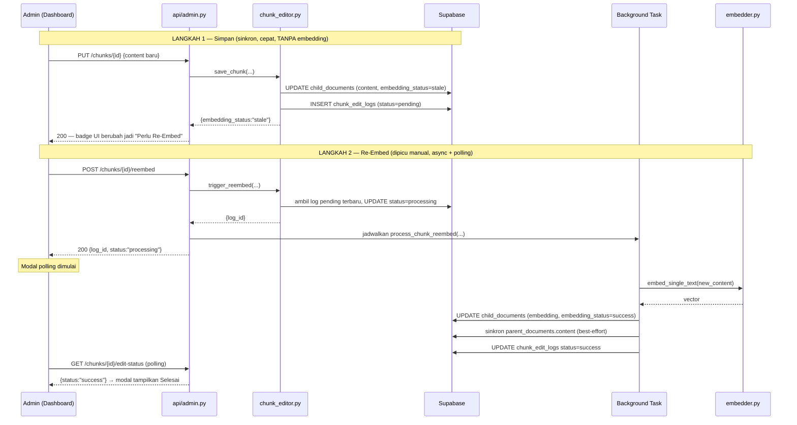
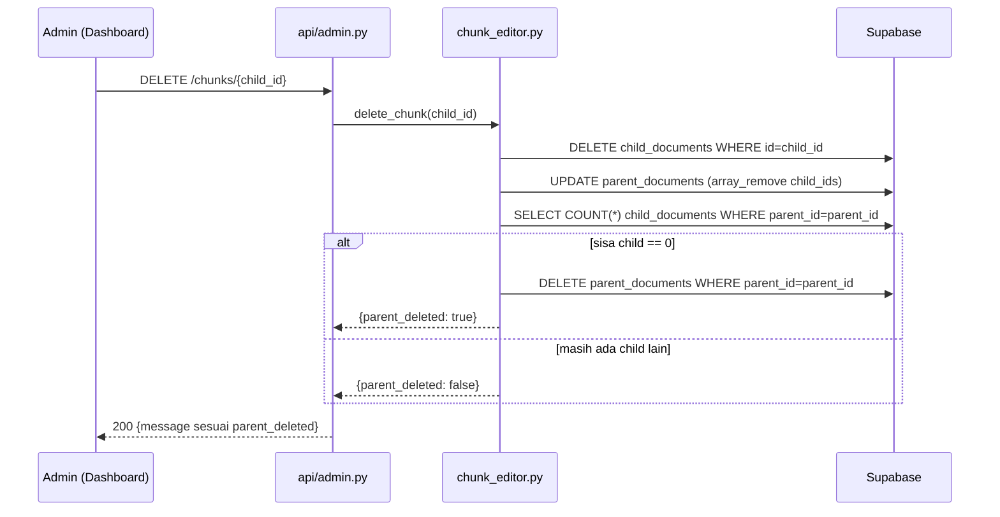

# Pseudocode Backend — Increment 3
## Admin Dashboard: Kelola Chunk & Autentikasi
### STMIK Widya Cipta Dharma

| | |
|---|---|
| **Versi** | 1.2 — Final: penghapusan dibatasi ke child chunk saja (tidak ada hapus parent/dokumen) |
| **Acuan** | `01_SKPL_Spesifikasi_Kebutuhan.md` v1.2 (FR-ADM-01 s/d FR-ADM-04), `02_DPPL_Perancangan_Sistem.md` v1.4 §3.1, §5.3, §8.3, `03_Rencana_Pengembangan_Incremental.md` v1.4 (Increment 3), mockup HTML Admin Dashboard |
| **Tanggal disusun** | 09 Agustus 2026 (v1.0), direvisi 10 Agustus 2026 (v1.1, v1.2) |
| **Cakupan** | Backend saja |

---

## 0. Riwayat Revisi

| Versi | Perubahan |
|---|---|
| 1.0 | Draf awal berdasarkan SKPL/DPPL saja, sebelum ada mockup |
| 1.1 | Direvisi berdasarkan mockup HTML: hierarki 4 level (dokumen→bab→parent→child), "Simpan" dan "Re-Embed" dipisah jadi dua aksi, kolom baru `embedding_status` |
| 1.2 | **Keputusan final**: penghapusan dibatasi ke level **child chunk saja**. Tidak ada endpoint hapus parent chunk atau dokumen sama sekali — parent yang kehilangan seluruh child-nya dibersihkan **otomatis** oleh `delete_chunk`, bukan lewat aksi admin terpisah. SKPL FR-ADM-03 & DPPL §5.3 sudah disinkronkan mengikuti keputusan ini. |

---

## 1. Model Hierarki Data (Klarifikasi Konseptual)

```text
Dokumen (source file, mis. "Panduan PI 2026.pdf")
  └─ dikelompokkan dari kolom `domain` di parent_documents + `source` di child_documents
  └─ Bab (mis. "BAB I Pendahuluan")
       └─ dikelompokkan dari kolom `section` di parent_documents
       └─ Parent Chunk (baris parent_documents, mis. "Parent-001")
            └─ Child Chunk (baris child_documents, terikat via parent_id)
```

**Tidak ada tabel "documents" atau "chapters" terpisah** — keduanya dihitung saat query (`GROUP BY domain, source, section`), bukan disimpan sebagai entitas dengan ID sendiri. Ini konsisten dengan skema Increment 0 yang sudah ada.

⚠️ **Catatan tentang keunikan `parent_id`**: Mockup memakai ID "Parent-001", "Parent-002", dst. yang berulang di tiap dokumen — kemungkinan besar penyederhanaan data demo. Karena `parent_id` adalah primary key di `parent_documents`, nilainya wajib unik secara global di data asli. Cek data hasil ingest Increment 0/1 kamu untuk memastikan ini (kemungkinan besar sudah unik karena sistem sudah berjalan).

---

## 2. Skema Database — Perubahan yang Diperlukan

```sql
-- Status sinkronisasi PERSISTEN per child chunk (beda dari chunk_edit_logs.status
-- yang sifatnya per-proses/transient — lihat §3.1 untuk pembagian perannya)
ALTER TABLE child_documents
  ADD COLUMN embedding_status text NOT NULL DEFAULT 'success'
    CHECK (embedding_status IN ('pending', 'stale', 'success', 'failed')),
  ADD COLUMN updated_at timestamptz NOT NULL DEFAULT now();

ALTER TABLE parent_documents
  ADD COLUMN updated_at timestamptz NOT NULL DEFAULT now();
```

- Default `'success'` aman untuk baris yang sudah ada — pipeline ingest (`embedder.py`) sudah meng-embed setiap chunk sebelum dianggap "ter-ingest", jadi seluruh data Increment 0/1 memang sudah dalam kondisi *synced* saat migrasi ini dijalankan.
- `updated_at` dipakai untuk stat "Terakhir Diupdate" di dashboard (§6) — di-set eksplisit oleh application code di setiap UPDATE.
- `chunk_edit_logs` (dari Increment 0) **tetap dipakai apa adanya**, tidak ada perubahan skema — hanya *kapan* ia diisi yang bergeser (lihat §3.1).
- **Tidak ada perubahan skema untuk penghapusan** — `delete_chunk` cukup pakai `DELETE` biasa + `array_remove` pada `parent_documents.child_ids`, tidak perlu kolom/tabel baru.

---

## 3. Keputusan Desain (Final)

### 3.1 Dua status yang punya peran berbeda — jangan disamakan
- **`child_documents.embedding_status`** — status **persisten**: "apakah embedding chunk ini masih sinkron dengan isinya sekarang". Nilai: `pending` (belum pernah di-embed — kasus langka), `stale` (isi baru disimpan tapi belum di-re-embed), `success` (sinkron), `failed` (percobaan terakhir gagal). Dipakai untuk badge status di tree/detail panel.
- **`chunk_edit_logs.status`** — status **transient**: progres SATU proses edit-lalu-reembed (`pending → processing → success/failed`). Dipakai HANYA untuk polling saat modal "Status Proses" terbuka, lewat `GET /chunks/{id}/edit-status`.

### 3.2 "Simpan" (PUT) TIDAK memicu re-embed — hanya "Re-Embed" (POST) yang memicu
- `PUT /chunks/{id}` — update `title`/`pages`/`content` (partial). Kalau `content` berubah: tulis baris baru ke `chunk_edit_logs` (status `pending`) dan set `embedding_status='stale'`. **Tidak memanggil OpenAI Embedding** — sinkron/cepat.
- `POST /chunks/{id}/reembed` — tidak menerima body. Mengambil log `pending` paling baru untuk chunk ini, lalu menjalankan embed di background (background task + polling, sama seperti pola async lain di sistem ini).

### 3.3 Sinkronisasi ke `parent_documents.content` tetap berlaku, dipicu saat Re-Embed
Pipeline retrieval mencari lewat **child** tapi teks yang dikirim ke LLM diambil dari **parent** (`parent_child.py` → `chain.py`). Maka saat re-embed sukses, sistem mencoba `parent.content.replace(old_content, new_content, 1)` memakai `old_content`/`new_content` yang tersimpan di `chunk_edit_logs` sejak langkah Simpan. Kalau `old_content` tidak ketemu persis di parent (mis. beda whitespace): log warning, parent TIDAK dipaksa berubah — child tetap benar untuk keperluan pencarian, hanya butuh pengecekan manual untuk parent-nya.

### 3.4 Tree dimuat penuh sekali di awal, detail chunk di-lazy-load
`GET /documents` mengembalikan **seluruh** struktur (dokumen → bab → parent → child) dalam satu response; child hanya berisi field ringan (`id`, `title`, `pages`, `embedding_status`) — TANPA `content`. `content` penuh baru diambil lewat `GET /chunks/{child_id}` saat admin membuka satu chunk. Cocok untuk volume data 4 domain (kemungkinan di bawah ~500 child chunk total).

### 3.5 Penghapusan dibatasi ke child chunk — parent kosong dibersihkan otomatis (FINAL)
**Tidak ada endpoint untuk menghapus parent chunk atau dokumen.** Admin hanya bisa menghapus child chunk lewat `DELETE /chunks/{child_id}`. Alasan keputusan ini:

1. **Parent tanpa child sudah "mati" secara fungsional** — retrieval selalu lewat child (embedding + BM25) untuk sampai ke parent; parent yang tidak punya child sama sekali tidak akan pernah ter-retrieve lagi. Menghapusnya secara eksplisit cuma housekeeping, bukan kebutuhan fungsional.
2. **Mengurangi blast radius kesalahan** — tombol yang bisa menghapus puluhan child sekaligus (hapus dokumen) jauh lebih berisiko dibanding hapus 1 child, apalagi tanpa mekanisme undo/soft-delete.
3. **Konsisten dengan mockup yang sudah jadi** — mockup memang cuma punya UI hapus child chunk; tidak perlu kerja tambahan untuk fitur yang tidak didemokan.
4. **Menghindari scope creep** yang sudah diantisipasi sendiri di risiko `03_Rencana...md`.

Sebagai gantinya, **`delete_chunk` melakukan housekeeping otomatis**: setelah sebuah child dihapus, sistem mengecek apakah parent-nya jadi tidak punya child sama sekali — jika ya, baris parent itu ikut dihapus dalam transaksi yang sama (lihat §5.2 langkah 8). Ini memenuhi semangat FR-ADM-03 ("menghapus... dokumen sumber yang sudah ada") tanpa menambah permukaan risiko di UI. Keputusan ini sudah disinkronkan ke `01_SKPL_Spesifikasi_Kebutuhan.md` v1.2 (FR-ADM-03) dan `02_DPPL_Perancangan_Sistem.md` v1.4 (§5.3).

### 3.6 Tidak berubah dari v1.0
Autentikasi admin (`admin/auth.py`), penerbitan token, dependency `get_current_admin`, dan script `reset_admin_password.py` **tidak berubah sama sekali**. Lihat §5.1 dan §5.4.

---

## 4. Struktur Folder yang Terpengaruh

```text
backend/
├── src/
│   ├── admin/
│   │   ├── auth.py                    TIDAK BERUBAH dari v1.0
│   │   └── chunk_editor.py            DIREVISI — §5.2
│   ├── api/
│   │   └── admin.py                   DIREVISI — §5.3
│   ├── ingestion/
│   │   └── embedder.py                TIDAK BERUBAH dari v1.0 (embed_single_text)
│   └── ...
├── scripts/
│   └── reset_admin_password.py        TIDAK BERUBAH dari v1.0
├── supabase_migration_admin_status.sql BARU — §2 (kolom embedding_status, updated_at)
├── application.py                     TIDAK BERUBAH dari v1.0 (registrasi router)
└── requirements.txt                   TIDAK BERUBAH dari v1.0 (tambah bcrypt)
```

---

## 5. Pseudocode per File

### 5.1 `backend/src/admin/auth.py` — Tidak Berubah dari v1.0

```markdown
ALGORITMA AUTENTIKASI ADMIN (admin/auth.py)

1. IMPOR PUSTAKA
   - bcrypt (hashing password)
   - FastAPI (Header, HTTPException, Depends)
   - Supabase client, loguru
   - jwt_utils (create_access_token, verify_access_token) dari src/auth/ — DIPAKAI ULANG APA ADANYA
   - Konfigurasi (get_settings)

2. FUNGSI hash_password(plain_password) -> str
   - bcrypt.hashpw dengan salt otomatis. Kembalikan hash sebagai string.

3. FUNGSI verify_password(plain_password, password_hash) -> bool
   - bcrypt.checkpw. Tangkap exception (hash rusak/format lama) sebagai False.

4. FUNGSI authenticate_admin(username, password) -> dict | None
   - SELECT * FROM admin_users WHERE username = username, batasi 1 baris.
   - JIKA tidak ditemukan ATAU verify_password gagal: KEMBALIKAN None.
   - (Fire-and-forget) UPDATE admin_users SET last_login = now() WHERE admin_id = row.admin_id.
   - KEMBALIKAN {admin_id, username, full_name} — TIDAK PERNAH menyertakan password_hash.

5. FUNGSI issue_admin_token(admin) -> str
   - payload = {"sub": admin["admin_id"], "username": admin["username"], "role": "admin"}
   - KEMBALIKAN jwt_utils.create_access_token(payload).

6. FUNGSI (DEPENDENCY) get_current_admin(authorization: str = Header(None)) -> dict
   - JIKA header kosong / bukan "Bearer <token>": HTTPException(401).
   - payload = jwt_utils.verify_access_token(token). JIKA None: HTTPException(401).
   - JIKA payload["role"] != "admin": HTTPException(403).
   - KEMBALIKAN payload.

7. KELAS ResourceNotFoundError(Exception) — dipakai chunk_editor.py, ditangkap api/admin.py jadi 404.
```

### 5.2 `backend/src/admin/chunk_editor.py` — Direvisi

```markdown
ALGORITMA PENGELOLAAN CHUNK OLEH ADMIN (admin/chunk_editor.py)

1. IMPOR PUSTAKA
   - Supabase client, loguru, datetime
   - embedder (embed_single_text)
   - ResourceNotFoundError

2. FUNGSI list_knowledge_tree() -> dict
   - Query ringan SEMUA parent: SELECT parent_id, title, domain, section, updated_at
     FROM parent_documents ORDER BY domain, section, parent_id.
   - Query ringan SEMUA child: SELECT id, parent_id, title, pages, source, embedding_status, updated_at
     FROM child_documents ORDER BY parent_id, pages.
   - DI PYTHON, petakan `source` untuk tiap parent berdasarkan child pertamanya (karena kolom `source` hanya ada di `child_documents`).
   - Kelompokkan: (domain, source) -> "dokumen" -> section -> "bab" -> list parent,
     tiap parent tempelkan children miliknya (index dulu child by parent_id di dict biar O(n)),
     tiap parent node sertakan child_count.
   - Hitung summary: total_documents (pasangan domain+source unik), total_parents, total_children,
     last_updated_at (MAX updated_at gabungan parent_documents & child_documents).
   - KEMBALIKAN {summary, documents: [...]}.

3. FUNGSI get_chunk_detail(child_id) -> dict
   - SELECT * FROM child_documents WHERE id = child_id (termasuk content penuh).
   - JIKA tidak ditemukan: LEMPARKAN ResourceNotFoundError.
   - Ambil info parent-nya: SELECT parent_id, title, section
     FROM parent_documents WHERE parent_id = child.parent_id.
   - (domain dan source diambil langsung dari record child_documents).
   - KEMBALIKAN {id, title, pages, content, embedding_status, reembedded_at,
     parent: {parent_id, title}, section, domain, source}.

4. FUNGSI save_chunk(child_id, admin_id, title=None, pages=None, content=None) -> dict
   - Ambil baris child_documents WHERE id = child_id. JIKA tidak ada: ResourceNotFoundError.
   - updates = {}, content_changed = False
   - JIKA content diberikan DAN content != child.content:
     - content_changed = True
     - old_content = child.content   (simpan SEBELUM di-overwrite)
     - updates['content'] = content
     - updates['embedding_status'] = 'stale'
   - JIKA title diberikan: updates['title'] = title
   - JIKA pages diberikan: split berdasarkan koma dan simpan sebagai array (TEXT[]) ke updates['pages']
   - JIKA updates kosong: KEMBALIKAN {child_id, embedding_status: child.embedding_status,
     content_changed: False, message: "Tidak ada perubahan."}
   - updates['updated_at'] = now()
   - UPDATE child_documents SET ...updates WHERE id = child_id.
   - JIKA content_changed:
     - INSERT INTO chunk_edit_logs (child_id, parent_id, admin_id, old_content, new_content, status)
       VALUES (child_id, child.parent_id, admin_id, old_content, content, 'pending').
       (Belum memicu embedding — hanya "menabung" perubahan untuk diproses saat Re-Embed.)
   - KEMBALIKAN {child_id, embedding_status: updates.get('embedding_status', child.embedding_status),
     content_changed, message: "Perubahan disimpan." + (" Klik Re-Embed agar chatbot pakai versi terbaru." jika content_changed)}.

5. FUNGSI trigger_reembed(child_id, admin_id) -> dict
   - Ambil baris child_documents WHERE id = child_id. JIKA tidak ada: ResourceNotFoundError.
   - Cari log PENDING terbaru: SELECT * FROM chunk_edit_logs
     WHERE child_id = child_id AND status = 'pending' ORDER BY edited_at DESC LIMIT 1.
   - JIKA ADA: log_id, old_content, new_content = log.log_id, log.old_content, log.new_content
   - JIKA TIDAK ADA (first-embed / retry tanpa edit baru):
     - INSERT INTO chunk_edit_logs (child_id, parent_id, admin_id, old_content, new_content, status)
       VALUES (child_id, child.parent_id, admin_id, NULL, child.content, 'pending') RETURNING log_id.
     - old_content = NULL, new_content = child.content
   - UPDATE chunk_edit_logs SET status = 'processing' WHERE log_id = log_id.
   - KEMBALIKAN {log_id, parent_id: child.parent_id, old_content, new_content}
     (dipakai endpoint untuk menjadwalkan background task — lihat langkah 6).

6. FUNGSI (BACKGROUND TASK) process_chunk_reembed(log_id, child_id, parent_id, old_content, new_content)
   - COBA:
     - vector = embedder.embed_single_text(new_content)
     - UPDATE child_documents SET embedding = vector, embedding_status = 'success',
       updated_at = now() WHERE id = child_id.
     - JIKA old_content BUKAN None (hasil dari sebuah edit, bukan first-embed):
       - Ambil parent_documents.content WHERE parent_id = parent_id.
       - JIKA old_content ADALAH substring persis di parent.content:
         - new_parent_content = parent.content.replace(old_content, new_content, hitung=1)
         - UPDATE parent_documents SET content = new_parent_content, updated_at = now()
           WHERE parent_id = parent_id.
       - SELAIN ITU: tulis log WARNING (parent tidak ikut ter-update otomatis, cek manual).
     - UPDATE chunk_edit_logs SET status = 'success', reembedded_at = now() WHERE log_id = log_id.
   - JIKA GAGAL (except):
     - UPDATE child_documents SET embedding_status = 'failed' WHERE id = child_id.
     - UPDATE chunk_edit_logs SET status = 'failed', error_message = str(e) WHERE log_id = log_id.
     - Tulis log ERROR lengkap.

7. FUNGSI get_edit_status(child_id) -> dict | None
   - SELECT * FROM chunk_edit_logs WHERE child_id = child_id ORDER BY edited_at DESC LIMIT 1.
   - JIKA tidak ada baris: KEMBALIKAN None.
   - KEMBALIKAN {log_id, child_id, status, error_message, edited_at, reembedded_at}.

8. FUNGSI delete_chunk(child_id) -> dict
   - Ambil baris child_documents WHERE id = child_id. JIKA tidak ada: ResourceNotFoundError.
   - parent_id = child.parent_id
   - DELETE FROM child_documents WHERE id = child_id.
   - UPDATE parent_documents SET child_ids = array_remove(child_ids, child_id),
     updated_at = now() WHERE parent_id = parent_id.
   - (Tidak dicatat ke chunk_edit_logs — tabel itu khusus riwayat EDIT, bukan hapus.)
   - HOUSEKEEPING OTOMATIS (lihat §3.5) — cek apakah parent jadi kosong:
     - sisa_child = SELECT COUNT(*) FROM child_documents WHERE parent_id = parent_id.
     - JIKA sisa_child == 0:
       - DELETE FROM parent_documents WHERE parent_id = parent_id.
       - parent_deleted = True
     - SELAIN ITU: parent_deleted = False
   - KEMBALIKAN {child_id, parent_id, parent_deleted}
     (dipakai endpoint untuk menyusun pesan yang tepat ke admin, mis. memberi tahu kalau
      parent-nya ikut terhapus karena sudah tidak punya child sama sekali).
```

### 5.3 `backend/src/api/admin.py` — Direvisi

```markdown
ALGORITMA ROUTER ADMIN (api/admin.py)

1. IMPOR — sama seperti v1.0 + BackgroundTasks tetap dipakai.

2. INISIALISASI ROUTER — APIRouter prefix "/admin", tag "Admin".

3. SKEMA REQUEST/RESPONSE (Pydantic):
   - ChunkSaveRequest: {title: str|None, pages: str|None, content: str|None}
     (minimal satu field terisi — validasi custom, tolak kalau semuanya None)
   - ChunkSaveResponse: {child_id, embedding_status, content_changed: bool, message}
   - ReembedTriggerResponse: {log_id, child_id, status: "processing", message}
   - ChunkDetailResponse: {id, title, pages, content, embedding_status, reembedded_at,
     parent: {parent_id, title}, section, domain, source}
   - ChildLite: {id, title, pages, embedding_status}   (dipakai di dalam tree, TANPA content)
   - ParentNode: {parent_id, title, child_count: int, children: list[ChildLite]}
   - ChapterNode: {section: str, parents: list[ParentNode]}
   - DocumentNode: {domain, source, chapters: list[ChapterNode]}
   - SummaryStats: {total_documents, total_parents, total_children, last_updated_at}
   - KnowledgeTreeResponse: {summary: SummaryStats, documents: list[DocumentNode]}
   - DeleteResponse: {deleted: bool = True, parent_deleted: bool, message}
   - (AdminLoginRequest/Response, ChunkEditStatusResponse — SAMA seperti v1.0)

4. ENDPOINT POST "/login" — SAMA seperti v1.0.
5. ENDPOINT POST "/logout" — SAMA seperti v1.0.

6. ENDPOINT GET "/documents" (Depends: current_admin)
   - Path: /admin/documents (tanpa query filter — tree sudah mencakup semua domain,
     filtering per-domain dilakukan di CLIENT seperti pola mockup)
   - Panggil chunk_editor.list_knowledge_tree().
   - KEMBALIKAN KnowledgeTreeResponse.

7. ENDPOINT GET "/chunks/{child_id}" (Depends: current_admin)
   - COBA: detail = chunk_editor.get_chunk_detail(child_id).
   - JIKA ResourceNotFoundError: HTTPException(404).
   - KEMBALIKAN ChunkDetailResponse.

8. ENDPOINT PUT "/chunks/{child_id}" (Depends: current_admin) — sinkron, TANPA background task
   - Terima ChunkSaveRequest.
   - COBA: result = chunk_editor.save_chunk(child_id, admin_id=current_admin["sub"],
     title=request.title, pages=request.pages, content=request.content)
   - JIKA ResourceNotFoundError: HTTPException(404).
   - KEMBALIKAN ChunkSaveResponse(**result).

9. ENDPOINT POST "/chunks/{child_id}/reembed" (Depends: current_admin, background_tasks: BackgroundTasks)
   - Tidak menerima body.
   - COBA: result = chunk_editor.trigger_reembed(child_id, admin_id=current_admin["sub"])
   - JIKA ResourceNotFoundError: HTTPException(404).
   - background_tasks.add_task(chunk_editor.process_chunk_reembed,
       result["log_id"], child_id, result["parent_id"], result["old_content"], result["new_content"])
   - KEMBALIKAN ReembedTriggerResponse(log_id=result["log_id"], child_id=child_id,
       status="processing", message="Proses re-embed berjalan. Cek progres via GET /chunks/{child_id}/edit-status.")

10. ENDPOINT DELETE "/chunks/{child_id}" (Depends: current_admin)
    - COBA: result = chunk_editor.delete_chunk(child_id).
    - JIKA ResourceNotFoundError: HTTPException(404).
    - message = "Chunk berhasil dihapus." + (" Parent chunk ini ikut terhapus otomatis karena sudah tidak punya child lagi." jika result["parent_deleted"])
    - KEMBALIKAN DeleteResponse(parent_deleted=result["parent_deleted"], message=message).

11. ENDPOINT GET "/chunks/{child_id}/edit-status" (Depends: current_admin) — SAMA seperti v1.0.

    (TIDAK ADA endpoint hapus parent/dokumen — lihat §3.5. Housekeeping parent kosong
     terjadi otomatis di dalam endpoint #10, bukan aksi admin terpisah.)
```

### 5.4 `backend/scripts/reset_admin_password.py` — Tidak Berubah dari v1.0

```markdown
ALGORITMA RESET/BUAT AKUN ADMIN VIA CLI (scripts/reset_admin_password.py)

1. IMPOR: argparse, getpass, bcrypt, Supabase client, get_settings.
2. ARGUMEN CLI: --username (wajib), --new-password (opsional, prompt getpass jika kosong),
   --full-name (opsional, dipakai hanya saat membuat admin baru).
3. main():
   - JIKA panjang password < 8 karakter: error, keluar.
   - password_hash = bcrypt.hashpw(...)
   - JIKA username sudah ada di admin_users: UPDATE password_hash.
   - JIKA belum ada: INSERT baris baru (admin_id, username, password_hash, full_name).
   - Cetak pesan konfirmasi sesuai kasus (reset vs buat baru).
```

### 5.5 `backend/src/ingestion/embedder.py` — Tidak Berubah dari v1.0

```markdown
FUNGSI TAMBAHAN embed_single_text(text) -> list[float]
   - Wrapper tipis di atas get_openai_embeddings yang SUDAH ADA.
   - KEMBALIKAN get_openai_embeddings(texts=[text], model=settings.embedding_model, batch_size=1)[0].
```

### 5.6 `backend/application.py` — Tidak Berubah dari v1.0

```markdown
- Import router admin, app.include_router(admin_router.router, prefix="/api")
  (mem-mount seluruh endpoint di /api/admin/*)
```

---

## 6. Kontrak API Ringkas (Final)

| Method | Path | Auth | Body | Response (ringkas) |
|---|---|---|---|---|
| POST | `/api/admin/login` | Publik | `{username, password}` | `{access_token, admin}` |
| POST | `/api/admin/logout` | Bearer admin | — | `{message}` |
| GET | `/api/admin/documents` | Bearer admin | — | `{summary, documents:[{domain,source,chapters:[{section,parents:[{parent_id,title,child_count,children:[{id,title,pages,embedding_status}]}]}]}]}` |
| GET | `/api/admin/chunks/{child_id}` | Bearer admin | — | `{id,title,pages,content,embedding_status,parent,section,domain,source}` |
| PUT | `/api/admin/chunks/{child_id}` | Bearer admin | `{title?,pages?,content?}` | `{child_id,embedding_status,content_changed,message}` |
| POST | `/api/admin/chunks/{child_id}/reembed` | Bearer admin | — | `{log_id,child_id,status:"processing",message}` |
| DELETE | `/api/admin/chunks/{child_id}` | Bearer admin | — | `{deleted:true,parent_deleted,message}` |
| GET | `/api/admin/chunks/{child_id}/edit-status` | Bearer admin | — | `{status,error_message,edited_at,reembedded_at}` |

**Tidak ada** endpoint untuk menghapus parent chunk atau dokumen (keputusan final, §3.5).

### Sequence — Simpan lalu Re-Embed (dua langkah terpisah, sesuai mockup)


### Sequence — Hapus Child Chunk (dengan housekeeping parent otomatis)


---

## 7. Pemetaan ke Black Box Testing (Increment 3 & 5)

| Requirement | Test Case | Endpoint/Fungsi | Ekspektasi |
|---|---|---|---|
| FR-ADM-01 | Login benar / salah / tanpa token / token mahasiswa | `/admin/login`, semua endpoint admin lain | 200/401/401/403 |
| FR-ADM-02 | Ambil tree lengkap | `GET /admin/documents` | Struktur 4 level benar, `child_count` cocok jumlah child aktual |
| FR-ADM-02 | Ambil detail satu chunk | `GET /admin/chunks/{id}` | Content penuh + info parent/bab/domain benar |
| FR-ADM-03 | Simpan title/pages saja (content tidak berubah) | `PUT /admin/chunks/{id}` | `embedding_status` TIDAK berubah, `content_changed=false` |
| FR-ADM-03 | Simpan dengan content baru | `PUT /admin/chunks/{id}` | `embedding_status` jadi `stale`, log baru masuk `chunk_edit_logs` |
| FR-ADM-03 | Trigger reembed setelah save | `POST .../reembed` → poll edit-status | Akhirnya `success`, jawaban chatbot pakai versi baru |
| FR-ADM-03 | Hapus child chunk BUKAN satu-satunya di parent | `DELETE /admin/chunks/{id}` | Chunk hilang, `parent_deleted=false`, parent lain tetap ada |
| FR-ADM-03 | Hapus child chunk SATU-SATUNYA di parent | `DELETE /admin/chunks/{id}` | Chunk hilang, `parent_deleted=true`, baris parent ikut hilang dari tree berikutnya |
| FR-ADM-03 | Hapus child chunk yang pernah diedit (punya riwayat di `chunk_edit_logs`) | `DELETE /admin/chunks/{id}` | Chunk hilang, log riwayat ikut hilang via CASCADE, tidak ada error FK |
| FR-ADM-03 | Pastikan **tidak ada** endpoint hapus parent/dokumen langsung | Coba `DELETE /admin/documents/{id}` atau `/admin/parents/{id}` | 404 (route tidak ada) — konfirmasi keputusan §3.5 |
| FR-ADM-04 | Poll status tepat setelah trigger reembed | `GET .../edit-status` | `processing` lalu akhirnya `success`/`failed` |
| — | Reset password CLI lalu login | `reset_admin_password.py` → `/admin/login` | Password lama tidak lagi valid, baru berhasil |

---

## 8. Checklist Sebelum Lanjut ke Frontend Asli

- [ ] Jalankan migrasi §2 (`embedding_status`, `updated_at`)
- [ ] Verifikasi `parent_id` di data hasil ingest asli sudah unik secara global (§1)
- [ ] Implementasikan file-file di §5.2 dan §5.3 (yang lain tidak berubah dari v1.0)
- [ ] Test manual: buka tree → pilih chunk → simpan title-only → pastikan `embedding_status` tidak berubah
- [ ] Test manual: edit content → simpan → status jadi `stale` → klik reembed → poll sampai `success` → tanya chatbot, pastikan jawaban pakai versi baru
- [ ] Test manual: hapus child chunk terakhir dalam satu parent → pastikan parent-nya ikut hilang dari tree berikutnya
- [ ] Jalankan seluruh test case §7, catat pass/fail